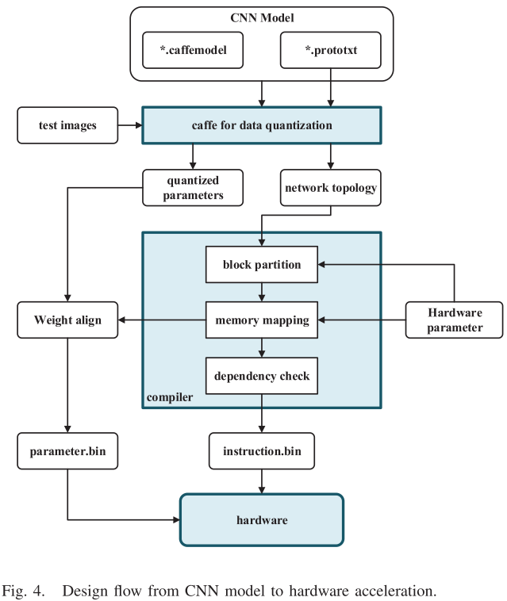
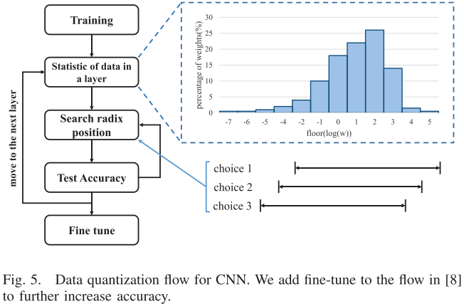
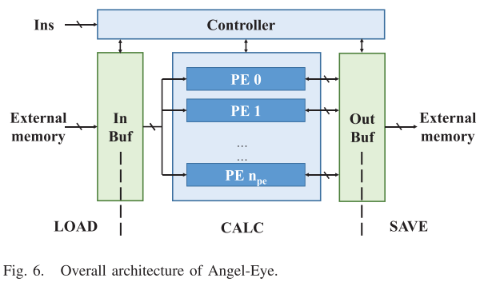
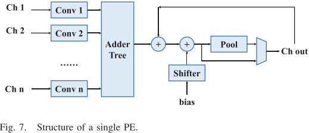
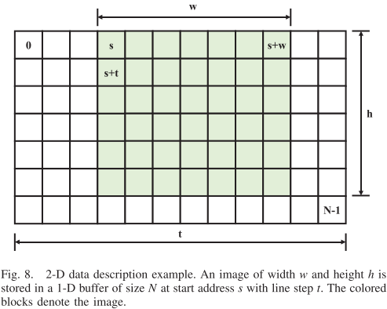
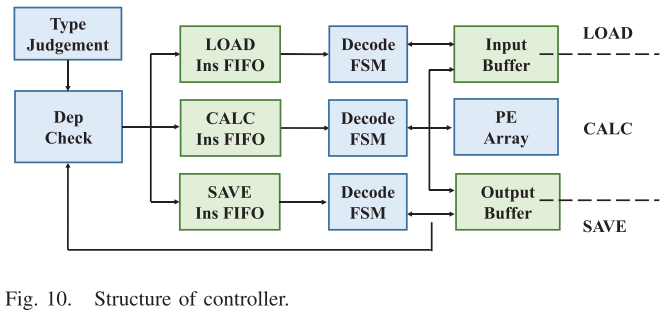
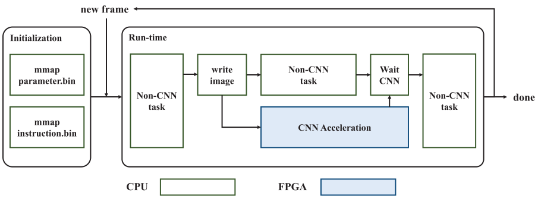
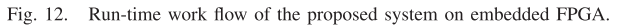

# Angel-Eye: A Complete Design Flow for Mapping CNN Onto Embedded FPGA

本文介绍了将CNN映射至FPGA的方法，具体介绍如下图：

①数据量化：减少数据位宽以减少工作负荷。

②设计编译器：生成一系列的指令来描述CNN的执行过程，具体分为三步：block partition，memory mapping，dependency check。

:one:数据量化（压缩模型，即减少数据位宽，在FPGA中易于实现）

由于CNN中涉及的数据范围变化很大，所以统一的定点化数据会带来巨大的性能损失。因此本文提出对于不同的层定点数的radix是不同的，这对硬件来说只需要增加额外的位移器即可，定点数加法器和乘法器保持不变。

具体量化方式：

如图5所示。首先我们用浮点数训练这个神经网络，然后我们收集特征图和网络的参数，绘制它们对数的柱状图。根据这个柱状图我们来确定小数点的位置。对于每一个可能的确定小数点的方案我们都会在网络上实验并确定它的精确度。上溢的数据我们保留其符号并取最大值，下溢的数据取0。从浮点数到定点数的转换采用四舍五入。最终我们会选用精确度最高的方案。将所有层都量化之后，我们使用微调（fine tuning）的方式进一步提高精确度。微调时所有的数据（导数，权重，数据）全部变为浮点数的形式，进行feed-forward和back propagation。经过微调的结果再进行逐层的、不同的定点化。

优化的过程中我们采用了贪心策略（:question:）。由于如果将所有层一起优化，解的个数会随着层数的增加指数增长。最终我们贪心策略求得目前（2018）最新的神经网络可以被化简成8位的定点小数的数据格式，并且精度损失可以忽略。至此，网络里的所有数据都是定点数而且有相同的位宽，但是每一层运算结果的位宽会变宽。在最终的实验中，本文用高性能FPGA实现了16bit量化的网络，在低功耗FPGA上实现了8bit量化的网络。实验结果显示，8bit的数据量化精度几乎没有影响，同时量化的bit数越少，fine tuning就越重要。8bit版本比16bit版本提升了50%的并行度，展现了量化的重要性。

:two:硬件结构

指令集包含的类型：1) LOAD 2) SAVE 3) CALC。这三类可以概括目前领先的CNN的模型。指令一般为128bit或192bit，包含以下域：

1）*操作符* 

2）*dependency code* 表明内部指令的依赖关系，有助于不同指令的并行和执行指令前的安排。（如果是状态机，是否仍然需要这个？）

3）*参数*  对于LOAD和SAVE指令，需要包含外部存储和片上存储的地址和数据大小。对于CALC指令，则需要包含数据块和片上存储的地址和数据大小。其他为池化、bias和padding的标识也要被包含。

下面开始介绍硬件结构：由4部分组成：PE组，片上缓存，外部存储和控制器

1）PE组：实现卷积运算，共有三级并行：

​	①*kenel level parallelism:*每个PE包含若干卷积引擎，每个卷积引擎并行地计算。

​	②*input channel parallelism:*每个卷积引擎的输入是并行的，不同引擎计算内容不同，最后结果会根据CNN全部相加.

​	③*output channel parallelism:*不同的PE有相同的输入通道和不同的卷积核，最后计算结果的输出也不同。

​         下面详细介绍PE的内容：每个内的卷积引擎计算一个二维的卷积。我们采用了3×3的卷积核，并且这个卷积核可以通过padding支持1×1的核，通过并联的方式支持5×5的核。由于量化数据，加法器和乘法器也是比较简单的定点运算器。但是为了防止数据上溢，我们将立即数的位宽扩展为24位。位移器用来对准小数点并对最终结果根据定点化方案进行修改。

2）片上缓存

这个部分将PE组和外部存储隔离开来，并且保证了数据传输和运算可以并行进行。输出缓存可以将数据传回PE以便迭代运算。为了更好地利用片上的缓存，我们采用2维的方式管理数据，如下图所示：                                                                                                                                 

每一个数据存储的图像通过以下参数描述：起始地址，宽度，高度和line step（:question:）

We introduce a 2-D description interface to manage the data, which is shown in Fig. 8. Each of the image in the buffer is described with the following parameters: start address, width, height, and line step. This enables that software can fully utilize the on-chip buffer for different feature map sizes. With this interface, software can also implement the ping-pong strategy on these buffer by splitting the matrix with address

3）外部存储

用于存储整个计算过程中的所有数据，解决了片上存储可能不够的问题。同时外部存储被CPU和本设计共用，减少了数据传输。

4）控制器

这个部分接收、译码并发射指令到其他三个部分。控制器监视每一个部分的工作状态并确认是否可以发射下一条指令。主机只需要将指令送入控制器的FIFO，并通过检查寄存器来查看工作是否完成，这样就减少了主机在PE运行的时候的开销，在PE运行时主机可以完成别的工作。

上图是控制器的具体结构。并行的指令有可能会带来数据的竞争和冒险。在硬件中一条指令如果要被执行需要满足两个条件：①指令对应的硬件处于空闲状态，②这条指令依赖的指令也全部完成了。第一个条件由LOAD ins FIFO、CALC ins FIFO、SAVE ins FIFO实现，条件二由Dep Check完成。

:three:编译器

编译器的作用是将神经网络映射成一条条指令。针对CNN大量而复杂的存储的优化这时也会完成。为了完全利用数据的位置分布并减少输入输出，以下的基本时序约束需要被遵守：

1）*input channel first:* 有时，Ifmap需要被切割成小块。我们在输入缓冲保存一组Ifmap并尽可能生成多的中间结果。这意味着在这个过程中卷积核是不断变化的。一般来说fmap比卷积核大很多，所以在片上系统中保留fmap比存储卷积核好很多。

2）*output channel second:* 当fmap被分成小块，我们首先在相同的位置下计算输出的块，然后再计算下一位置的结果。

3）*no intermediate result out:* 这说明当输出缓冲器充满了中间结果，我们就加载一个新的Ifmap到输入缓冲器并在输出通道上进行累加。

4）*back and forth:* 当我们计算完一组结果之后，我们经过了所有的输入通道，因而下一轮的计算会和上一轮方向相反，这样可以减少一个多余的LOAD指令。

在编译的过程中包含三个步骤：

1）*分块：*由于片上资源有限，我们需要将一层的计算分开再放入硬件中计算。我们的指令集可以实现几乎所有种类的分块，同时也为了找出分块效率最高的方式进行分析。减少输入输出可以为系统里协同工作的加速器和主机降低功耗减少带宽。为了保持数据猝发传输的长度不变，我们将数据的宽度保持不变，即进行水平的分块，现在的问题就是要解决横向分块分成多少份比较合适。随后本文进行了细致的数学推导。

2）*存储映射：*外部存储空间实际是为了主机和PE之间的交流安排的。先排布Ifmap，以行为准，一个一个通道连续地排布，再排布每一层结果的位置。计算时每一层只需要两块存储：一个用于输入一个用于输出。因此，可能存在不相邻的层输出结果的重叠。编译器需要将后续还要用到的结果保存起来。在整个CNN的加速过程中这些空间都会被预留，因此只要在进行第一次加速前初始化一次即可。分块完成之后，卷积核和bias的使用顺序就确定了，根据这个顺序编译器会生成存储空间的文件。存储空间安排完毕之后，指令里的相关地址也会被填上。

3）*依赖检查：*数据间的依赖检查可以发现计算和输入输出之间可能存在的并行，然后标记指令上的标识位，让硬件根据这些表示进行并行处理。

:four:Run-time Work Flow

上图展示了系统运行时的工作流程。由数据量化产生的parameter.bin文件和指令会根据编译器指定的地址置入存储中。与CNN无关的工作会被ARM处理器完成。当开始处理CNN相关的工作时，输入的图像首先被送入编译器指定的物理存储的位置，随后指令也被送入加速器，当CNN加速器正在工作时，主机通过检查寄存器来查看工作是否完成，此时主机可以完成其他工作。这个框架可以完成很多CNN的工作，图像处理仅仅是其中一个例子。

​	最后的实验结果让本文得出了三条结论：①精度和功耗非常相关。提升一点精度可能意味着增加很多的功耗。②硬件的利用非常重要。③数据的输入输出影响功耗。

