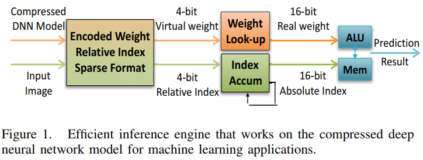
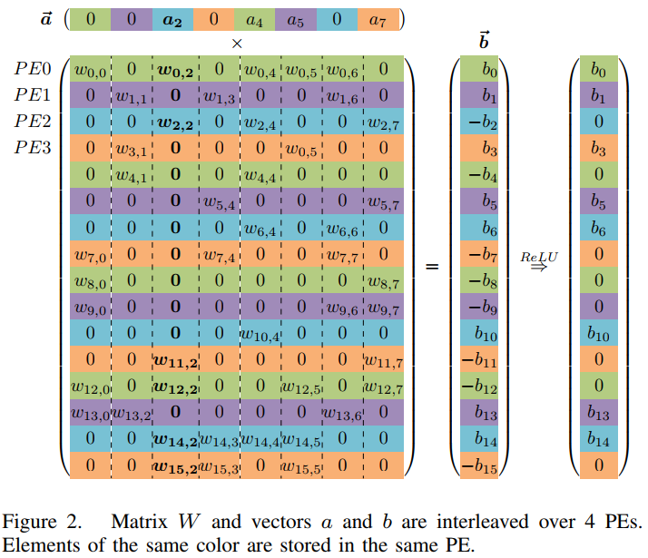
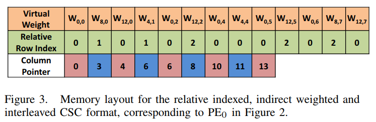
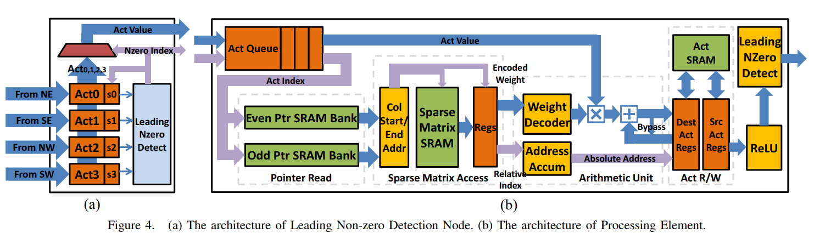

# EIE: Efficient Inference Engine on Compressed Deep Neural Network  

## remark

本篇主要是FC层稀疏性的解决，用到了eyeriss v2里提到的CSC编码，并提出了相应的计算方法，同时对PE的结构有比较详尽的描述。

## 摘要

目前的深度学习神经网络有 成千上万的连接，计算和存储的强度都很大，使得它们很难在硬件和功耗资源有限的嵌入式系统上实现。尽管定制硬件可以帮助计算，从DRAM读取权重比ALU操作的消耗高两个数量级，主导了所需的能量。

之前提出的“深度压缩”使得将大型网络完全放入片上SRAM成为可能。这种压缩是通过修剪多余的连接和多个连接分享同一个权重达成的。我们提出了一个高能效推断引擎（EIE），它在这种压缩模型上执行推断并且通过权重共享来加速因为压缩带来的稀疏矩阵向量的乘法。将DRAM改成SRAM给EIE带来了120×的能量节省；对稀疏性的发掘节省了10×；权重分享节省了8×；略过ReLU带来的0activation节省了3×。根据九个DNN标尺比较，EIE比实现同等未压缩DNN的CPU快189×，比GPU快13×。EIE直接执行一个压缩网络时处理功耗为102 GOPS，对应一个未压缩网络的3 TOP。处理AlexNet的FC层时速度为1.88×10⁴帧/秒，功耗仅为600mW。它比CPU节能24000倍，比GPU节能3400倍。和DaDianNao相比，EIE比它有高2.9倍的吞吐率，19倍的能效，3倍的面积效率。

## 1 introduction

在硬件中如果没有数据的重利用，总的能耗将会被存储的存取所主导。大型的网络不适应片上存储，因此需要更昂贵的DRAM存取。如果没有模型压缩，我们只能在片上SRAM实现小型的网络。

高效地实现CNN的卷积层被深入地研究过，因为其数据重利用和控制很适合定制硬件实现。然鹅，FC层在大型网络上带宽受限。不像卷积层，FC层没有参数重利用。当在CPU或GPU上训练网络时，数据分块成为一个有效的解决方式，但是它不适于对延迟有要求的实时应用。

通过修剪和权重分享实现的网络压缩使得现代网络在片上SRAM上实现成为可能。然鹅处理这些压缩后的模型是一个挑战。修剪之后的矩阵更加稀疏，indicies会更加相关。经过权重分享，每个权重仅需要一个短小（4b）的index。在CPU和GPU上这会提升复杂度和低效率，因为它增加了额外的迂回。

为了能够高效地处理压缩后的DNN模型，我们提出了EIE，一个执行特定稀疏矩阵向量乘法并能在没有效率损失的情况下处理权重分享的专业加速器。EIE是一组可扩展的PE阵列。每一个PE存储一部分的网络在SRAM里并且完成与之相关的计算。它利用的方面有：动态的输入向量稀疏性，静态的权重稀疏性，相关的indexing，权重分享和极窄权重（4b）。

在我们的设计里，每一个PE包含压缩模型131K的权重，对应于原密度模型的1.2M的权重，并且能够每秒完成8亿次权重计算。

本文的贡献有：

+ 第一个处理稀疏和权重分享的神经网络加速器。直接处理压缩后的网络使得大型神经网络能够在片上SRAM执行。
+ 第一个探索activation的动态稀疏性来减少计算的加速器。
+ 描述了一个可以在许多PE上实现并行执行一个特定层的存储分配和计算分配，达成了工作平衡和好的可扩展性。
+ 将EIE应用于许多神经网络上，包括CNN和LSTM。

## 2 motivation

矩阵向量乘法（M×V）是广大神经网络和深度学习应用的基石。在CNN中，FC层是通过M×V实现的，超过96%的连接出现在FC层。在物体识别算法中，FC层需要在指定区域运行很多遍，占据了38%的计算时间。在RNN中，M×V会在每一个时间节点的新的输入和隐藏状态运行，产生一个新的隐藏状态和输出。LSTM是一个广泛使用的RNN结构块，可以提供更复杂的隐藏单元计算。每一个LSTM块可以被分成八个M×V运算，对每一个input gate，forget gate，output gate和一个暂存记忆块各有两个M×V运算。

在进行M×V运算时，存储的读取往往是个瓶颈，尤其是在矩阵大于cache的大小时。这里没有输入矩阵的重利用，因此每一次运算都需要进行一次存储的读取。分块常用于CPU和GPU，但是会带来延迟。因此我们创造需要一个有效的方式来执行大型神经网络。

因为在大型网络中存储的存取是一个瓶颈，压缩神经网络提供了一个解决方式。尽管压缩减少了操作的总数，随之而来的无规律性阻止了CPU和GPU的有效加速，如下表所示：

在之前的加速器里，压缩后的网络也不够高效。

## 3 DNN compression and parallelization

### B representation

为了发掘activation的稀疏性，我们将编码后的稀疏权重矩阵$W$以compressed sparse column（CSC）形式存储。

对于矩阵$W$的每一列$W_j$，我们会存储一个向量$v$，其中包含非零的权重，还有第二个等长的向量$z$来表示对应v里面非零值前有多少个0。v和z内的每一个元素由4bit表示。如果有连续超过15个0出现，我们会在向量v里面增加一个0元素。举例：

[0,0,1,2,0,0,0,0,0,0,0,0,0,0,0,0,0,0,0,**0**,0,0,3]

v=[1,2,0,3]

z=[2,0,15,2]

所有列的v和z存储在一对巨大的阵列里，由一个指针向量$p$每一列的起始向量位置。p里面的最后一个元素指向倒数第二个向量元素，因此第$j$列的非零元素数量（包括pad的0）由$p_{j+1}-p_j$表示。

将稀疏矩阵用CSC的形式存储使得发掘activation的稀疏性变得简单。我们只需要将每一个activation和其对应列中非零的元素相乘即可。

### C parallelizing compressed DNN

我们通过将矩阵W的行插入多个PE里进行矩阵的分配和并行。在N个PE里，PE$_k$保存了所有行$W_i$，输出activation $b_i$和输入activation $a_i$，其中$i(mod N)=k$。在PE$_k$里列$W_j$的部分以CSC的形式存储，只是对0的计数仅仅指在这个PE里列的子集的0的个数。每一个PE有其自身的$v$，$x$和$p$阵列用来编码这一部分的稀疏矩阵。（:question:这个x上文中没有，应该是指z?）

上图是一个在N=4个PE上输入activation向量a（长度为8）和一个16×8的权重矩阵相乘得到一个输出activation向量b（长度为16）的例子。a，b，和W的元素底色表明了它们在不同PE之间的分配。每一个PE有4行W，2个a的元素和4个b的元素。

我们这样执行稀疏矩阵×稀疏向量：先扫描向量a来寻找其下一个非零值$a_j$，再将$a_j$沿着它的index $j$传播到整个PE阵列，之后每一个PE就将$a_j$和它对应列里的非零值相乘，再在累加器里累加部分和得到输出向量b里的每一个元素。在CSC的形式下，这些非零权重被连续地存储，因此每个PE仅需从$p_j$走到$p_{j+1}-1$的位置来加载权重。为了处理输出累加，对应每一个权重$W_{ij}$的行编号$i$是通过保持一连串x阵列元素的和来生成的。

在图2中的例子里，第一个非零值$a_2$在$PE_2$里，$a_2$的值和它的下标2被传播到所有PE中（:six_pointed_star:带宽？），然后每个PE将$a_2$和其中第二列的每一个非0值相乘，$PE_0$乘$W_{0,2}$和$W_{12,2}$；$PE_1$在第二列没有非0值所以不做乘法；$PE_2$将$a_2$和$W_{2,2}$和$W_{14,2}$相乘，以此类推。每一个积会在对应的行累加器进行累加。例如$PE_0$计算$b_0=b_0+W_{0,2}a_2$和$b_{12}=b_{12}+W_{12,2}a_2$。在每一层开始计算前累加器会被初始化为0。

插入的CSC表示有助于发掘activation向量a的动态稀疏性和权重矩阵W的静态稀疏性。我们通过仅仅传输输入activation a的非零元素来发掘activation的稀疏性。为0的元素被完全跳过。插入的CSC表示允许每一个PE快速地找到每一列里的非零值来和$a_j$相乘。这种组织方式也保存了所有PE本地的运算，除了传播过来的输入activation。图2中插入的CSC表示的矩阵如下图：

（:six_pointed_star:这里的解释和eyeriss v2里的一样，图三为PE0里的情况。）

这个处理方式可能会存在工作量不平衡，因为每一个PE可能会有不同数量的非零值。第四部分会讲述如何通过排队来解决这个问题。

## 4 hardware implementation 

上图展示了EIE的结构。一个中央控制单元（central control unit，CCU）控制一列PE，每个计算一部的压缩网络。CCU也会从分散的*第一个非零甄别*网络接收非零activation，并把这些值传送到PE里。

除了收集将要传播到所有PE的非零输入activation，几乎所有EIE里的计算都在PE本地完成。然鹅，收集和传播activation的时序并不重要，因为大多数PE需要花很多周期来处理每一个输入activation。

### activation queue and load imbalancing

输入activation向量$a_j$的非零元素以及其对应下标$j$会被CCU传播到每个PE里的activation队列。如果有一个PE的队列满了，就不会进行传播。PE正在处理的activation处在队列的最前面。

activation队列使得PE能够建立起一个backlog来均衡工作量的不平衡，因为每个PE不同列的非零值个数可能会不一样。

### pointer read unit

在activation队列的第一个项的下表$j$是用来寻找指向$v$开始指针$p_j$和结束指针$p_{j+1}$和列$j$对应的$x$阵列。为了能一个周期内从单端SRAM阵列里读取两个指针，我们将指针存放在两个SRAM bank里，并用地址的最低位来选择不同的bank，不同bank里的$p_j$和$p_{j+1}$会保持不同。EIE里的指针长度为16bits。

### sparse matrix read unit

稀疏矩阵读取单元用指针$p_j$和$p_{j+1}$来读取单个PE里稀疏矩阵SRAM中的一部分列向量$I_j$中的非零元素（如果有的话）。SRAM里的每一个项长度为8bit，包含一个v的4bit元素和x的4bit元素。

为了提升效率，PE内部的一部分编码后的稀疏矩阵存储在一个64bit宽的SRAM。因此每读一次SRAM可以得到8个项。指针$p$的高13位选择了SRAM的行，低3位选择了行里的一个项。每个周期都有一个项$(v,x)$提供给计算单元。

### arithmetic unit

计算单元从稀疏矩阵接收到一个$(v,x)$项后开始执行计算乘加操作$b_x=b_x+v×a_j$。下标x用来指示一个加数的行（目标activation寄存器），v和activation队列的首个元素相乘。因为v是以4bit的形式存储的，它首先会通过一个查找表扩展成16bit定点数。如果相邻的两个周期里同样的加数被选择，一个旁路会用于将加法器的输出连到输入。

### activation read/write

在单个一轮FC层的计算中，activation读写单元包含两个activation寄存器分别存放源和目的activation的值。到了下一层，源和目的寄存器文件就会互换它们的角色。因此我们不需要额外的数据传输来多层向前传播计算。

每一个activation寄存器文件包含64个16位activation。这足以包含64个PE所需的4K activation向量。更长的activation向量可以被2KB的activationSRAM容纳。当activation向量的长度大于或等于4K时，M×V的计算将会分批完成，每一批的向量长度小于等于4K。所有本地的reduction（:question:是减法吗）会在寄存器文件中完成。SRAM只会在开始时被读取在批次的结束时被写入。

### distribution leading non-zero detection

输入activation是被分级地分配到每一个PE里的。为了利用输入向量的稀疏性，我们使用首位非零检查逻辑来选择第一个非零的结果。每4个PE为一组，在它们的输入activation上做一个本地首位非零检测。结果会被送到一个Leading Non-zero Detection节点（LNZD Node），图4中有描绘。每一个LNZD节点从4个子节点中找到下一个非零activation并把结果送到下一个四叉树（:question:）。四叉树是排列好的，所以当我们累加PE时wire的长度保持不变。在LNZD节点的根部，选出的非零值会通过一个H树内分离的通路传播回所有PE。

### central control unit

 CCU就是LNZD的根节点。它跟主机（比如一个CPU）交流，并通过设置控制寄存器在监视每一个PE。中心单元包括两个模式：I/O和计算。在I/O模式下，所有PE都处在空闲状态，同时每一个PE内的activation和权重都可以被一个和中心单元相连的DMA读取。这是一个消耗时间的模式。在计算模式，CCU不断地从LNZD的四叉树收集一个非零值并将这个值送往所有PE。直到超过输入长度，这个过程会一直继续。通过设置输入长度和指针队列的起始地址，EIE就可以计算不同的层。