# Eyeriss: An Energy-Efficient Reconfigurable Accelerator for Deep Convolutional Neural Networks  

## remark

本篇文章主要介绍了5个技术：RS (row stationary)数据流的设计，RLC(run-length compression)编码方式，GLB(global buffer)的设计，NoC(network on chip)的设计，以及PE内部的设计，这5个部分都可以作为参考。

其中本文花了相当大的篇幅介绍RS数据流，将CNN拆解成一维的乘加之后，再利用PE组将其扩充成二维，接着讲述了logical PE到physical PE的映射，最后讲述超过二维之后完成整个层该如何运算，这种扩充包括了PE内部运行多个一维运算、physical PE运行多个logical PE，不同时间上physical PE运行的运算之间的协作。

RLC的编码方式在eyeriss v2中被CSC所替代，它不支持在PE内部使用。

GLB的作用是和片外交流，同时暂存不同批次PE间可以重利用的数据，主要存储ifmap和psum，两者之间的比例需要根据不同的层动态地调节。小部分用来缓存filter。

NoC的设计我不是很熟悉，本文的描述类似SRAM，即用X、Y-bus负责分配数据（I/O），以及一个额外的local network来适应RS的纵向累加。

最后是PE内部，包含MAC、FIFO、三个spads以及clock gate模块。

## 摘要

eyeriss是为目前最新的深度卷积神经网络设计的加速器。它优化了整个系统的能耗效率，包括加速器芯片本身和片外DRAM。通过**可配置的结构**它能供不同形态的CNN使用。CNN目前广泛使用于现代AI系统，但也给底层的硬件带来了吞吐率和功耗的挑战。这是因为它的计算需要大量的数据，导致片内片外的数据移动带来的比计算本身消耗的能量更多。因此，对任何形态的CNN，减少数据移动带来的能耗是高吞吐率和低功耗的关键。通过在一个有168个PE的空间结构上使用一个名为行静态（row stationary, RS）的数据流，eyeriss达成了这一目标。根据一个给定的CNN结构，RS数据流重新配置计算映射，通过最大限度地**重利用本地数据**来减少高能耗的数据移动，比如读取DRAM，从而优化功耗。**压缩和数据门控**也被用于更进一步的降低功耗。处理AlexNet时，eyeriss以35帧/秒和0.0029 DRAM读取/MAC的速率处理卷积层，功耗为278mW。处理VGG-16时，速率为0.7帧/秒，0.0035 DRAM读取/MAC，功耗为236mW。

以下内容引自[CSDN](https://blog.csdn.net/qq_40268672/article/details/108809413)，我在原文的基础上进行了一些改动和补充

# 一.Title

Eyeriss: An Energy-Efficient Reconfigurable Accelerator for Deep Convolutional Neural Networks

# 二.Abstract

## why?

AI算法近年来取得了巨大的成功，但是它也给AI算法的硬件部署带来了吞吐率和能效方面的挑战。由于绝大多数AI算法的计算都需要大量数据的搬运（片上数据传输and片外数据传输）,而这些数据的搬运都是十分耗费功率的，因此，存储便成了加速器中一个特别需要考虑的因素。

## how?

作者为了缓解这个问题，提出了一个名为Eyeriss的加速器，它极大的优化了整个系统的能效，并且具有可重构特性，能适应多种形状、大小的卷积运算。在加速器中，作者采用了row stationary(RS)的结构，充分进行了数据重用，降低了对片外DRAM的访问，提高了功效，除此之外，作者还对网络进行了压缩(compression)和数据门控（data gating)，进一步提高了系统的能效。

## result?

作者在AlexNet和VGG-16上进行了实验，发现在AlexNet上Eyeriss处理图像的速度达到了35fps,访存计算比为0.0029 DRAM access/multiply，功耗为278mW(BatchSize=4)，而在VGG-16上处理速度为0.7 fps，访存计算比为0.0035 DRAM access/MAC，功耗为236mW（BatchSize=3)

# 三.Methods

首先是一些参数含义的声明

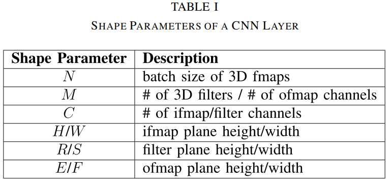

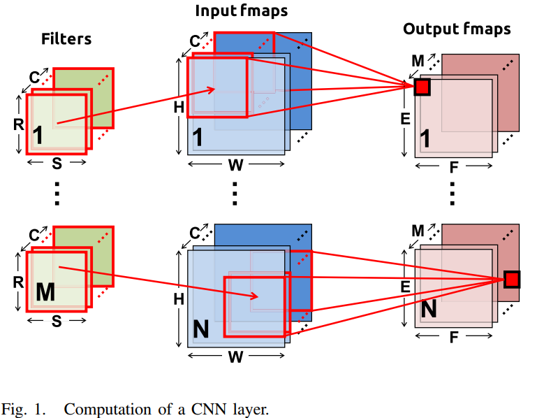

一些缩写说明

spads: scratch pads

GLB: global buffer

RS: row stationary

NoC: network on chip

RLC: run-length compression

psums: partial sums

## 1.SYSTEM ARCHITECTURE

上图显示了Eyeriss的整体架构，它有两个时钟域：
1、**Link Clock**
用于控制片上存储和片外DRAM的数据传输。
2、**Core Clock**
用于控制片上系统的处理过程。
这两个时钟域是异步的，因此，他们之间相互独立，通过FIFO进行数据交换。在Core Clock时钟域，主要结构包括PE阵列、GLB、RLC CODEC和一个ReLu模块。

整个系统的存储层次分为4层，按能量消耗降序排列，为**DRAM**，**GLB**,**PE之间通信**和**PE内部的存储单元**（spads)。

整个系统的控制也分为两个层次，**顶层控制**有以下3点
1、DRAM和GLB之间通过异步口的数据通信
2、PE阵列和GLB之间通过NoC的通信
3、RLC CODEC和ReLu模块的操作
而**底层控制**为PE内部的控制逻辑，这也使得PE之间的操作是相互独立的，并不需要同步。和脉动阵列有所不同。

**处理过程：**加速器一层一层地处理CNN。对于每一层，加速器首先加载其配置bit并转变成一个1794b的scan chain bits对整个加速器进行配置（比如配置GLB内哪些用于存ifmap哪些用于存psums），用时小于100μs。配置内容包括ifmap和filter的大小和形状，计算映射，NoC的数据传输模式。这些bit离线生成并在运行时静态地被获取。之后，加速器从DRAM中加载ifmap和filter，处理后将ofmap输入至DRAM。对同一层一批批的ifmap可以被按顺序地处理，并且不用再对整个芯片进行配置。

## 2.ENERGY-EFFICIENT FEATURES

加速器主要从两个方面来提高能效，分别是
1、减少数据传输次数
2、利用数据的统计信息

### A.Energy-Efficient Dataflow: Row Stationary

在Eyeriss中，作者提出了一种Dataflow结构**Row Stationary**(RS)，它具有很好的可重构特性，可以处理多种形状的输入，而且它还最大化了数据的重用，减少了数据传输，尤其是对片外DRAM的访问。
在卷积运算中，数据重用的形式包括
1、*卷积重用* ：每一个卷积核都在一张特征图上复用了ExF次，每一个输入特征通常都被重用了RxS次（边缘部分的少于RxS次）。
2、*卷积核重用* ： 每一个卷积核都被N个输入特征重用
3、*输入特征重用* ： 每一个输入特征都被M个卷积核重用
Eyeriss采用如下方式对所有形式的数据同时进行重用（ **最大限度地使用spads的内存和PE的并行性** ）

#### 1-D Convolution Primitive in a PE

一维卷积计算单元，它将二维的卷积运算拆分为每一行之间的一维卷积，一维卷积的运算结果为部分和，多行对应的部分和相加即可得到最终的运算结果。如下图所示
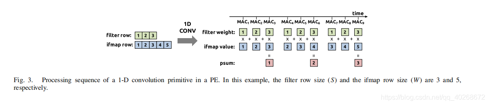

每一个primitive都被映射进一个PE里进行处理，且行保持静态。每一个PE使用本地的spads进行卷积数据重利用和部分和的累加。由于每次只需要保存一个移动窗口的数据，因此spads的大小取决于filter的行大小S。具体来说，就是

1）对filter而言，spads的大小是S

2）对ifmap的移动窗口而言，是S

3）对部分和的累加而言，是1。

:six_pointed_star:由此我们可以确定spads的大小，后文中由于并行的进一步提高，这个spads的大小还要进一步提高。

#### 2-D Convolution PE Set

二维卷积计算单元由许多一维卷积计算单元组成，如下图，以3x3卷积核和5x5输入特征的卷积计算为例，卷积核的每一行按水平方向被广播到对应的PE单元，输入特征的每一行按照对角线被广播到对应单元，部分和则在垂直方向上求和并得到最终结果。
若卷积核的大小为RXR，而输出特征图的大小为EXE，则PE阵列的排布应为R行E列。

:six_pointed_star:由于我们的设计专用于inference，我们可以确定R和E的具体值有哪些后进行对physical PE的设计。​

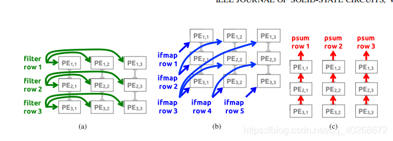

这样做尽可能地减少了访问GLB和DRAM的次数，提高了数据的重利用率。

#### PE set mapping

物理上PE的个数和排列是固定的，而实际使用时PE的排列和数量又由每层的卷积核及输入决定，因此存在一个将使用的逻辑PE映射到物理PE的一个问题。本设计中可以进行随意的映射，只要二者维度相同，同时尽可能靠近以分享数据。存在两个例外：

①PE sets的个数大于物理PE个数（168个）：这时会进行分块处理。

②PE sets的个数小于168，但是宽度大于14或高度大于12：如果过宽，会被分块处理。但是eyeriss不支持过高的PEsets。（:six_pointed_star:一般而言卷积核的高度超过12的比较少，同时12方便被3整除，从而可以运行多个logical PE）

#### Dimensions Beyond 2-D in PE Array

首先介绍本部分可能会用到的一些参数。

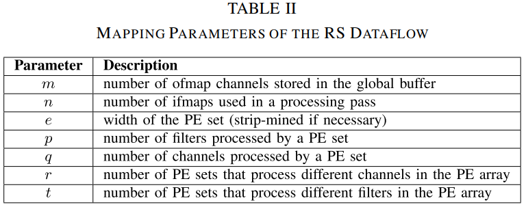

由于N,M,C的存在，实际的卷积不是二维的，我们处理的方法是，固定这额外三维中的两个维度，然后只考虑其中一个维度，这样一共有三种复用模式：
1、不同的输入特征复用同一个卷积核（N，一共N组特征)
2、不同的卷积核复用同一个输入特征（M，共M个卷积核)
3、不同输入通道的卷积核和输入特征图的部分和可以相加求和（C，C个输入通道数)
如图，是三种复用模式的示意图，不同输入特征复用同一卷积核见(a)，只需不同输入特征图的行拼接起来就能实现，而(b)和(c)分别是复用模式2和3的示意图。
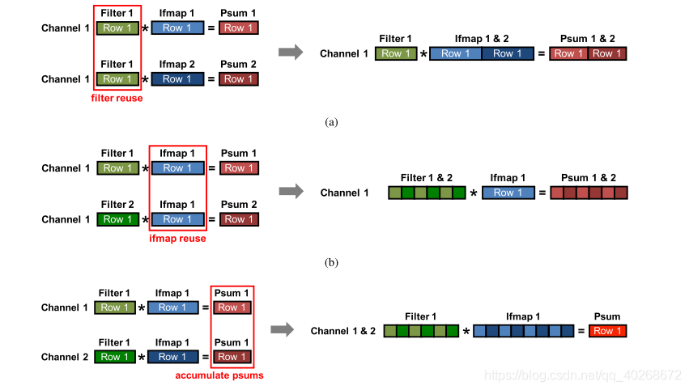
实现高维卷积，主要有以下两种方式:

##### 1）Multiple 2-D Convolutions in a PE Set

即在一个PE Set内进行高维卷积，我们主要通过修改一维卷积单元来实现，上图中的a比较容易理解，即保持PE内部的filter不变，流入不同的ifmap。b和c博客编写者的猜测的运行过程如下（不一定正确）

①图6b的猜想：

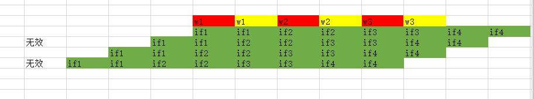
上图是b的运行过程，不同颜色表示不同的卷积核（M），则在起初，我们得到两个输出通道的输出

$O^1_{11}=if1*w1+if2*w2+if3*w3$(红色w)
$O^2_{11}=if1*w1+if2*w2+if3*w3$(黄色w)
滑动两次之后，得到输出
$O^1_{12}=if2*w1+if3*w2+if4*w3$(红色w)
$O^2_{12}=if2*w1+if3*w2+if4*w3$(黄素w)

②图6c的猜想。

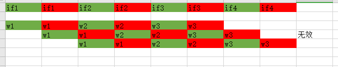
上图是c的运行过程，不同的颜色表示不同的输入通道（C），则在起初，得到输出特征第一行的第一个元素的部分和 $O11=(if1*w1+if2*w2+if3*w3)(绿色通道一)+(if1*w1+if2*w2+if3*w3)(红色通道二)$
然后，滑动2次后，得到$O12=(if2*w1+if3*w2+if4*w3)(绿色通道一)+(if2*w1+if3*w2+if4*w3)(红色通道二)$

:six_pointed_star:在以上的两个过程中涉及到了对PE的进一步扩展，即一个PE内运行多个一维计算。

这时，对spads的大小需求为：

1）对filter而言，spads的大小是p×q×S

2）对ifmap的移动窗口而言，是q×S

3）对部分和的累加而言，是p。

##### 2）Multiple PE Sets in the PE Array

这部分介绍在physical PE上运行多个logical PE的安排。

举一个例子（AlexNet），如下图
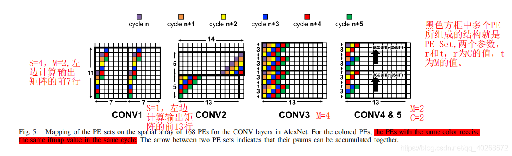
CONV1是一个U=4的11x11卷积，输出特征大小为55x55（:question:）
CONV2是一个U=1的5x5卷积，输出特征大小为27x27
CONV3是一个 U=1的3x3卷积，输出特征大小为13x13
CONV4&5是一个U=1的3x3卷积，输出特征大小为13x13
对CONV1，由于步长为4，因此输入特征的行不再是按照对角线复用，而是在（x+1,y+4)位置复用，在CONV1中，共有两个PE Set，并且这两个PE Set的输入特征行相同，因此可以判断，这是输入特征被2个卷积核复用的情况。
对CONV2，步长为1，输入特征的行按照对角线复用，共两个PE Set，并且上一个PE Set的最后四行和下一个PE Set的最开始四行相同，因此，可以判断，上边的PE Set计算输出特征图的前14行，而下边的PE Set计算输出特征的后13行。
对CONV3，共四个PE Set，且每个Set的输入特征的行都一样，因此可以判断，这是同一个输入特征被4个卷积核复用。
对CONV4&5，共四个PE，其中上边两个PE输入特征完全不同，可以判断为是输入特征的不同通道在进行计算，箭头则表示不同通道的部分和相加，而下边两个PE Set同上边两个情况完全相同，又能判断出有两个卷积核，因此这是M=2,C=2的情况。

更详细的内容见另一篇论文Eyeriss: A Spatial Architecture for Energy-Efficient Dataflow for Convolutional Neural Networks

如果PE没有被填入数据，会被clock gated。

###### a) PE array processing passes

作者将一次能在所有PE上完成的运算量称为一个*Processing Pass*，一个CNN层往往涉及到成百上千个processing passes，在pass与pass之间夹杂着ifmap的重利用和psums的累加，这些操作决定了GLB的大小，GLB存储中间变量，直到最终的ofmap被算出来这些数据才会转移到片外。

下图举例了如果要计算一个6通道，8核，4ifmaps的层，一个同时能处理3通道、4核、2ifmaps的PE队列该如何分批运算出所有结果。简单来说就说先保持ifmap的ID不变，再保持通道的ID不变，最后再变核的ID，来计算出所有组合的结果。这时GLB需要同时存储8通道的ofmaps。

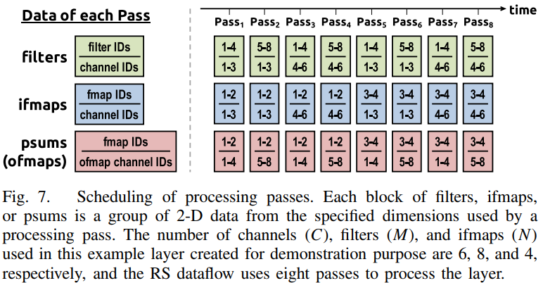

processing pass的安排决定了GLB内部需要存储ifmaps和psums的多少。$n×q×r$个二维ifmaps和$n×m$个二维psums需要被存储在GLB以便重利用。GLB也需要可配置。

###### 2) Summary

表二中的数据经过如下优化过程后决定，这个优化过程需要考虑的因素有：1）功耗以及每一层的存储等级。2）硬件资源，包括GLB、spad的大小和PE的数目，具体参考论文Eyeriss: A Spatial Architecture for Energy-Efficient Dataflow for Convolutional Neural Networks

下表举例了AlexNet在eyeriss上的分配

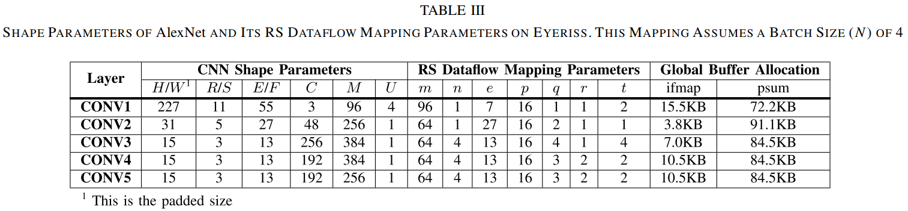

### B. Exploit Data Statistics

尽管RS结构大大降低了数据传输的次数，提高了能效，但是，为了更进一步优化，作者还进行了数据统计，并挖掘其中优化的方向
1)减少对片外DRAM的访问，因为访问DRAM是存储系统中最耗时耗能的
2)跳过一些不必要的计算，比如和0的乘法

#### RLC

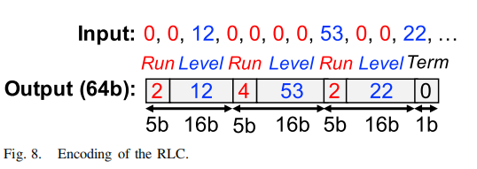
作者采用了RLC方法来减小对特征图中那些不必要的0的存储，减小了对内存带宽的需求。上图是RLC编码的示意图。
最多31个连续的0可以被5bit的叫做Run的数据记录，下一个数据则是一个16bit的非零值，叫做Level,紧接着又是Run，如此重复3次，这3对Run-Level则会被打包为一个64bit的数据，最后1位则用来表示是否已经达到末尾。这样编码仅增加5%到10%的信息熵。
在本实验中，作者比较了采用RLC编码前后加速器对DRAM的访问次数，得到下图

同时作者指出，如果对权重也进行RLC编码，那么压缩的效果还会更好。

除了输入数据和CNN的第一层，所有fmap都以RLC压缩过的形式存储在DRAM里。加速器需要使用时再对数据进行解压存入GLB中，而ofmap经过ReLU函数后也要经过RLC压缩再存入DRAM里，这样节约了DRAM的存储空间也降低了DRAM的读写带宽。

## 3.SYSTEM MODULES

### A. Global Buffer

Eyeriss拥有一个108KB的GLB片上缓存，用于和DRAM进行异步的数据传输，通过NoC和PE Array通信，GLB的108KB中，有100KB用于存储输入特征和输出特征（或部分和）以支持数据复用，而剩下的8KB空间则用于存储权重。当PE Array正在进行处理数据时，GLB会预取（preload）下一个阶段要用到的权重。

100kb的空间被分成25个bank，以便配置，因为对不同的层ifmap和psums占的空间可能会不一样（参考表3）。这些是在刚开始配置时就用scan chain bits设置好的，因此PE可以同时获取ifmap和psum的数据。

### B. Network-on-Chip

NoC用于调度安排PE和GLB之间的数据传输以及PE之间的数据传输，以适应各种shape。NoC至少满足以下三个要求：

+ 支持在RSflow中用到的数据传输模式。大多数PE组里的数据移动是统一的，如图4，但是仍有3个例外：
  + 步长不为1（如图5中的CONV1）
  + 一个PE组被分割后放入PE队列的不同位置（如图5中的CONV2）
  + 多个PE组被同时映射进PE队列里，每一个组需要不同的数据（如图5中的CONV4&CONV5）
+ 平衡数据重利用以更进一步降低能耗
+ 提供足够带宽

NoC一般由以下三部分构成：
1)**Global Input Network**
GIN能够将GLB中的数据在单个时钟周期内多播到所有需要相同filter、ifmap或ofmap(psum)的PE上，因此，多播的目的地定向是一个需要解决的问题。
在本文中，作者采用了X-Bus和Y-Bus的方式来实现多播，对一个12x14的PE阵列来说，一个Y-Bus包含12个X-Bus,并且每个X-Bus都包含14个PE，每个X-Bus都有一个Row ID,而每一个PE都有一个Col ID,这些ID是可以配置的，所有接受GLB中相同数据的X-Bus或者PE都具有相同的ID，而每个从GLB中读出的数据都有一个(row,col)的标签，这个数据只会被广播到那些和（row,col)标签匹配的PE内，那些未匹配的PE则会被锁住从而节约能耗，这个匹配则是由Multicast Controller (MC)来实现的。
Eyeriss拥有分离的GIN，分别为filter、ifmap、psum而设置，以用来提供足够高的介于GLB和PEs之间的内存带宽。

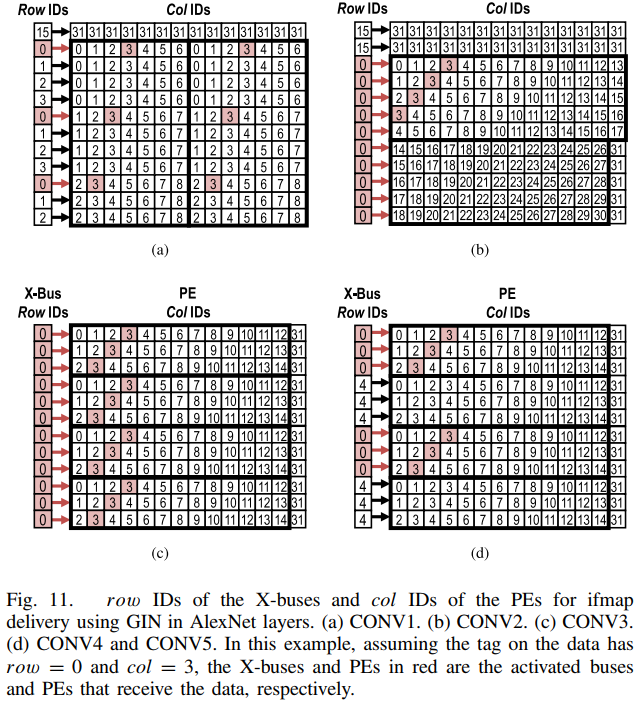

2)**Global Output Network**
功能同GIN，只是方向相反。
3)**Local Network**
在两个垂直方向上相邻的PE之间，底部的PE可以将psum传输给顶部的PE，这是LN的主要作用。

### C. Processing Element and Data Gating

这里介绍了PE内部的结构和Data Gating。图12是PE的内部结构。

在PE内部，有一个数据门控逻辑，当它检测到0时，门控逻辑便会阻止对该数据的读取和MAC运算，从而起到了节约功耗的目的。

# 四、Experiment&Result

Eyeriss采用65nm工艺实现，下图是Eyeriss的详细特性。
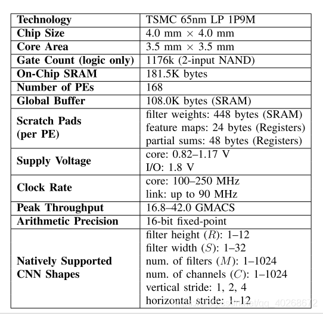
图a显示了Eyeriss core的面积占比情况，图b是每一个PE的面积占比情况。
可以看到，scratch pads占据了PE中绝大多数的面积，而包括scratch pads和GLB在内的片上存储，占了芯片总面积的2/3，乘法器和加法器则只占据总面积的7.4%。
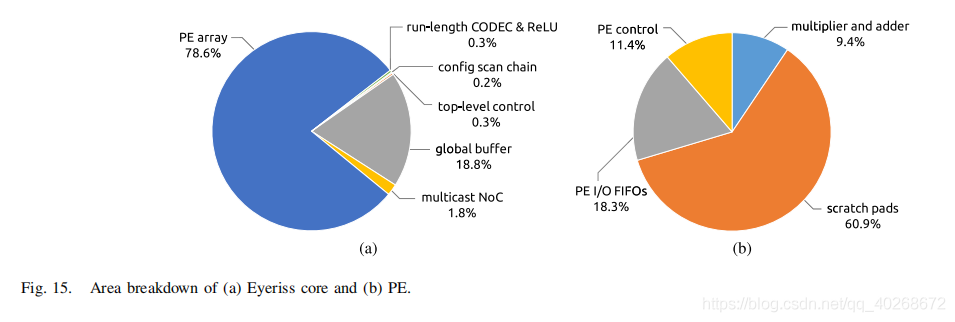
之后，作者在两个CNN模型上进行了基准测试，分别是AlexNet和VGG-16，batchsize分别选为4和3。

## A. AlexNet

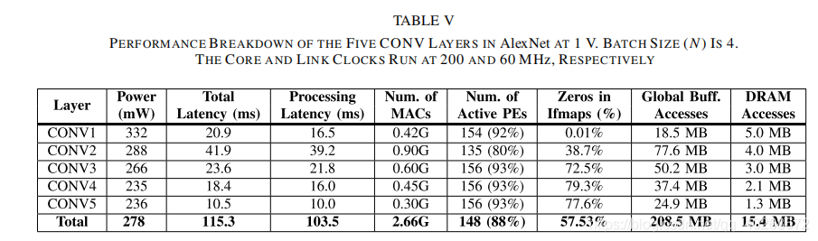
表V是AlexNet各层的性能情况，可以看到，功耗随着层数的增加而降低，这主要是因为越深的层，0越多，而Eyeriss有跳过0乘法的功能，因此功耗不断下降。
平均上来讲，Eyeriss加速器达到了34.7frames/s的帧率，23.1GMACS的计算性能，测量所得功耗为278mW,能效为83.1GMACS/W。

上图显示了CONV1和CONV5的功耗占比情况。不同的数据复用模式和不同的数据流映射所导致的功耗分配情况也不同。总的来看，ALU运算所占功耗小于10%,而数据搬运所产生的功耗则达到了45%，这也证实了数据传输比算数运算更加耗费能量。

## B.VGG-16

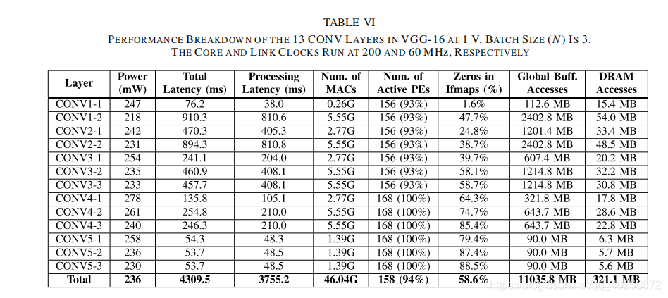
表VI显示了电压为1V下VGG-16中13个层的性能情况。平均上来讲，加速器帧率为0.7frames/s,功耗为236mW。

# 五、Conclusion

作者提出的Eyeriss，利用RS结构，进行了充分的数据复用；并且利用数据统计，在进行乘法运算时跳过0元素，降低了功耗，并采用RLC编码，降低了系统对内存带宽的需求。最终，Eyeriss在AlexNet和VGG-16上取得了很好的效果。