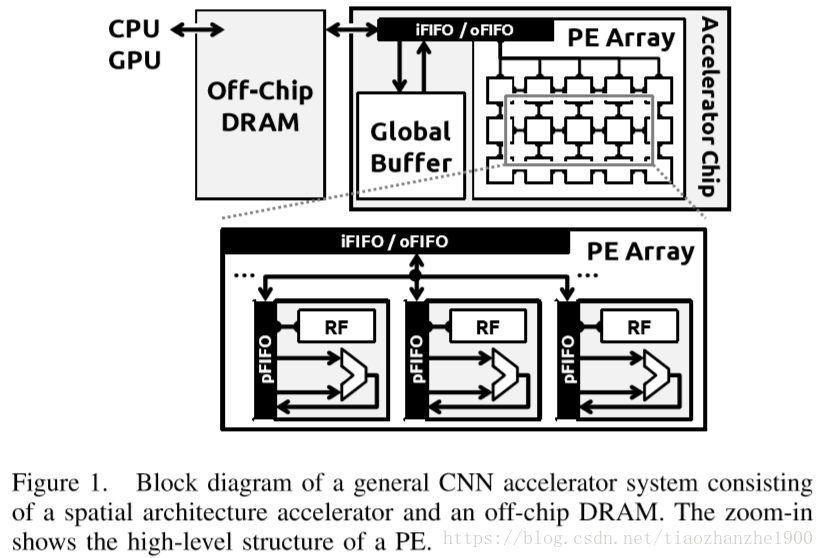
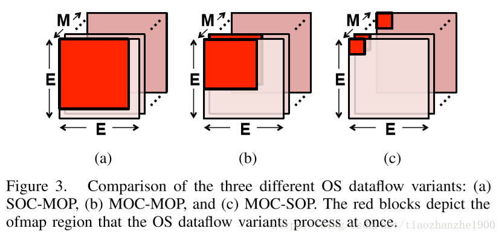
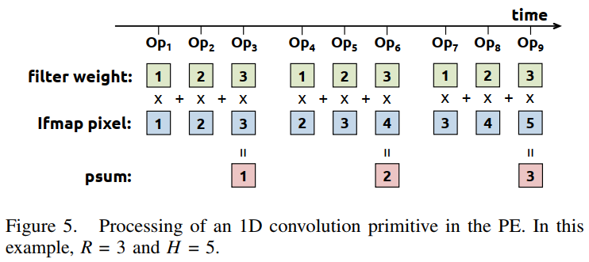
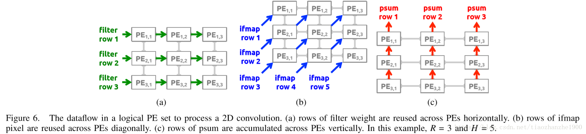
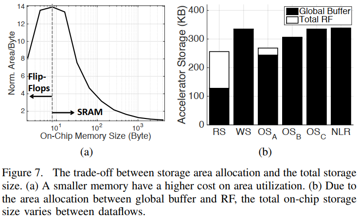
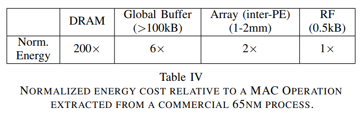
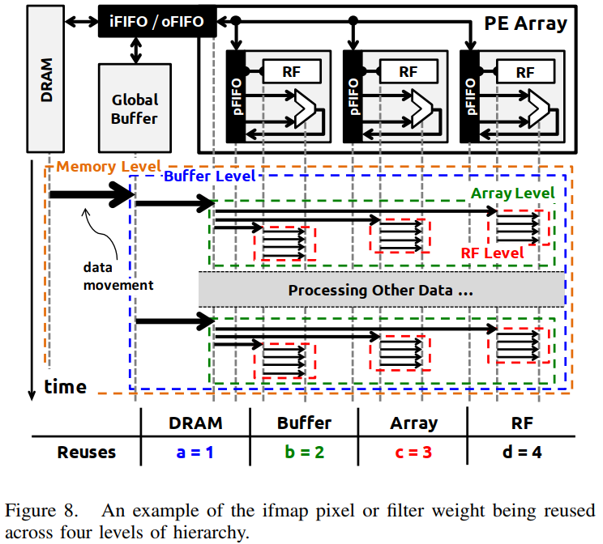
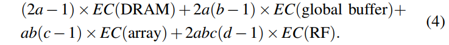
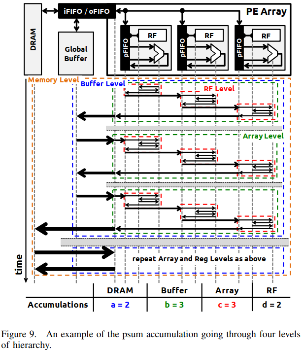

# Eyeriss: A Spatial Architecture for Energy-Efficient Dataflow for Convolutional Neural Networks  

## remark

本文主要针对CNN的两个问题：吞吐率和功耗，提出了自己的加速器结构。这和另一篇文章基本上是同时发布的，但是两者的侧重点不同，这篇更加注重对方法的分析讨论和验证。本篇对RS的解释更加清楚，明确提出了logical PE和physical PE的区别，并提出了比较不同结构加速器能耗的方法。其中PE和存储器的安排使得本文的设计在有一定吞吐率的情况下有了更低的功耗，值得参考。

# 缩写

- RS: row-stationary
- NoC: network on chip
- RF: register file
- ISP: image signal processing
- SA: Spatial architecture

# 1abstract & introduction

**本篇论文的主要贡献**

1. 对现有CNN dataflow的分类
2. 基于row stationary的spatial architecture，优化了所有类型的数据流
3. 对不同CNN dataflow的量化的分析框架
4. 对不同CNN dataflow的比较分析

# 2 spatial architecture

**Spatial architecture的定义：** class of accelerators that can exploit high compute parallelism using direct communication between an array of relatively simple PE.

**Spatial architecture的分类：**

- 粗粒度Spatial architecture
- 细粒度Spatial architecture

**粗粒度Spatial architecture的优点：**

- CNN层的操作都很统一，可以大量并行
- PE内部的数据交流可以高效的利用

FPGA一般使用集成DSP来组成PE的数据通路。无论哪种方法，问题都在于如何将CNN映射到SA上，并且能提高吞吐率和降低功耗。

下面开始介绍本设计的结构，如下图，主要是4部分

+ GLB：提高数据重利用，掩盖DRAM很慢的读写速度。100-300kB

+ PE：由NoC连接，NoC由数据流向决定
  + ALU：MAC和加法
  + RF：register file，即spads，1kB

+ PE FIFO：iFIFO&oFIFO
+ DRAM

四级存储：DRAM, GLB, NoC, RF(spad)。读取数据功耗又高到低排列。

# 3 CNN background

## B CNN的挑战

**CNN的挑战：**

1. 大量数据处理：①带宽以及功耗；②大量中间数据带来的存储压力和额外的读写功耗

   解决：①输入数据的重利用，包括卷积数据，核数据和ifmap:

**输入数据的复用：**

- convolutional reuse：权重可以复用 $E^2$次，输入特征图的一个像素可以复用 $R^2$次
- filter reuse：一个batch有N个输入特征图，故权重可以复用N次
- ifmap reuse：一共M个kernel，故一个输入特征图可以复用M次

②合适的操作安排

**如何缩小存储空间：** operation scheduling： $CR^2$个部分和压缩成一个结果。然鹅最大化的输入数据重利用不能和psum的压缩同时达成，因此要达到高吞吐率和低功耗需要同时考虑输入数据重利用和部分和累加。

2. adaptive processing：同一网络不同层之间相差大，硬件难以被固化，数据流也要适应不同形状。因此硬件结构必须是可编程的，以动态地映射高效的数据流。

## C CNN与传统图像处理的区别

- CNN的滤波器权重是训练得到的
- ISP主要用二维卷积

# 4 现有的CNN dataflows

## A weight stationary(WS) dataflow

Each filter weight remains stationary in the RF to maximize convolutional reuse and filter reuse.

## B output stationary(OS) dataflow

The accumulation of each ofmap pixel stays stationary in a PE. The psums are stored in the same RF for accumulation to minimize the psum accumulation cost.

## C no local reuse(NLR) dataflow

通过inter-PE communication对输入特征图和部分和进行复用，有点像脉动阵列

# 5 Row stationary dataflow

目前存在的数据流不能同时最大化输入数据重利用和最小化部分和累加的代价。本文提出了一个能够同时做到这两者并且能适应、优化不同卷积形状、减少移动开销的方式。

## A 1D Convolution Primitives  

每个primitive operates是对一行权重和一行输入特征图像素进行计算，产生一行的部分和，每个primitive是在一个PE上计算。对于一个PE来说，这一行权重会被复用好几次，这里就是**convolution reuse**，行是静态的（row stationary）。

由于整个卷积涉及到成百上千的primitives，所以具体怎么将primitive映射到PE上是很重要的，这会大大影响功耗。

## B two-step primitive mapping

映射分为两步。映射静态地发生于计算开始之前，所以不需要在线的计算。

先是 **logical mapping**，理论上需要很多一维卷积的操作，数量会远大于硬件已有的PE阵列，这时候我们理论上需要的PE阵列被称为logical PE（如图6）。filter的行横向排列，ifmap按对角线排列，他们同时被重利用，最后垂直累加就能得到部分和的结果。（具体见Eyeriss: An Energy-Efficient Reconfigurable Accelerator for Deep Convolutional Neural Networks）假设输入特征图batch size是N，input channel为C，output channel是M，那么完成整个卷积运算需要$N×M×C$个logical PE。

然后是 **physical mapping**，也就是将logical PE进行相应的折叠，使它能够映射到physical PE上。它能够折叠的原因有二：①这样在PE间保持了logical PE内部的卷积重利用和部分和累加；②在$N×M×C$个sets之间存在别的可能的重利用和累加：

1. 同一个权重可以复用N次
2. 同一个输入特征图像素可以复用M次
3. C个通道的部分和输出可以累加到一起

因此将不同组但位置相同的logical PE sets折叠在一块physical PE上之后我们就可以在RF的层面上更深入地重利用。具体有多少logical PE sets折叠和映射到physical PE上分别由RF的大小和物理PE阵列大小决定。最后再用6-C提到的准则看如何优化的情况最好。

映射之后physical PE能够同时处理的一批logical PE被称为一个processing pass。一个pass也不能完成一层卷积，因此需要进一步的折叠。GLB就负责在不同passes之间进一步寻找数据的重利用并且存储中间变量。第二阶段的折叠程度由GLB大小决定。

## C energy-efficient data handling

RS数据流之所以可以优化所有数据的移动是因为它充分利用了存储的层次，以下层次功耗由低到高排列并一一介绍：

1. register file：第一阶段的折叠之后RF可以用于所有类型的数据移动来探索可能的重利用。每一个primitive里有卷积重利用、部分和累加，被折叠的primitive之间有filter和ifmap的重利用还有部分和累加。
2. array/inter-PE communication：在这一个层次所有卷积内部的重利用全部完成。这时filter和ifmap的重利用可以通过将多个将多个logical PE sets空间映射到physical PE组，同时完成部分和累加。（:question:）
3. global buffer: 在第二阶段的折叠之后根据GLB的大小会继续完成ifmap的重利用和部分和的累加。

## D Support for Different Layer Types  

- FC layer：跟卷积很像，即kernel和输入特征图尺寸一样，没有convolution重利用
- pool layer：把PE的MAC计算改成MAX比较即可。

## E Other Architectural Features  

**NoC data type：**

1. 对ifmaps和权重的NoC多路广播
2. 本地PE-to-PE NoC对部分和

**利用稀疏性：**

- 只对非零值read和MAC
- 压缩数据

具体内容参照论文：Eyeriss: An Energy-Efficient Reconfigurable Accelerator for Deep Convolutional Neural Networks

# 6 实验方法

## A dataflow implementation

本节旨在找出现有数据流设计方法的共同点来表征它们的关键特点

### weight stationary

每个PE内一次存储一个权重。部分和要么转移至相邻PE要么进入GLB，PE以脉动阵列的形式工作。对GLB的要求很高。

### output stationary

每一个PE每次计算一个ofmap的像素。

### no local reuse

没有本地的RF，所有类型的数据全部存储在GLB里。

## B setup for dataflow comparison

本节提出了一个比较不同数据流性能的方法：将硬件的面积和处理的并行度固定，存储空间也固定（只是分配在不同的部分），再比较性能。一般而言同等存储大小的情况下RF占的面积比GLB小（如图7a）。图7b展示了所有数据流在256个PE的情况下需要的存储空间。

对于吞吐率而言，因为能提升吞吐率的技术有很多，所以数据传输不是影响吞吐率的重要原因。

## C framework for energy efficiency analysis

功耗主要由两个因素影响：①输入数据重利用和部分和累加的策略；②数据的来源，不同来源功耗不同。

我们的目标是在考虑所有数据获取的情况下找到更低功耗的方法。

本节提出一个framework可以用于对所有SA进行优化。

### data movement hierarchy

按能耗大小由高到低分为四级：DRAM，GLB，NoC，RF。两级之间传输数据的功耗由功耗更高的一级决定。

### analysis methodology

由于功耗主要有两个来源：输入数据和部分和累加，计数一共向不同级别的存储进行存取的次数再求加权和即能得到总的功耗。

#### 1) input data access energy cost

最佳情况是数据从DRAM输入RF一次，然后ALU读取RF很多次。然鹅实际情况中由于存储和运算安排的限制，这很难做到。我们将每一级的重利用定义为 *the number of times each data value is read from this level to its lower-cost levels during its lifetime.*  

e.g. 如图8所示，如果将一组数据在DRAM、GLB、NoC、RF读取的次数设为a, b, c, d, 那么整体的重利用带来的功耗计算公式如下：

EC即为表4里的数值。

#### 2) psum accumulation energy cost

基于和输入数据相似的推导，本文提出了累加带来的功耗公式。

#### 3) obtaining the parameters

对于数据流里的每一种数据（ifmap, filter, psum），都有一组参数（a, b, c, d）与之对应。硬件将会根据公式计算出功耗最低的优化方案。

## D dataflow modeling side note

实际情况下不同大小的GLB、RF，传输距离不同的NoC带来的功耗会有差异。