# Eyeriss v2: A Flexible Accelerator for Emerging Deep Neural Networks on Mobile Devices  
## remark

本篇文章主要介绍了三个技术：HM-NoC、稀疏PE编码运算以及PE内部的SIMD，可以参考。HM-NoC可能有别的参考，后面会继续阅读。

## 缩写

iact： input activations 

HM-NoC：hierarchical mesh network

数据类型：三种，即iact，weight和psum

CSC: compressed sparse column

## 摘要

由于DNN的应用逐渐广泛，对实现DNN的平台要求更少的资源和更小的面积，为了使DNN模型更小、更易于硬件实现，出现了更加紧凑、数据更加稀疏的DNN，它们和以往的DNN相比形态更加多变，需要更专业的硬件进行性能提升。因此本文提出了一个专门为紧凑和稀疏DNN设计的加速器。为了应对多变的层的形状和大小，本文提出了一个非常灵活的片上网络，叫hierarchical mesh，它可以适应不同的数据重利用和不同数据类型的带宽需求，从而提高计算资源的利用率。此外，eyeriss v2可以在紧凑域直接处理系数的权重或者activations，因此可以提高稀疏模型的处理速度和降低其功耗。

## 1 introduction

为了降低DNN的计算复杂度，常见的方法有

+ 降低权重和activations的精度
+ 压缩网络架构
+ 提高filter里权重的稀疏度

这些理论上的方法需要实际的硬件实现从而查看在功耗和速度上的提升。

目前硬件上实现低精度的加速器有很多，本文从另外两个方面进行补充探究。

### A challenges for compact DNNs

现阶段在追求更高精度的同时也在限制DNN的大小，因而产生了很多各种形状和大小的DNN。紧凑型DNN使得DNN的任何一个维度都有可能变小。下表展示了不同维度以及其被减小的原因。这说明我们能对DNN维度做的假设变少了。

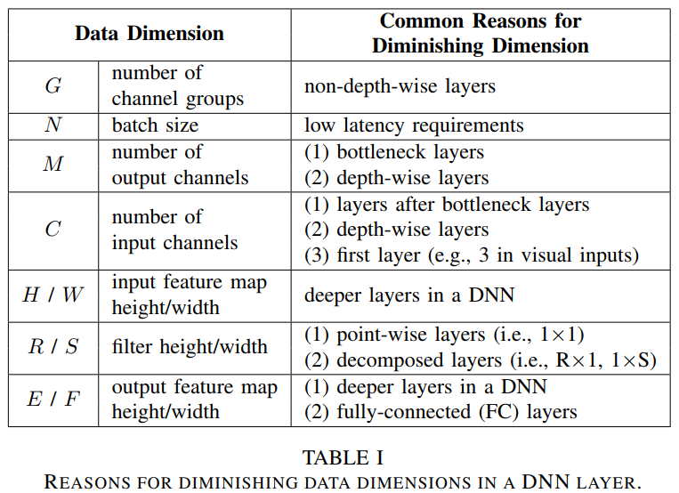

对于硬件而言，形状相差巨大的DNN层，尤其是减少的维度，会带来很大的挑战，因为这使得DNN的一个关键性质发生改变：数据重利用。数据重利用对硬件加速器来说就意味着提高效率。三种数据（iact, weight, psums），能被重利用的次数是层的形状和大小的函数。缩减的数据维度说明从任意一个特定角度发掘数据的重利用变得更加困难。

上图展现了最近出现的DNN的各种变形，可以看到整体的数据重利用率降低，这给硬件加速器的设计带来了两大挑战：

#### 1) array utilization

目前流行的加速器一般会事先选择一个维度来寻求PE的并行性来获得高性能和数据的重利用性来降低功耗。下图展示了常用的两个方法。

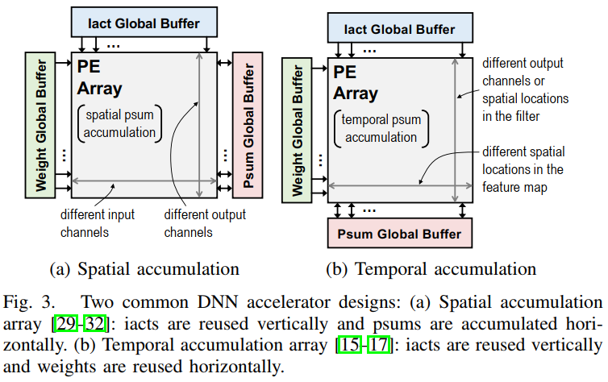

如果DNN的维度降低，那么PE组的利用率和总体的能源效率也会降低。因为PE组在不断变大，降低的维度使得DNN更难填满PE组，低效的问题会更加严重。

下图展示了一般PE阵列在实现depth wise卷积时遇到的难以利用全部PE的问题。由于RS的灵活性，本设计的eyeriss可以有更高的利用率。

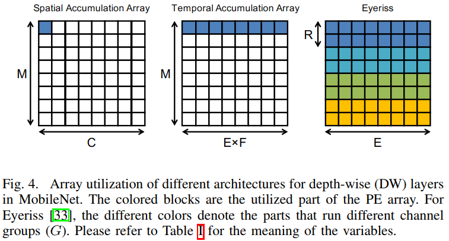

#### 2) PE utilization

更低的数据重利用率意味着我们需要更高的带宽来使PE保持忙碌。而如果NoC针对更高的带宽进行优化，它可能不能在可以的时候利用数据重利用。

:three:一个额外的挑战是当我们在设计硬件时我们并不知道所有需要实现的DNN是什么样的。（:six_pointed_star:我们的设计应该是知道的）因而硬件需要足够地灵活来支持多种多样的DNN。

### B challenges for sparse DNNs

sparse activations出现的原因：①ReLU函数的使用（超过90%的0）；②自编码器和生成对抗网络的流行（超过75%的0）。

sparse weights出现的原因：对权重的修剪（90%的0）。

稀疏性可以以两种方式提高能源效率和处理速度：①MAC计算可以被门控（降低功耗）或者跳过（降低功耗且减少运行周期）；②权重和activation可以被压缩以减少存储（降低功耗）和数据移动（降低功耗且减少运行周期）。

但是由于以下两个原因，这些好处很难真正被利用：

#### 1) irregular accesses patterns

计算门控是一个有效的方法。为了同时提高吞吐率和节约功耗，我们需要考虑如何跳过0。这需要一个更复杂的逻辑电路。一个自然的方式是将权重和iacts进行压缩，但压缩后数据会有不同长度而且只能串行读取。而且如果权重和iacts里有一个0就需要跳过，压缩编码很难做到这一点。压缩编码带来的不规律也会使我们不能使用pre-fetching来提高吞吐率。所以压缩编码很麻烦。

因此目前各种加速器在这方面做的并不好。（包括我之后要看的cambricon-x和EIE）

#### 2) workload imbalance and PE utilazation

PE间工作量的不平衡会使得整体的吞吐率由工作量最大的PE决定，使整个PE组的使用率下降。

### C contributions of this work

针对以上提出的4个挑战，本文提出了eyeriss v2，一个可以适应多种多样压缩DNN的加速器。本文的主要贡献如下

+ 一个名为hierarchical mesh新颖的NoC，它可以适应不同的带宽需求。
+ 一个能发掘权重和activations的稀疏性的PE，从而能实现多种多样的DNN层的同时提高吞吐率和能量效率。
+ 一个包含上述贡献、能支持压缩和稀疏DNN的加速器eyeriss v2。

## 2 architecture overview

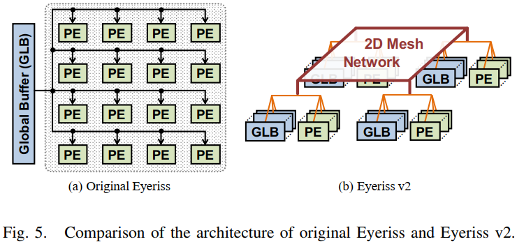

eyeriss v2和原版不同的地方在于它采取了层次的结构，PE和GLB被分成一簇一簇的以支持一个灵活的NoC，和原版一样它采用了一个分离的NoC来传输三种数据（iacts、weights、psums）。

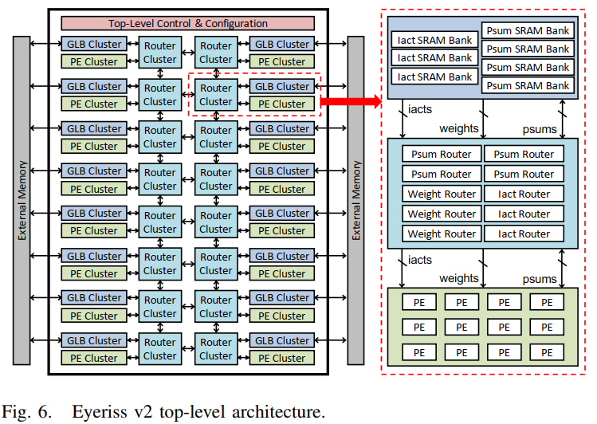

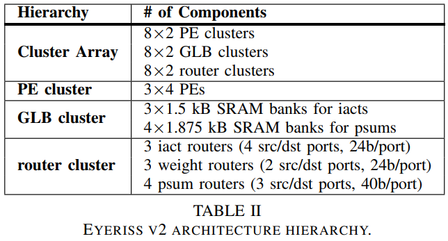

一个有层次的NoC被用于连接PE和GLB：PE和GLB簇通过2维的由路由器簇组成的片上网络连接。在一个路由器簇内部，有3个路由器给iacts，3个给weight，4个给psum。在PE簇和路由器簇之间，我们使用了一个all-to-all的NoC来连接所有PE和路由器，每一种数据类型都有。具体内容见第3部分。

在两级结构的存储里数据是这样流动的：

+ iacts 从片外读取至GLB簇，可以根据配置直接送入GLB存储或者直接送入路由器簇。
+ psums 一旦被移出PE簇就被存储在GLB里。最终的结果会跳过GLB直接发往片外。
+ weights 不被存储在GLB里，穿过路由器簇之后最终会直接存储在每个PE的spads里。

v2沿用了RS结构，并且深入挖掘了通过任一层维度将MAC操作排布在PE上。

每一个PE都包含了MAC数据通路来处理8位定点数的iacts和weights（8位常用于推断器）。iacts可以是有符号数或者无符号数，因为大多数层收到的iacts都是经过ReLU函数的，这进一步拓宽了iact的表示范围。psum的精度为20位。累加结束后，20位会被转换成8位并送到片外。PE包含分开的spads用于存储iact、psum和weight。具体内容见第4部分。

v2和原版的相似之处也在于它采用了两级的控制结构。

+ 系统级控制逻辑协调片外数据获取和GLB及PE之间的数据传输。

+ 低一级的控制逻辑控制PE内部运行。

在处理每一层DNN时，芯片可以被配置成能够最大限度提升能效和吞吐率的状态。这包含了给NoC设置特定的数据通路，流向GLB或者spads的数据和每一个PE分配的工作量。对于每一层而言，一个描述了优化配置的2134-bit的指令会被发送到芯片并且在处理这一层的过程中被静态地读取。一次只会处理一层。当一层处理结束，芯片会被重新配置以处理下一层。

## 3 flexible hierarchical mesh on-chip network

如果想支持紧凑型DNN，需要一个灵活且高效的NoC。本部分介绍NoC的实现和如何配置。

### A motivation

NoC是现代DNN加速器里不可或缺的一部分。其设计需要考虑：①通过在存储和数据通路之间高效传输数据以支持高并行的处理。②发掘数据重利用以减少带宽需求和提高能效。③具有可扩展性。

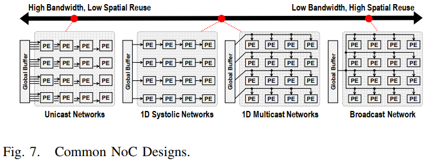

由于每一种数据类型的重利用率不能被同时发掘，一般会使用上图的NoC的混合版本。这种设计方式适合大型DNN，紧凑型DNN会使这种方法效率降低，主要是因为对紧凑型CNN来说很难预测其数据重利用率或者每种数据类型的带宽，因为这些都会随着层和DNN类型改变，这给NoC的设计带来了很大的挑战。

+ broadcast network可以发掘最多的数据重利用率，但是当重利用率底的时候它的低带宽会限制吞吐率。
+ unicast network可以提供最高的带宽但是会错过一些数据重利用的机会。
+ 将两者结合，一个all-to-all的网络可以承受变化的数据量和带宽需求。但其设计开销和节点数（PE数）成平方关系，因此难于扩展。

### B high-level concept and use cases

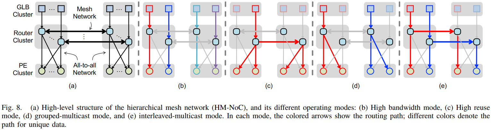

为了解决上述问题，本文提出了一个hierarchical mesh network（HM-NoC），如上图a所示。它利用了all-to-all网络的优势，并通过制造两个层级解决了难于扩展的问题。all-to-all的范围被限制在12个PE内部（一簇），这大大减少了开销。在顶层，每一簇进一步用一个网格网络连接。例子中展现了一个2×1的网格，实际在eyeriss v2里使用的是8×2的网格。这样扩展起来更加方便，实现开销和节点数成线性关系而非平方关系。

图8b-e展现了HM-NoC能够被配置的四种状态。配置由数据重利用的机会和带宽需求决定。

+ *高带宽模式*：图8b，每一个GLB或者片外数据I/O可以独立地将数据传输至簇里的PE，达到了unicast的效果。
+ *高复用模式*：一个来源的数据可以路由至不同簇的所有PE。达到了broadcast的效果。
+ *grouped-multicast和interleaved-multicast*：当重利用并不需要使用整个PE阵列时使用，如图8d、e。

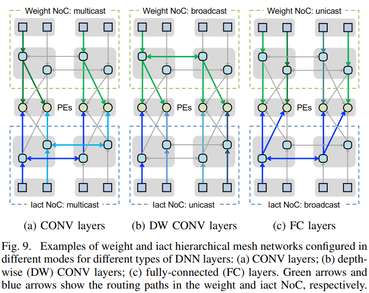

上图是几个HM-NoC的例子，为了简单起见，例子里只使用了2簇PE组，每簇里只有2个PE，并且省略了psums的NoC。但是对于所有类型的数据和大规模网络，对NoC使用的规则是一致的。

+ conventional CONV layer（图9a）：在普通卷积层里存在着大量的iacts和weights的复用。为了使4个PE以最低的带宽需求保持忙碌状态，我们需要从数据源取出2个iacts和2个weights。在这种情况下，iact和weight都被配置成grouped-multicast模式，其他的被配置成interleaved-multicast模式。
+ Depth-wise(DP) CONV layer（图9b）：由于没有输出通道，这里几乎没有对iact的重利用。因此我们就仅仅通过broadcast把weights传播到所有PE上，同时从单一的来源取出iact。
+ Fully-connected(FC) CONV layer（图9c）：和DP相反，FC对weights的重利用很少，尤其是当batch的大小有限时。在这种情况下，本例和上一例的weights和iacts的状态恰好相反。

### C implementation details

为了实现上 一节所说的功能，每一个HM-NoC都会采用circuit-switched routing。circuit-switched routing由mux组成，并且会被配置比特静态地配置（第2节描述的）。因此每一个路由器的实现代价是很低的。每一种数据类型都有一个分离的HM-NoC为其量身定做一个数据流。每种数据的路由器的具体说明见表2（见前）。对iact和weight而言每一个端口是24bit的，这样它们可以传输3个8bit的未压缩数据或者一对12bit的压缩数据。（第4部分讲压缩）对于psum，其位宽是40bit，每个周期可以收或发2个psums。下面来介绍每一种数据类型中路由器、GLB和PE是如何相连的。

#### 1) HM-NoC for input activations

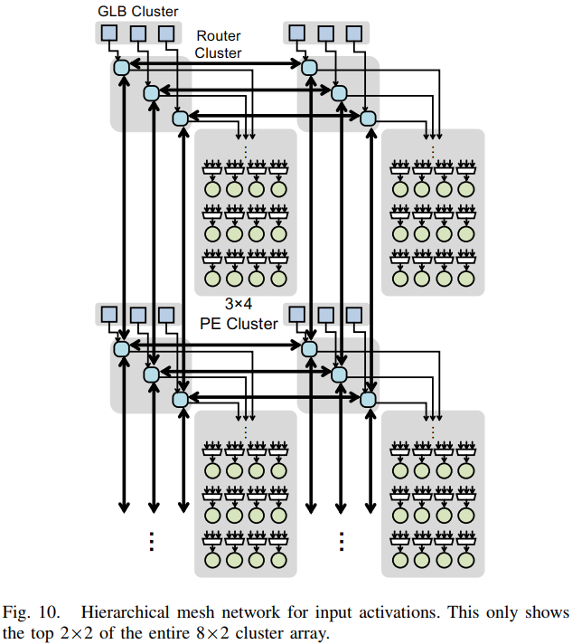

每个路由器簇里有三个iact路由器，对应于GLB里的三个iact SRAM。每个路由器有四个源端口（用于接收数据）和四个目的端口（发送数据）。其中3个源和目的端口用于和网格里的其他簇来接收和发送数据（加粗的线条）。尽管一个典型的网格网络需要四对源和目的端口，由于我们只有8×2的簇，我们只需要3对，因此其他东西方向上的端口可以被忽略。第4个源端口接收来自GLB簇或者片外的数据，第4个目的端口连接至所有3×4个PE。由于PE簇all-to-all的连接，从任何路由器来的任何数据可以传输到同一簇的任何PE。

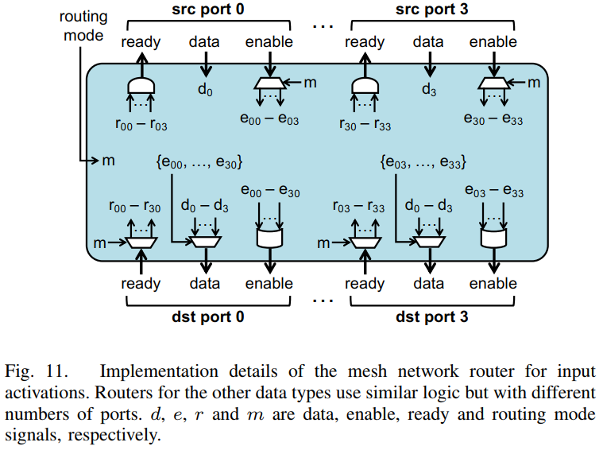

上图展现了mesh network的实现细节。每个端口除了数据口（d）以外还有就绪（r）和使能（e）口，用于握手。每个源端口生成4个使能信号，每一个都对应一个目的端口，根据其自身的使能信号和静态配置路由模式（m）确定。m有以下几种模式：unicast，horizontal multicast，vertical multicast或者broadcast。这决定了哪一个端口可以用于通过数据。例如在horizontal multicast下，垂直方向连接其他路由器的端口将不会使能。在每个目的端口，来自源端口的使能信号经过一个或门后生成最终的使能信号。从目的端口到源端口的就绪信号有相似的生成方式，除了它是通过一个与门。最终源端口的输出数据会在目的端口进行选通，并且会根据源端口来的使能信号进行选通。也就是说来自使能的源端口的数据可以通过。

#### 2) HM-NoC for weights

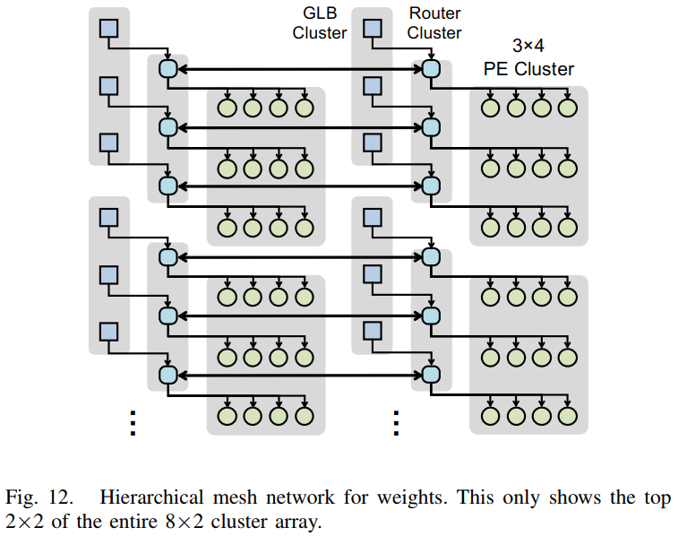

如上图所示，每一个路由器簇里有三个权重路由器，每一个路由器刚号对应一行PE。由于eyeriss v2使用RS数据流，所以我们可以在PE内使用spads发掘大量的权重重利用，而且只有水平的PE需要被发掘重利用。因此NoC对于权重的实现可以在HM-NoC的两个级别上同时简化，并且依然满足灵活性。2维网格在簇之间垂直方向的的连接可以被移出。此外，在每一簇里，每一个路由器只需要连接一行PE。与此对应，每一个权重路由器有两个源端口和两个目的端口和相邻的簇进行通信。我们只需要一对端口，因为我们仅仅有8×2个簇，东西方向的端口可以被省略。第二个源端口连接GLB以接收片外数据，第二个目的端口连接簇内的PE。具体的实现和图11类似。

#### 3) HM-NoC for partial sums

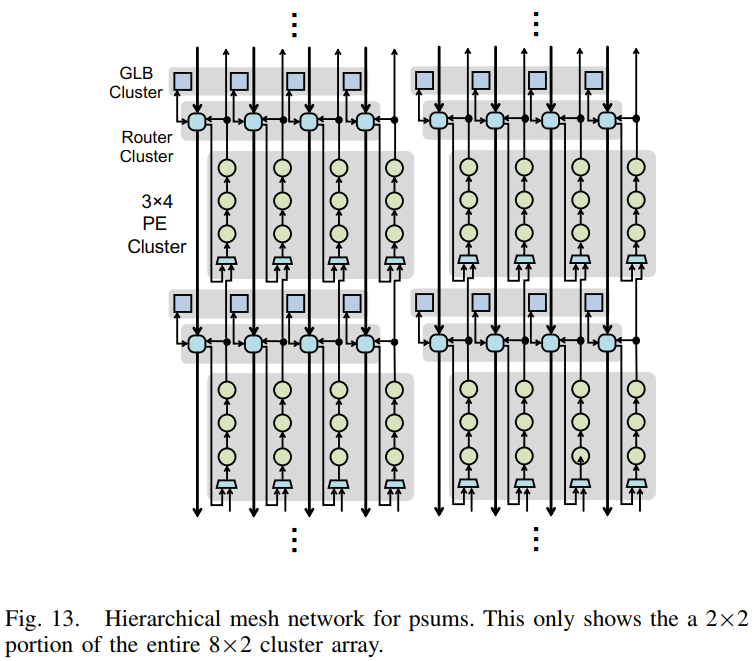

实现如上图。每一个PE簇里有4个部分和路由器，一个对应GLB簇里的SRAM bank或者PE簇里的一列PE。和权重NoC相似，因为RS数据流的设计，部分和的NoC设计被简化了，即部分和的累加只在垂直方向进行。因此水平方向的连接可以被移除。在每一簇内，PE之间垂直相连，每一个psum路由器只需要将psum发送到PE列的底端，再从PE列的顶端接收新的部分和。因此，每个psum路由器有三个源端口和三个目的端口。一个源端口用来接收相邻的路由器簇向北来的数据，一个目的端口用来向南发送数据到相邻的路由器簇。第二对源和目的端口通向GLB，第三个源端口通向PE列的顶端PE

### D scalability

另一个HM-NoC的设计要点是强大的可扩展性，在PE增多时性能（吞吐率）也要有同等的增量。但是性能是一个和很多因素相关的函数，包括NoC设计，片内片外的数据带宽等等。为了测试HM-NoC的影响，我们在下面的实验中假设片外带宽无穷大并且不存在工作量不均衡（即没有稀疏性）。

我们对三种规模的PE进行了可扩展性测试：256个PE,1024个PE和16384个PE，每一个PE的处理速度在1MAC/cycle。每一个PE簇里有固定大小的队列，即4×4个PE，8×8个PE和32×32个PE。为了比较，我们也测试了原版eyeriss的可扩展性，PE被排列成正方形，即16×16，32×32和128×128。两个版本的eyeriss都采用RS数据流。为了能快速评估大规模的架构，我们建造了一个分析模型，它可以考虑不同规模的两种eyeriss不同NoC的数据分布和带宽限制，寻找最佳性能的运行映射。

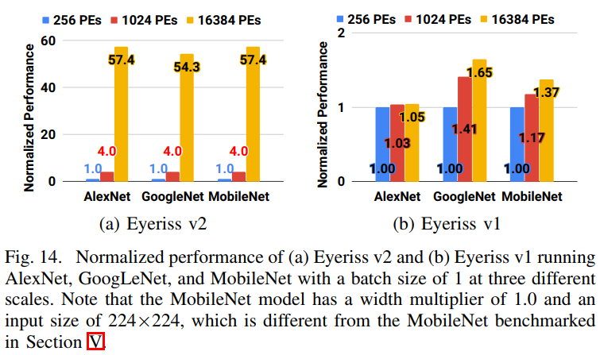

上图为实验结果。v2从256PE到1024PE有一个线性增加，到16384个PE时有85%的线性增加。而v1几乎没有性能提升，因为它的broadcast带宽太窄了，而v2可以适应更高的带宽需求，而且可以同时发掘数据重利用以达到更高的能效。需要注意的是最终的性能瓶颈将来自片外数据带宽。

第3-C部分描述的是8×2个PE组，当扩展时需要进行调整，尤其是iact和weight的网格路由器需要一对额外的源和目的端口来处理多于两列PE的数据传送。路由器占的面积和功耗都是非常小的，扩展也不会带来很大的影响。

## 4 sparse processing with SIMD support

原版的eyeriss里利用稀疏性提高能效的方法是门控。v2要探索如何同时利用权重和iact的稀疏性来提高能效和吞吐率。v2将会在PE内部都采用压缩的数据来减少片上带宽和片上存储的需求。然鹅，压缩数据往往会有变长，如何操控这些数据成为了一个挑战。本节将会介绍一个新的PE结构，它可以处理压缩数据并且支持SIMD，每个PE一个周期可以处理两个MAC。

### A sparse PE architecture

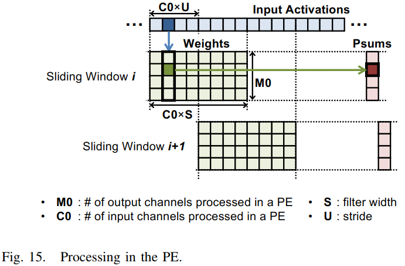

回忆RS数据流，许多一维的行向量权重和iact被映射到一个给定的PE上并且以一种滑动窗口的方式被处理；在这里，C0×M0行权重乘S后被分配到PE处，以及属于M0输出通道和C0个输入通道的权重:question:(here, the C0 × M0 rows of weights with width S are assigned to the PE, and the weights belong to M0 output channels and C0 input channels. ) 对于每一个iact，PE在连续的周期中按顺序运行，让它和对应列中的M0个权重进行MAC操作，并且累加M0个部分和。通过走过数据流中的一个C0×S的iact窗口，整个运行过程走过矩阵中所有M0×C0×S个权重并且累加同一个M0中的部分和。然后它通过替换窗口前的C0×U个iact滑向iact流里的下一个窗口，然后和同样的权重矩阵重复这个操作，只是累加另一组的部分和。注意，对每一个iact的窗口，权重的接触模式会以一个以列为主的方式顺序经过整个权重矩阵一次。

当iact和权重，或者iact和weight之中有一个是稀疏的时候，为了加速整个处理过程，我们的目标是只读iact流和权重矩阵中的非零值。此外，只有当iact和weight都不为0的时候我们才会想进行操作。挑战在于准确有效地对所有数据类型进行处理。例如，当在两个不为0的iacts间跳跃时，权重的获取模式不再是按顺序经过整个权重矩阵。而是，我们需要一个额外的逻辑电路来取对应列的权重给不确定的非零iact。相似的，当在两个处于同一列的权重之间跳跃时，它需要计算对应部分和的地址而非简单地将地址加一。由于获取顺序的不确定，从spads取权重出来变得很有挑战性。

为了能完成上述的稀疏数据处理，我们将会采用compressed sparse column (CSC) 的数据形式（:six_pointed_star:类似于两篇论文内提到的，其中一篇EIE之后会读到，另一篇A scalable sparse matrix-vector ´multiplication kernel for energy-efficient sparse-blas on FPGAs  以后可以阅读）对于每一个非零的数据，CSC形式会记录一个值，这个值是非压缩形式数据中从上一个非零数后到目前这个非零数之间0的个数。这个和RLC很像，这个计数值会在之后被用在计算非零数之间的地址变化。CSC比RLC好在它有一个额外的地址值，从而允许数据被分成块，便于处理，当然也增加了开销。

iact和weight都被编码成CSC的形式。对于iacts，数据被分成不重合的C0×U个部分，每一个部分都分别编码成CSC。这样就允许了滑动窗口的操作，当窗口滑动时，只需要把数据换成新的一个部分就好。由于每一个部分的数据长度会变，需要额外的地址值来指向被编码的部分。因此，对于每一个编码之后的部分，一个地址值也会附在后面，这个地址代表被编码的部分在整个编码好的数据流的位置。权重也会被CSC编码，每一列M0个权重会作为一个部分并且分开编码。这也就能快速获取每一列的非零权重。

上图为权重编码的一个例子。当读取第一列权重（从0开始计数）时，读地址向量的[1]和[2]，并相减，就能知道这一列非零的值有几个。根据这个地址可以及时更新部分和的值。

对于计数向量（count vector）的带宽，如果带宽过低，0的个数超过计数值的最大值，可能会降低效率；如果带宽过高，计数向量的开支会变大。根据本文的实验，对8b的数据4b的计数向量最佳。因此存在spads的count-data对为12b。（和RLC类似）

总结：权重和iacts都可以直接以CSC的形式被处理。处理过程中可以完全跳过0并且不花额外的时钟周期，因此提高了处理吞吐率和能效。

上图为PE的结构。只读非零数据会带来读依赖。对于压缩后的数据，地址必须先于data-count对读出。为了保证只有非0数据被读，我们会先读iact，这样只有当iact不为0时非零的权重才会被读取。为了能够兼顾这种读依赖和维持吞吐率，PE采取了7级流水线和5个spads的设计。第一二级流水线负责从spads里读取非零iact。iact地址spad用于存储CSC压缩后的iact的地址向量，也用于给从iact数据spad里读出的值编地址。iact数据spad里存储数据和计数向量。当一个非零的iact读取之后，接下来的3级流水线读取对应的权重。相似地，也有一个权重地址spad对从权重数据spads中读取的数据编地址。最后两级流水线对非零iact和weight进行MAC操作，将更新后的psum送到psum spads或者送出PE。（:six_pointed_star:CSC是按列编码的，但是RS是按行分解的权重，对角线分解的iact？）

对于iact和weight为0或者非零，存在三种情况

+ *若iact为0*：CSC会保证该值不被读出，因此没有时钟周期会被浪费。
+ *若iact不为0*：这个值会被读出并且送到下一级流水线。
  + *若有非零权重与之对应*：非零值会被送入下一级流水线计算。0值的权重会被跳过，因为权重也是CSC的形式。
  + *若没有非零权重与非零iact对应*：非零iact会继续流入下一级流水线。这不一定会引入bubbles，因为经过取权重的阶段后，如果存在多个对应的权重，流水线依旧可以对之前的非零值进行累加。

在eyeriss v2 PE内，iact的地址和数据spads的大小分别为9×4b和16×12b，允许的最大iact窗口的大小为16。权重的地址和数据spads的大小分别为16×7b和96×24b。最大的权重矩阵大小为96×（24b/12b）=192。psum spad的大小为32×20b，能够允许的最大权重矩阵高度为32（也就是输出通道数M0的最大个数）。如果我们充分利用iact spads和psum spad，需要的权重矩阵大小为32×16=512，比最大的192还要大。然鹅，稀疏PE设计可以利用在编译时我们就已经知道权重的稀疏状况这一点，所以保证压缩后的权重可以放入较小的spads是可能的。下面的例子是alex net，可以看到压缩后最大的非零权重也是可以放入spads的（:six_pointed_star:我们的设计在一开始就能知道权重的具体情况，可以确定权重spads的大小）。这样映射相比普通的直接映射减少了不同PE间工作量分配不均的问题，也提高了PE的效率。

当稀疏性不高时，PE可以直接以未压缩的形式处理数据，从而减少了数据传输的额外开支（:six_pointed_star:我们也可以在设计时确定哪些层需要压缩，哪些不需要）。这时iact和权重地址spads都没有工作，因此时钟被门控关闭，降低功耗，CSC形式里的计数值也被固定为0，以便正确地处理数据。

### B SIMD support in PE

由于在一个PE内部MAC占的面积和功耗都非常小，因此引入SIMD以获得至少两倍的加速。

图17展示了SIMD的应用。每个时钟会读取两个权重并对同样的iact执行两个MAC，也就是SIMD的宽度为2，变化在图17中用红色标出。SIMD不仅提高了吞吐率也减少了读取iacts的次数。对于结构上的变化，SIMD需要权重数据spads的字宽为2字宽，这就是权重数据spads的大小是96×24b而非192×12b。psum spads同样拥有两对读写端口，用于每个周期更新两个psum。如果weight的非0值个数为奇数，那么最后一对数据的最后一个数为0。当PE遇到全零的数据计数对，它会关闭第二对MAC数据通路以及psum spad的读写时钟，降低功耗。

