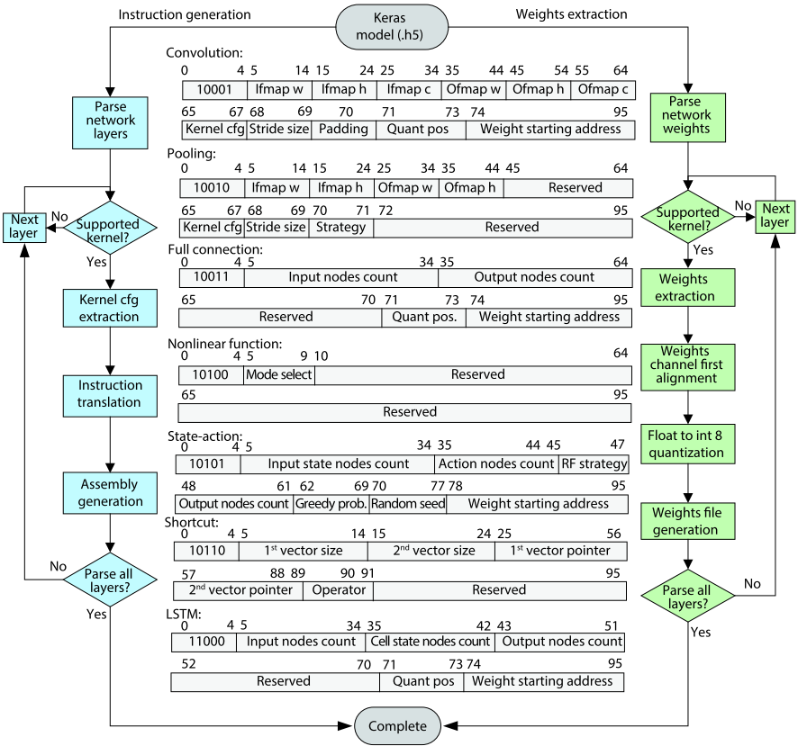
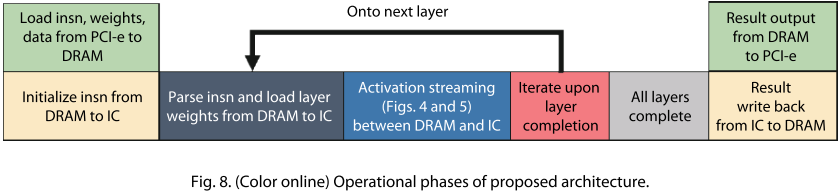
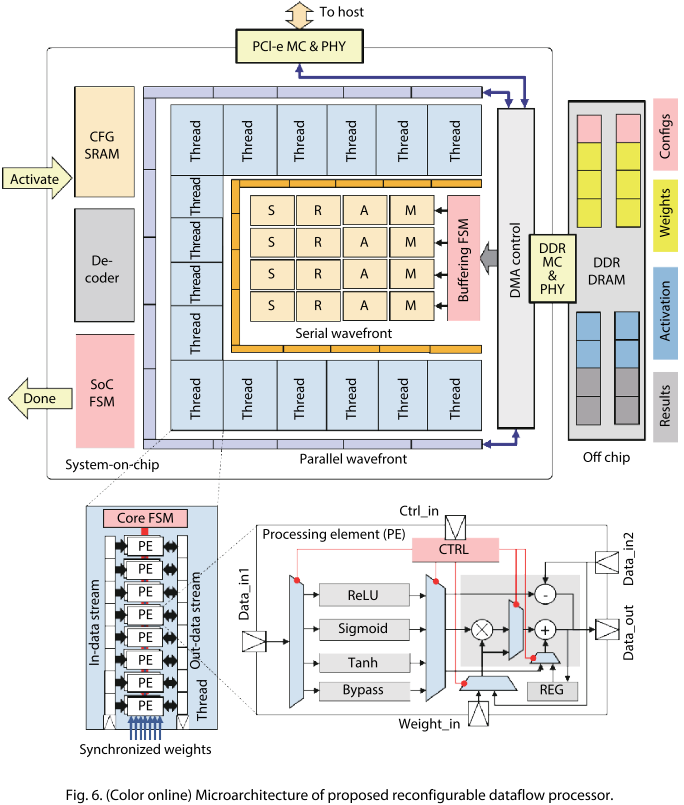

# Accelerating hybrid and compact neural networks targeting perception and control domains with coarse-grained dataflow reconfiguration中的状态机和指令详细介绍

①对于一个神经网络，首先用设计好的软件，一层一层地分解成两个部分：指令和权重。

  软件拆分指令流程：对于一个层，首先看是否支持该卷积核（不支持会跳过，看下一层），如果支持，就提取核的信息，并翻译成对应的指令，产生汇编语言，再按顺序对下一个层进行分析。对于不能直接生成的层（如状态执行），软件会提供图形化界面让用户手动输入层的特性。

​    指令：由操作符（5位）、输入输出操作数的特性、数据量化位宽和权重寻址地址4部分组成，共96位。数据默认从上一层流入。

​              共有7种操作符：卷积，池化，全连接，非线性方程，状态执行（DQN），直连，LSTM。

+ 卷积：包括输入输出图像的长、宽和通道数，核的相关参数，步长，padding，量化数，权重的起始地址。卷积的模式（标准，PW, DW）会根据核的维度自动判别。
+ 池化：包括输入输出图像的长、宽，核的相关参数，步长，策略（最大、最小、平均池化）。
+ 全连接：包括输入输出节点数，量化数，权重的起始地址。
+ 非线性方程：仅含模式选择。（sigmoid、ReLu、tanh、bypass）
+ 状态执行（DQN）：输入状态节点数，执行节点数，RF策略，输出节点数，贪婪可能性，随机数种，权重的起始地址。
+ 直连：包括第一个和第二个向量的尺寸和指针（地址），操作符。
+ LSTM：输入输出和cell state节点数。

软件拆分权重流程：对于一个层，首先看是否支持该卷积核（不支持会跳过，看下一层），如果支持，就提取核的权重信息，使用weights channel first alignment技术进行对齐（在另一篇论文中详述，可以提升性能），并采用浮点数量化成int8的量化技术对权重进行处理，最终生成权重文件（包含权重的起始地址，大小等信息）。然后再对下一个层进行同样的处理。

​                                 对权重进行拆分的目的是最大限度地使用DRAM，方便猝发传输，省去复杂的数据流控制。

②将一个神经网络拆分成指令和权重之后，就可以启动状态机了。状态机大致可以分为三个部分：初始化，计算，输出。里面会涉及到很多步骤如：数据和权重的缓存，多线程之间的同步以及数据处理。

+ 初始化：图8的前两个格子。在这个阶段里，状态机控制将指令、权重、数据通过SERDES（如PCI-e）从主机送到片上的DRAM（每种数据都有专门的区域）。随后指令在从DRAM送入CFG缓冲器。（图6中的CFG SRAM）

+ 计算：这是一个循环迭代的过程，即图8的中间三个格子，持续到所有层计算结束。首先进行取址和译指，并且将硬件线程和PE配置成操作符对应的层或非线性函数。整个过程占8个时钟周期。随后权重和数据便用interleave的方式流入单个硬件线程和PE中进行处理，这样每次传输的权重和数据就是DRAM能够猝发传输的最大值。计算完成后便取下一条指令进入下一层重复上述操作进行计算，中间值都会暂存在DRAM里，控制器不加干涉。
+ 输出：对应图8的最后三个格子。神经网络的每一个层都计算完毕后，结果会输入到DRAM。得到所有结果后系统便将结果通过SERDES送回主机。