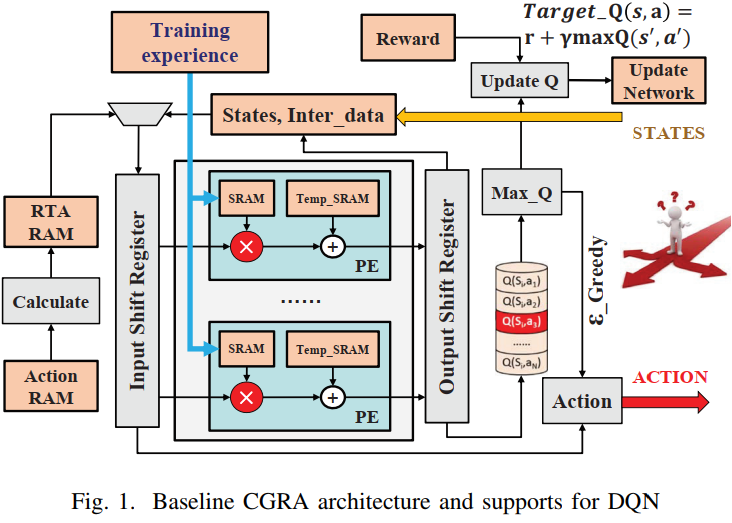
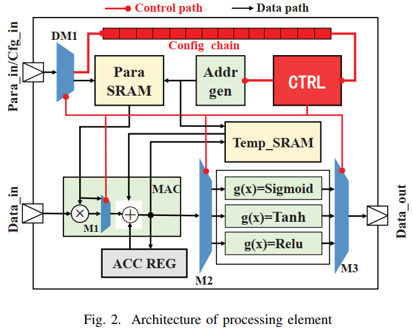
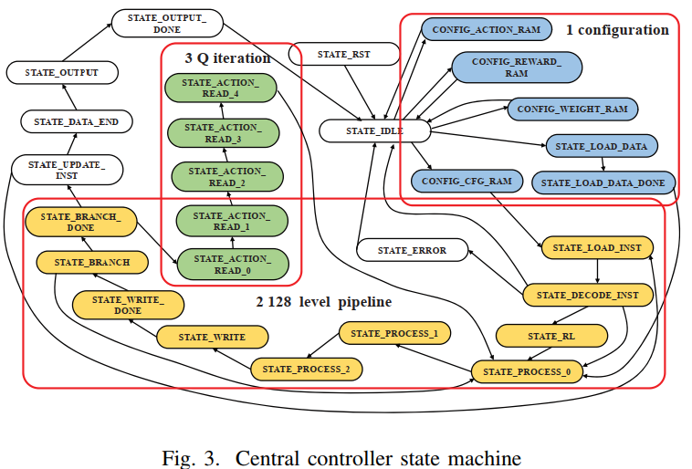

# A CGRA based Neural Network Inference Engine for Deep Reinforcement Learning  

## remark

本文和之前使用FSM的设计是一个作者，设计思路可以参考，但是介绍得很简略，需要阅读更多的文献。本文中涉及到了决策神经网络。我不确定我们的设计中是否需要。

## 摘要

近日飞速发展的人工智能算法需要更专业的神经网络加速器，为了能使深度学习算法在边缘计算节点上实现，这些加速器必须拥有高的计算性能和低功耗。目前前沿的深度学习引擎大多数支持监督学习网络如CNN、RNN，然而很少有AI引擎支持片上强化学习，这是为自主系统设计的最新的决策算法。在本文中，我们设计了一个基于CGRA的、能够同时支持监督学习和强化学习的AI计算引擎。基于65nm工艺和200MHz频率的逻辑综合展现了本设计的物理特性：硅面积为0.32mm^2^ ，功耗为15.45mW。该设计有助于实现端到端的感知和决策网络，在自动驾驶、机器人和UAVs等领域有广泛的应用。

## 正文

### III 为增强学习设计的CGRA

神经网络和以数据流为中心的信号处理算法有相似之处。

#### 基本结构

①顶层架构

如上图显示，顶层的CGRA架构是根据流入流出设计原则设计的。数据流从片上SRAM或片外DRAM流入位移寄存器，经过处理后重新流入这些存储器里。和用脉动阵列实现的加速器相比，本设计使用了已为的PE阵列，通过移除为了取数据而设计的高扇出crossbar而节约了大量的功耗。层间数据和小型神经网络的系数由于高效的能耗易于存储在SRAM上，然而先进前沿的网络的数据只能被存储在片外并且动态地流入。为了使这个情况更加便利，我们设计了一个能够对网络进行取指和译指的中央控制器。总共128个PE放在片上，共享同一个输入数据流，数据流的长度不定。

②PE

如上图，又控制模块，存储模块和运算单元组成。控制模块由配置寄存器，一个处理状态机和一个地址生成单元组成。一个基础的计算模块包括一个乘法器，一个加法器和一个支持ReLU激活函数的模块。存储模块由参数SRAM，暂存SRAM和累加寄存器组成。参数SRAM存储网络系数，在新的网络层被译码时更新；暂存SRAM用于存储写入输出寄存器前的中间数据。目前PE支持的模式有卷积、池化、全连接和DQN的状态行为网络。各种各样的处理模块分享同一个计算资源（如乘加单元和参数SRAM），主要区别在于地址产生器的工作模式。

③状态变换

上图展示了本CGRA引擎的部分状态转换图。状态可以被分为几个部分。第一组实现了初始化状态如加载初始数据和系数。第二组实现了指令加载，译码和128级流水线的向量处理执行。第三组专注于实现基于DQN的加强学习。其他状态实现了数据输出和错误管理。

#### 支持增强学习的架构

为了支持增强学习，片上包含了神经暂存（neural temporal）SRAM，行为定义RAM和实时动作RAM，控制器的状态包含动作迭代和动作选择逻辑。（:six_pointed_star:这部分和决策神经网络相关，略过。）

#### CGRA和训练主机之间的交互

由于增强学习有丰富的上下文，不说所有的运算都适于在片上实现的。本设计中断CGRA引擎加速了计算强度大的动作选择过程。而更加灵活、缺乏并行性的奖赏计算（reward calculation）就留给主机CPU计算。这个可以通过穿过状态行为对记录的经历有效地离线执行。鉴于更新的参数可以被加载进CGRA芯片用于深入自我探索，计算好的奖励值可以用于调整通过DQN标准训练过程的网络参数。因此，在感知和决策上CGRA芯片是有自主意识的，同时人也可以通过控制离线训练更新它的行为。

### IV 实验结果

本文的设计是用Verilog语言编写的，用modelsim仿真。synopsys Design Compiler用于逻辑综合，Cadence EDI用于布局布线。（剩余部分为物理实现结果，略过）