# MobileNets: Efficient Convolutional Neural Networks for Mobile Vision Applications

## remark：

这篇论文提及的方法我在不少其他论文中看到过，是一个压缩神经网络的有效方式，我们的设计很有可能需要使用这种神经网络进行优化。

## 摘要：

本文提出了一类适用于移动和嵌入式图像处理应用的高效模型——mobilenets。该网络基于一个使用深度可分离卷积的有效架构，构建了一个轻量级的深度神经网络。我们引入了两个简单的全局超参数，可以有效地在延迟和精度之间折衷。这两个超参数使得模型构建者可以基于实际问题的限制为他们的应用选择合适大小的模型。我们提供了很多在资源和精度之间折衷的实验以供参考，并且该模型相较于其他流行的图像分类模型展现出了强大的性能。同时，我们也通过大量的应用，展现了MobileNets的有效性，包括物体识别，精细分类，面部特征和大规模地理定位。

## 内容：

### 3 MobileNets架构

下面来介绍MobileNets的架构。首先会介绍MobileNets的基础：深度可分离网络。然后阐述MobileNets的结构。最后描述两个关键超参数作为总结。

### 3.1 深度可分离卷积

深度可分离卷积即是将标准卷积进行因式分解，分解成两个功能：①滤波，②组合，分别对应了深度卷积和点卷积（1×1的卷积）。一个标准的卷积计算量为：

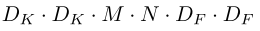

深度可分离卷积的计算量为：（第一项对应于深度卷积，第二项对应于点卷积）

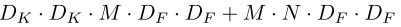

减少的计算量为

深度可分离卷积示意图：

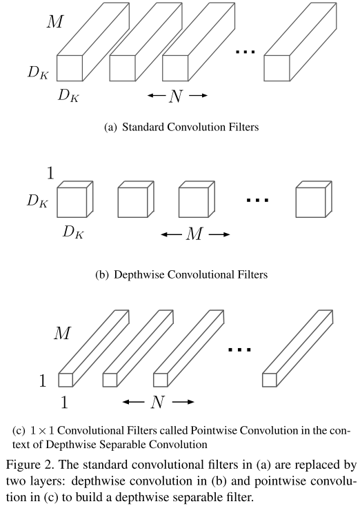

### 3.2网络的结构和训练

MobileNets除了第一层是一个完整的卷积，其他部分都是由深度可分离卷积构成的。具体结构见表1。

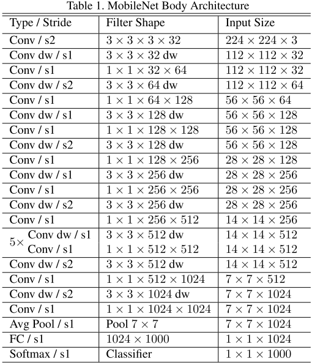

每一层都跟随了一个批量标准化和ReLU函数，除了最后一层全连接层是跟随的softmax函数。标准卷积的一个层和MobileNets的一个层的对比见下图。

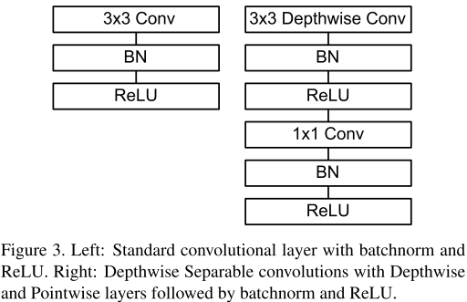

下采样是通过步进来实现的。最后一层平均池化层将空间分辨率降为1。如果将深度卷积和点卷积视为不同的卷积层，那么MobileNets共有28层。

为了保证所有运算操作能被有效地实现，本模型结构几乎将所有涉及到的运算放入了密集的1×1的卷积中，这就可以被深度优化的GEMM方程实现。一般而言，在实现GEMM之前矩阵需要进行重新排列，但是本设计不需要这一步，可以直接使用GEMM方程。MobileNets中95%都是1×1的卷积运算，并且这些运算使用了75%的参数。具体的运算量和参数使用可以参考下表：

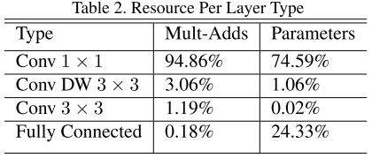

在MobileNets的训练中，我们使用了TensorFlow，并且使用了less regularization和data augmentation技术（:question:），因为小的模型不容易发生过拟合的问题。When training MobileNets we do not use side heads or label smoothing and additionally reduce the amount image of distortions by limiting the size of small crops that are used in large Inception training [31]. Additionally, we found that it was important to put very little or no weight decay (l2 regularization) on the depthwise filters since their are so few parameters in them. For the ImageNet benchmarks in the next section all models were trained with same training parameters regardless of the size of the model.

### 3.3宽度乘数：更瘦的模型

为使模型更小更快，本文引入了一个参数$\alpha$∈(0,1]，将M和N进行压缩。压缩后的运算量大约能减少$\alpha^2$：

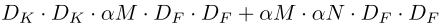

$\alpha=1$为基准模型，$\alpha<1$ 为压缩后的MobileNets，压缩后的模型需要重新训练。

### 3.4分辨率乘数：降低代表数

另一个减少运算量的方法是引入一个分辨率乘数$\rho$∈(0,1]，将其运用到输入图像上，降低其分辨率。实际应用中我们会通过设置输入的分辨率来隐式地设置该参数，MobileNets中的输入分辨率只能为224,192,160或者128。在设置$\alpha$和$\rho$之后整体的运算量变为：

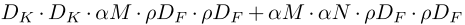

$\rho$的存在使得整体的运算量降低至$\rho^2$。下表展示了将标准卷积转换为深度可分离卷积并应用$\alpha$和$\rho$的效果。

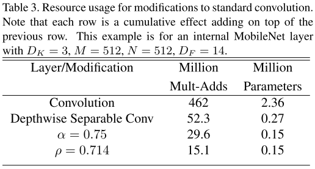

### 4 实验

本节首先介绍深度卷积和降低网络宽度带来的影响。之后展现改变两个超参数带来的折衷效应。最后展现MobileNets的不同应用。

### 4.1 模型选择

根据下表可以看到使用深度可分离卷积会使精度下降1%但节约了大量运算资源。

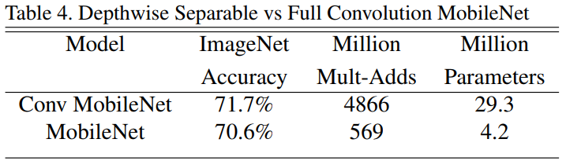

下表显示了相对于更浅的网络，降低网络位宽可以在消耗相似资源的前提下有更高精度。

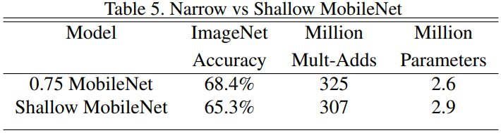

### 4.2 模型压缩超参数

下面两个表展现了超参数的变化对网络性能的影响。

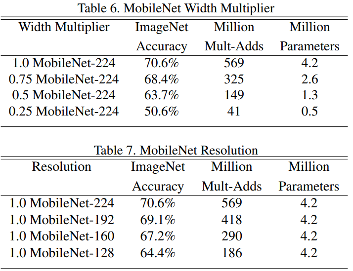

下图展示了当两个超参数同时变化时使用的运算单元数量和精度的关系。

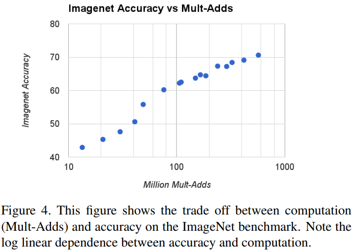

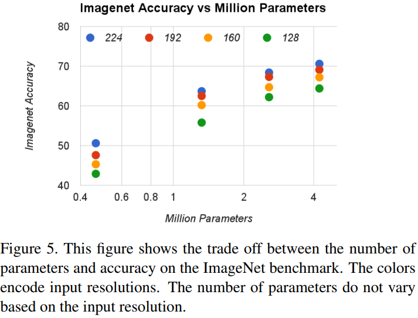

下面的两个表展现了MobileNets和现今较为流行的神经网络的比较。

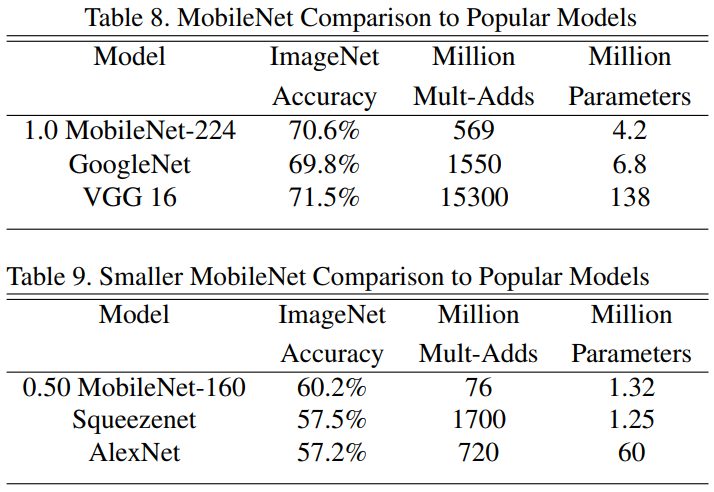

### 4.3 细粒度识别

MobileNets在细粒度识别上的运行结果

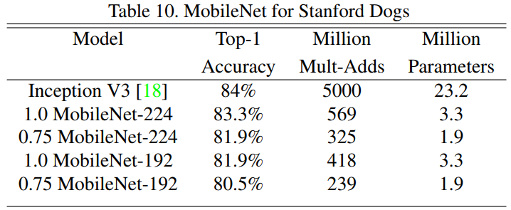

### 4.4 大规模地理定位

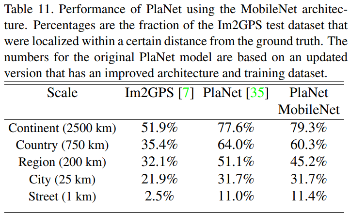

### 4.5 面部属性分类

### 4.6 物体识别

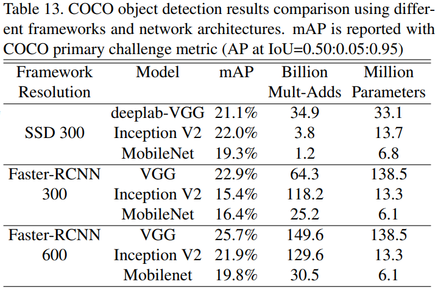

### 4.6 人脸识别

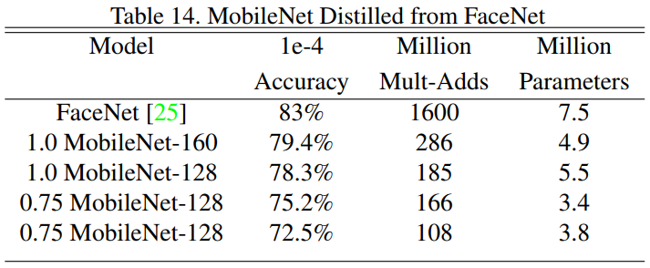

最后分享一个有本论文翻译并且提供相应代码的网站：[程序园](http://www.voidcn.com/article/p-qhhihmcm-brr.html)

