# Cambricon: An Instruction Set Architecture for Neural Networks  

## remark

本篇文章集中介绍了适用于神经网络的ISA应该包含哪些指令，以及以此为基础设计一个处理器的方式。

## 摘要

近来，专门用于神经网络的加速器被提出，用于降低功耗。然而，这些加速器仅仅是为一小部分计算模式相似的NN设计的。它们有复杂、信息量大的指令（控制信号）直接对应于NN的高层次的功能模块（比如层），或者针对整个NN。尽管这样对有限的NN计数来说直接且易于实现，灵活性的缺乏使它不能灵活和有效地适应多样的NN。

本文提出了一个新颖的确定领域的ISA，cambricon。它是在综合分析现有的NN之后提出的一个load-store architecture，集成了数值，向量，矩阵，逻辑，数据传输和控制指令。我们选取了10个具有代表性且独特的NN对cambricon进行了测试，可以看到cambricon对广泛的NN展现出了强大的描述能力，并且比一些主流的通用ISA有更高的代码密度。目前最新的加速器dadiannao只能支持三种NN技术。

## 1 introduction

目前来看，ISA设计是一个基础且未解决的挑战，它很大程度上限制了现存NN加速器的灵活性和效率。

本文根据RISC ISA的设计原则设计了NN加速器的ISA：①将复杂且信息量大、描述高层次功能块的指令分解成更短的指令，对应低层次的计算操作（比如点积），这使得加速器可以有更广阔的运用空间，因为由此使用者可以用低层次操作编写高层次功能块。②短小精悍的指令大大降低了设计/验证的复杂性和指令译码器的功耗/面积。

cambricon是一个64位的，包含64个32bit通用寄存器（GPRs）用于存放数值，主要是为了控制和编址。为了以可以忽略的面积和功耗支持大量相邻且变长的读取向量/矩阵数据，cambricon没有使用任何向量寄存器文件，而是将数据保存在片上便签存储器上，这对程序员和编译器都是可见的。我们不需要实现片上存储的多个端口，因为通过分解地址的低位来同时获取不同bank的数据足以支持NN技术。不像SIMD一样性能被寄存器的有限宽度限制，cambricon高效地支持更大、变化更多的数据宽度，因为片上便签存储的bank可以轻易地加宽，超过寄存器文件的宽度。

本文的主要贡献：

1）一个轻量级、新颖的、对NN技术有强大描述能力的ISA

2）对现有NN技术的计算模式进行了综合细致的研究

3）在TSMC 65nm的技术下实现了第一个基于cambricon的加速器并以此评估了cambricon的效率。

## 2 overview of the proposed ISA

### A design guidelines

为了能设计出一个简明、灵活并且高效的NN ISA，在做出确切的设计决定之前，我们对很多NN技术的计算操作、存储存取模式进行了分析，并提出了一个设计守则。

+ **data-level parallelism.**我们发现在大多数NN技术中神经元和突触是以层的形式组织的，并且以一种统一/对称的方式被操作。当支持这些操作时，被向量/矩阵指令使能的数据层面的并行会比传统的指令级别的并行更高效，有更高的代码密度。因此，*cambricon的重点在于数据级别的并行。*
+ **customized vector/matrix instructions.**尽管现存很多线性代数的库能够成功包含很多科学计算应用，对NN技术而言，在这些代数库里的基本操作并不一定是有效且高效的选择，有些甚至是冗余的。更重要的是，有很多NN技术中常用的操作并不包含在传统线性代数库里。因此，我们必须*综合地定制一个小但是对NN技术来说有代表性的向量/矩阵指令，*而不是简单地按照现有的线性代数库重新实现向量/矩阵操作。
+ **Using on-chip scratchpad memory.**我们发现NN技术中经常需要进行大量连续且变长的向量/矩阵数据的存取，因此使用定长的高功耗向量寄存器不再是最高效的选择。本设计中，*我们将向量寄存器替换成片上便签存储*，为每一次数据的存取提供了灵活的长度。这对NN里数据层面的并行往往是一个高效的选择，因为NN里的突触数据往往很大但很少使用，降低了向量寄存器文件带来的性能加持。

### B an overview to cambricon

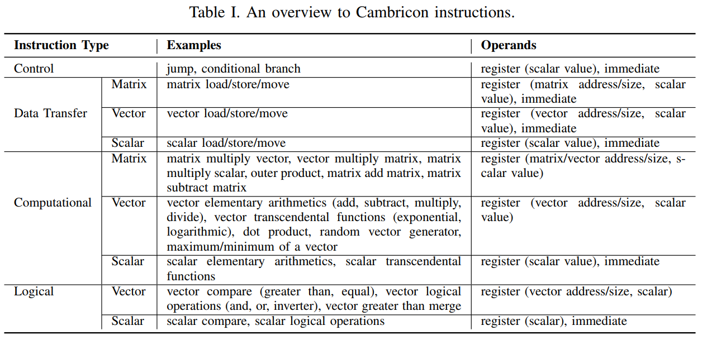

我们根据上一部分的指导设计cambricon，上表展示了cambricon的整体概览。cambricon是一个存取架构，主存只能被存取指令接触。cambricon包含64个32位GPRs来存储数值，可以用于片上便签存储的寄存器非直接取址以及暂存数值数据。

**type of instructions.**cambricon共有4种指令：*计算，逻辑，控制，数据传输*。尽管不同指令的有效位可能不同，指令的长度是定长64位，便于存储对齐和存取、译码逻辑的设计简便。本部分仅简要介绍控制和数据传输指令，因为它们和对应的MIPS指令相似，虽然融合了NN技术。

**control instructions.**有两个控制指令：*jump*和*conditional branch*。如下图所示：

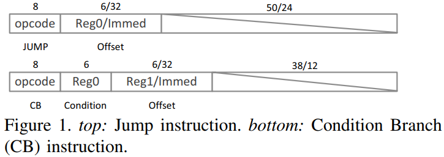

jump指令用一个立即数或者GPR指明了偏置，偏置值将会和PC值累加。条件转移指令除了偏置外还指明了存储在GPR的predictor以及分支目标（PC+偏置值或者PC+1）（取决于predictor和0比较的结果）。

**data transfer instructions.**为了能够灵活地支持矩阵和向量的计算/逻辑指令，cambricon的数据传输指令支持可变的数据大小。更明确地说，这些指令可以存取变长数据块（数据大小由数据传输指令中的数据宽度操作数决定），从主存到便签存储器或者反之，或者在便签存储器和数值GPR之间传输数据。下图展示了向量load指令（VLOAD），它可以从主存中加载大小为$V_{size}$的向量到向量便签存储器，主存中的源地址是GPR中储存的基地址和一个立即数的和。VSTORE，MLOAD，MSTORE指令和VLOAD相似。

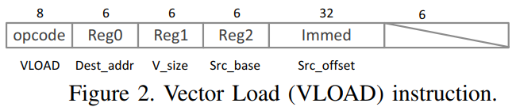

**on chip scratchpad memory.**寒武纪不使用任何向量寄存器文件，而是直接将数据存储在片上便签存储器内，且它对程序员和编译器是可见的。换句话说，寒武纪中片上便签存储器的角色类似于传统ISA中的向量寄存器文件，向量操作数的大小不再被定长的向量寄存器文件限制。因此，寒武纪的指令中向量/矩阵的大小是可变的，唯一值得注意的限制是在同一指令中向量/矩阵操作数的大小不能超过便签存储寄存器的大小。如果超过了，编译器将会将过长的向量/矩阵解构成短的块，并生成多个指令来处理它们。

寒武纪内向量和矩阵的片上存储大小必须是固定的。更明确地说，寒武纪将向量指令的存储大小固定为64KB，矩阵指令中的存储大小为768KB。寒武纪没有便签寄存器的bank数量做出明确地限制，给微架构层次的实现带来了很大的自由。

## 3 computational/logical instructions

在神经网络中，大多数代数运算（如加法，乘法和激活函数）可以被归纳为向量操作，并且根据我们对目前前沿的CNN（Googlenet，赢得2014图像比赛）进行的量化观察，向量操作的比重可以达到99.992%。同时，我们也发现GoogLeNet中99.791%的向量操作（比如点积）可以被进一步归纳为矩阵运算（例如向量矩阵相乘）。简单来说，就是NNs可以被自然地分解成数值、向量和矩阵操作，同时ISA的设计必须有效地利用潜在的数据级并行和数据的局部性。

### A matrix instructions

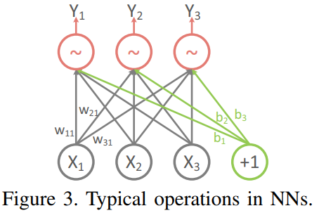

我们细致综合地对NN技术进行了回顾，然后为寒武纪设计了总共6个矩阵指令。这里我们以MLP（multi-level perceptrons）为例，展示它是怎么被矩阵指令支持的。从技术上来讲，一个MLP一般有很多层，每一层都在根据某些值已知的神经元（比如输入神经元）计算某些未知的神经元的值（比如输出神经元）。图三展示了一个这样的层的前馈运行。更明确的说，图三中的输出神经元$y_i$($i=1,2,3$)可以这样计算：$y_i=f(∑^3_{j=1}w_{ij}x_j+b_i)$，其中$x_j$是第$j$个输入神经元，$w_{ij}$是第i个输出神经元和第j个输入神经元之间的权重，$b_i$是第i个输出神经元的偏置，f是激活函数。输出神经元可以当作是向量$\mathbf{y}=(y_1,y_2,y_3)$的计算：

​       $$\mathbf{y}=\mathbf{f}(W\mathbf{x}+\mathbf{b})$$                    (1)

其中$\mathbf{x}=(x_1,x_2,x_3)$，$\mathbf{b}=(b_1,b_2,b_3)$分别是输入神经元和偏置，$W=(w_{ij})$是权重矩阵，$\mathbf{f}$是元素顺序版本的激活函数$f$。

公式（1）中很重要的一步是计算$W\mathbf{x}$，在寒武纪里这将会被matrix-mult-vector(MMV)指令计算，该指令如图4，其中Reg0表示向量输出（$Vout_{addr}$）；Reg1表示输出向量的大小（$Vout_{size}$）；Reg2，Reg3和Reg4分别表示输入矩阵的基址（$Min_{addr}$），输入向量的基址（$Vin_{addr}$）和输入向量的大小（$Vin_{size}$，注意这是一个变量）。

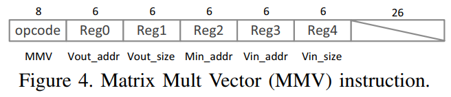

MMV指令可以支持变长的矩阵向量乘法，只要输入和输出数据可以同时保存在便签存储里。我们选择用更耗费心力的MMV指令而非分解成多向量点积来计算$W\mathbf{x}$，是因为后者需要额外的努力（比如，明确的同步，对同一地址的同时读写）来对$M$的不同行向量重利用输入向量$\mathbf{x}$，这样效率会降低。

然而，不像前馈网络，MMV对NN训练中的反馈网络并没有提供有效支持。更明确地说，一个重要且出名的步骤，反向传播（BP）算法，是计算向量斜率，这一计算可以化成一个向量和一个矩阵相乘。如果我们用MMV实现，我们需要一个额外的指令来执行矩阵的转置，而转置对数据位移的消耗很大。为了避免消耗，寒武纪提供了vector-mult-matrix（VMM）指令，它可以直接运用于反馈训练。除了操作码，VMM指令和MMV指令有一样的域。

此外，训练NN时，权重矩阵$W$经常要被更新成：$W=W+ηΔW$，其中η是学习速率，ΔW是两个向量的外积。寒武纪提供了一个外积（OP）指令，一个matrix-mult-scalar（MMS）指令和一个matrix-add-matrix（MAM）指令来协作完成权重的更新。此外，寒武纪也提供了一个matrix-subtract-matrix（MSM）指令来支持RBM里的权重更新。

### B vector instructions

以公式（1）为例，可以发现上一部分介绍的指令依然不能完成全部计算。我们依然需要将$W\mathbf{x}$的向量输出和bias向量$\mathbf{b}$相加，并且要对$W\mathbf{x}+\mathbf{b}$执行元素顺序的激活。

尽管寒武纪为向量相加提供了一个vector-add-vector（VAV）指令，支持元素顺序的激活需要很多指令。为了不损失普遍性，我们以被广泛使用的sigmoid函数$f(a)=e^a/(1+e^a)$为例。元素顺序的sigmoid激活对输入向量$\mathbf{a}$的激活可以分解成三个连续的步骤，并且分别被3个指令支持：

①计算向量$\mathbf{a}$里的每一个元素的指数函数$e^{ai},(a_i,i=1,...,n)$，寒武纪提供了一个vector-exponential（VEXP）指令完成一个向量里元素顺序的指数运算。

②对向量$(e^{a1},...,e^{an})$里的每一个元素进行加一操作。寒武纪提供了一个vector-add-scalar（VAS）指令，其中数值可以通过一个GPR立即指明。

③对每一个下标$i=1,...,n$，计算$e^{a_i}$除以$1+e^{a_i}$。寒武纪提供了一个vector-div-vector（VDV）指令来计算向量之间每个元素的相除。

然而，sigmoid并不是NN中唯一使用的激活函数。为了实现元素顺序版本的多种多样的激活函数，寒武纪提供了一系列向量代数运算指令，比如vector-mult-vector（VMV），vector-sub-vector（VSV）以及vector-logarithm（VLOG）。在设计硬件加速器时，和超越函数（如对数，三角函数和反三角函数）相关的指令可以高效地重利用同一个功能块（包括加法，位移和查找表操作），使用CORDIC技术。此外，有一些激活函数（比如$max(0,a)$和$|a|$）部分依赖于逻辑操作（比如比较）将会在后文描述。

另外，随机向量生成也是一个常见于许多NN技术的重要的操作（比如dropout和随机采样），但是它并不被认为是一个传统科学计算线性代数库里必要的部分。寒武纪提供了一个指令random-vector（RV），它可以生成一个处在区间$[0,1]$的遵循正态分布的随机向量。有了标准随机向量，我们就可以使用ziggurat算法和其他向量计算、向量比较指令进一步生成遵循其他分布（比如高斯分布）的其他随机向量。

### C logical instructions

目前前沿的NN也综合利用了比较以及其他逻辑操作。最大池化操作就是一个例子。如下图：

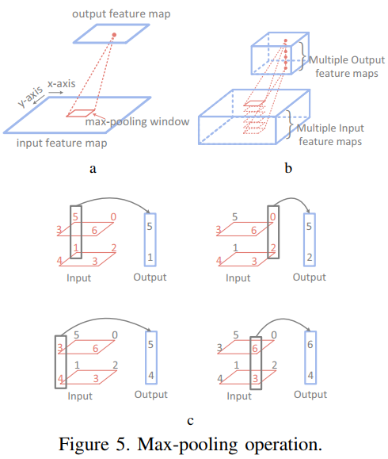

它用一个池化窗口找到有最大输出的神经元，并且对池化窗口对应的不同ifmap重复这一操作（图5b）。寒武纪用一个vector-greater-than-merge（VGTM）指令来支持最大池化操作，如下图：

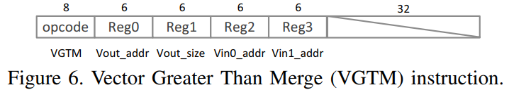

该指令完成的运算为$Vout[i]=(Vin[i]>Vin[i])?Vin0[i]:Vin1[i]$。3-E部分会展示寒武纪的最大池化代码，完成图5c的操作。

寒武纪还提供了vector-greater-than（VGT），vector-equal（VE），vector AND/OR/NOT（VAND/VOR/VNOT），数值比较以及数值逻辑指令来处理前文提到的conditional branch指令。

### D scalar instructions

尽管我们发现Googlenet里只有0.008%的计算不能被矩阵和向量指令支持，但是NN中仍有不可分割的数值运算，比如基本代数运算操作和数值超越函数。表1中有概括。

### E code example

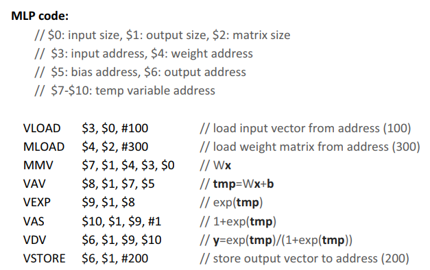

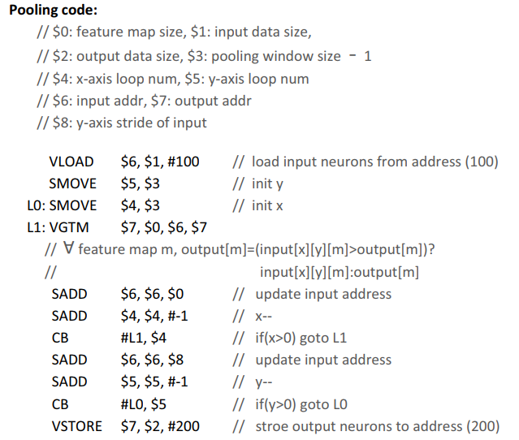

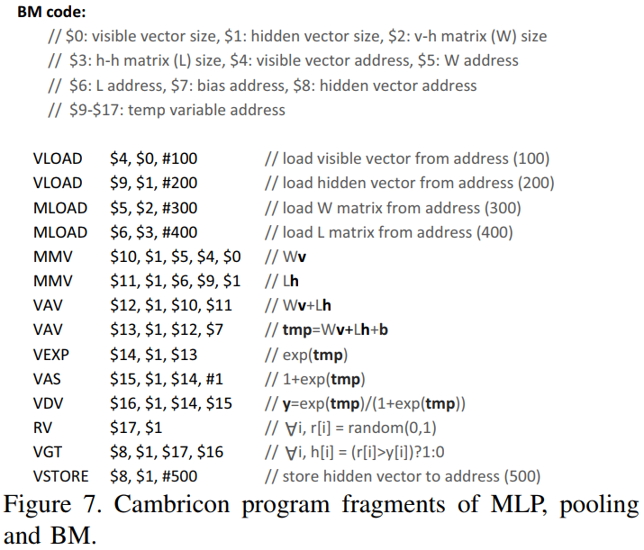

我们举了3个简单但有代表性的例子。如上图。为了表示简明，我们省略了数值的存取，并且仅展示了单个池化窗口。

## 4 a prototype accelerator

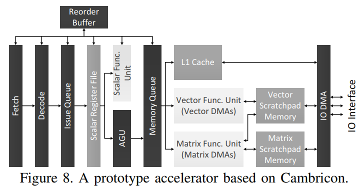

以寒武纪为原型的加速器如上图。该加速器包含7个流水线层级：*取指，译码，发射，读寄存器，执行，写回，提交*。本加速器中我们使用了诸如便签存储，DMA等成熟的技术，因为在后面的验证中我们发现这些经典的技术足够反映该ISA的灵活，简洁和高效。我们不打算用前沿的技术来实现这一加速器，因为我们相信一个好的ISA不该和新兴技术绑定，而是易于实现的。

如图8，经过取指和译码之后，一条指令就被注入一个按顺序排列的发射队列。从数值寄存器中成功获取操作数（数值数据，或者向量/矩阵的地址/大小）之后，根据指令的类型，该指令将会送往不同的单元。控制指令和数值计算/逻辑指令将会直接送往数值功能单元直接执行。对数值寄存器文件进行写回之后，该指令将会从一个记录缓存器中移交出去，只要它是目前最后一个执行过但是没有提交的指令。

数据转移指令，向量/矩阵计算指令还有向量逻辑运算指令，它们有可能接触L1 cache或者便签存储，将会被发往地址生成单元（AGU）。这些指令需要在顺序存储队列中排队等待，以解决和之前指令之间存在的潜在存储依赖问题。之后，数值数据的load/store请求指令会被发往L1 cache，向量的数据传输/计算/逻辑指令会被送往向量功能单元，矩阵的数据传输/计算指令会被送往矩阵功能单元。执行之后，这一指令就可以从存储队列中移出，送往记录缓冲器，只要它是目前最后一个执行过但是没有提交的指令。

加速器实现了向量和矩阵功能单元。向量单元包含32个16bit加法器，32个16bit乘法器，并有64KB的便签存储器。矩阵单元有1024个乘法器和1024个加法器，它们被分割成32个分离的计算模块，以避免线路堵塞和长距离数据移动的功耗。每一个计算模块带有一个单独的24KB便签存储器。这32个计算模块是通过一个H树来连接的，这个H树负责向每个模块传输输入值和收集每个模块的输出。

寒武纪一个值得注意的点是它不使用任何向量寄存器，而是把数据存储在便签存储器里。为了高效地读取便签存储器，原型加速器的矩阵/向量功能单元集成了三个DMAs，每一个都对应于一个指令的矩阵/向量输入或输出。此外，便签存储器也需要一个IO DMA。然而，每一个便签存储器自身仅提供一个单端口给每一个bank，但是很多bank需要同时应对最多4个地址来应对读写需求。我们为便签存储器设计了一个独特的结构来解决这个问题，如下图：

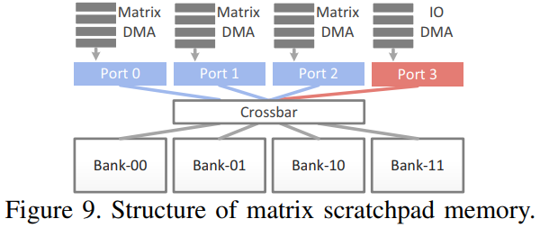

更确切地说，我们根据地址的低2位将存储分为4个bank，并用4个读写端口相连，通过一个crossbar来保证没有bank会被同时读取。幸亏有专用的硬件支持，寒武纪不需要昂贵的多端口向量寄存器，并且可以通过片上便签存储器灵活高效地支持不同的数据位宽。