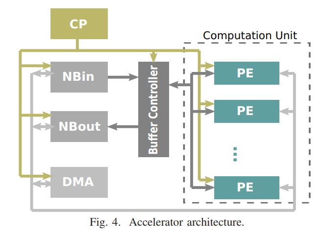
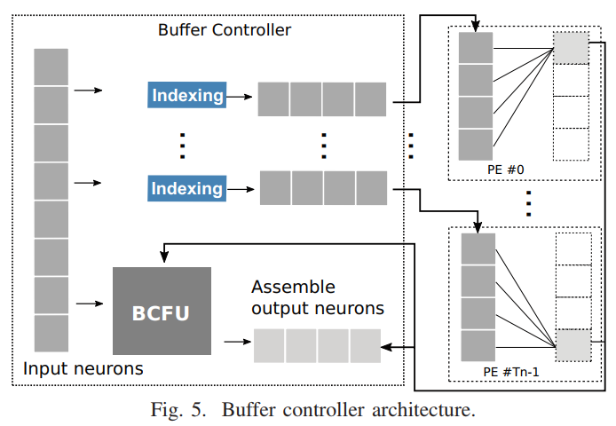
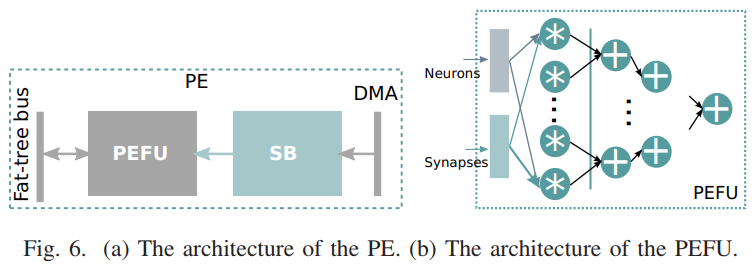
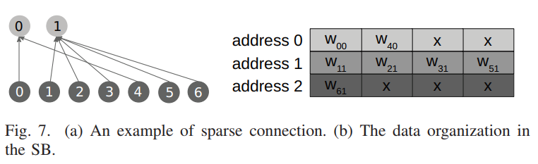
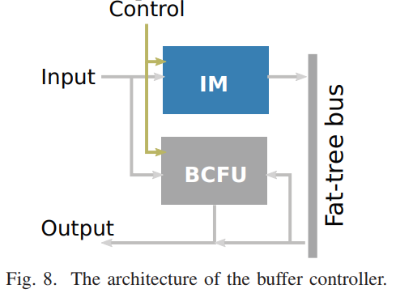
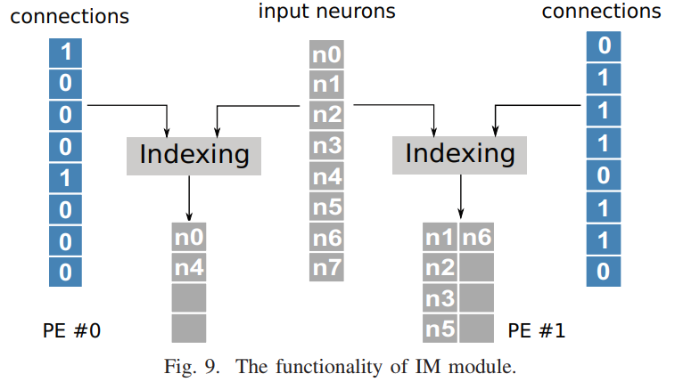
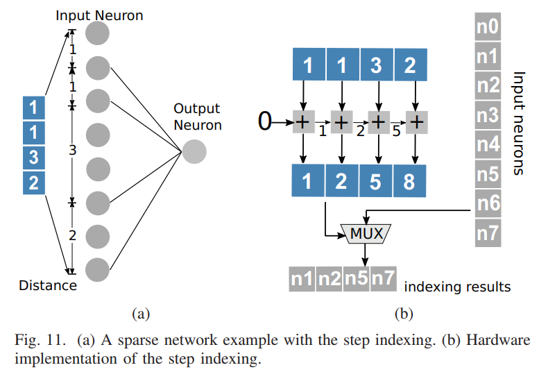
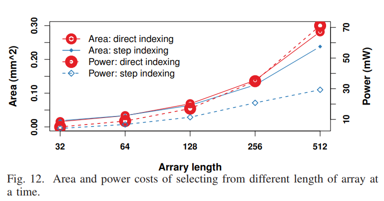
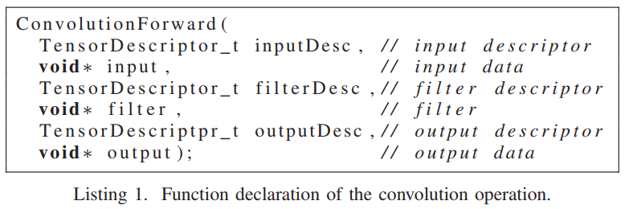
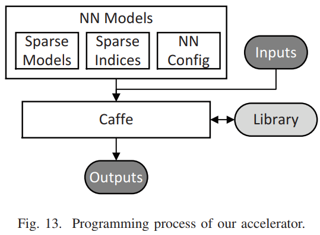

# Cambricon-X: An Accelerator for Sparse Neural Networks  
## remark

本篇的重点在于处理稀疏神经网络，设计了一个IM解决静态突触稀疏性的问题，详细介绍了加速器的硬件结构，大致介绍了软件编译器的功能。

## 摘要

稀疏神经网络是一种能够有效减少计算量和存储需求的方法。尽管现存的NN加速器可以高效处理密集有规律的网络，它们并不能利用突触权重的减少。

为了提高效率本文提出一个新颖的加速器cambricon-x来发掘NN模型的稀疏性和非规律性。提出的加速器是一个以PE为基础的架构，由很多PE组成。一个indexing module（IM）高效选择并向相连的PE以低带宽传输需要的神经元，同时每个PE为了本地计算异步地存储无规律的压缩突触。

## 1 introduction

大大降低的突触数并不一定会提高现有加速器的性能和能效，因为现有加速器善于处理规律并且密集的神经网络，但是对无规律的稀疏模型没有专门的支持。

本文提出了一个新颖的加速器，它不仅可以处理原本密集的神经网络，也可以处理被大大修剪过的稀疏网络。该加速器是一个以PE为基础的架构，由许多带有缓冲控制器（BC）的PE组成，以便发掘NN模型的稀疏性和无规律性。特别地，BC集成了一个IM来从集中的神经元缓冲器中选择需要的神经元，之后把这些神经元以更低的带宽传输到相连的PE中。接收到这些神经元之后，PE可以利用本地存储的压缩后的突触高效地运行计算。此外，由于突触的无规律分布，多个PE可以异步地工作以提高效率。

## 2 background and motivation

### A primer on neural networks

**state-of-the-art neural networks.**CNN和DNN之间的主要区别在于卷积层，CNN中卷积层的突触是分享的，而DNN中是私有的。

**sparse neural networks.**修剪的方式主要有三种：训练连接，修剪连接（突触），训练权重。第一步中，神经网络用传统的反向传播算法和正常的学习速率进行训练。然后，权值低于预先设定好的阈值的连接会被移出。最后，修剪过的网络会以一个很小的学习速率重新训练一遍来获得最终的权值。为了得到一个高的压缩率，上文的过程会被不断重复，直到没有突触可以被移除。各种代表性的NN经过无精度损失的修剪后的平均稀疏性（修剪过后剩下的突触和原来所有的突触数的比）为12%。

### B motivation

尽管通过修剪，操作的数量和存储的存取数可以被大大减少，现存的硬件平台（包括CPU，GPU，FPGA和定制硬件）并不能从中得到很多性能和能效上的好处，因为没有专门用于处理非规律和稀疏的硬件平台。

## 3 accelerator design

### A overview

上图展示了加速器的架构，由一个control processor（CP），一个buffer controller（BC），两个神经缓冲器（NBin和NBout），一个DMA和一个由$T_n$个PE构成的computation unit（CU）组成。所有PE以一个fat-tree的拓扑结构连接以避免布线堵塞，BC根据被CP翻译的指令，从PE本地选择PE需要的神经元，然后将这些神经元传输到PE进行高效的本地计算。BC和多个PE之间的连接如图5。

该架构的一个关键的设计特点在于BC里的indexing unit。一共有$T_n$个indexing unit，每一个对应于一个PE，用来选择对应必要的神经元。

在本设计中，我们使用了16位顶点运算单元而非32位的浮点单元。（:six_pointed_star:我们应该使用压缩后8位顶点数的神经网络？不过具体精度也要进行定点化之后才能确定，依照angel-eye的方法。）主要原因在于，根据之前的研究，在几乎可以省略的的精度损失前提下，16位的定点单元有远远低于32位浮点单元的硬件开销。更明确地说，在台积电65nm的工艺下，一个被截断的16位定点乘法器比一个32位浮点数乘法器小6.10倍，能效高7.33倍。另外，用16位的数据表示，数据总线的宽度可以减半。

### B computation unit

计算单元是用来高效计算神经网络的核心操作的，也就是用多个PE进行向量乘加操作。图6a展示了PE的架构，由synapse buffer（SB）和PE内的神经网络功能单元（PEFU）组成。PEFU从本地的SB取出突触，从BC取出神经元作为输入，产生的输出神经元将会送回BC。

**PEFU.**PEFU主要用于神经网络中的乘加操作。单个PEFU包含了共$T_m$个乘法器，以及一个$T_m$输入的加法器数，如图6b。因此$T_n$个向量的乘加操作（$T_m•T_m$）可以由$T_n$个PE同时完成。为了能够提高频率，我们将PEFU内的功能单元进行了两级流水线的划分：一级乘法和一级累加所有乘法结果。在$T_m$个输入时，$T_n$个PE可以同时输出$T_n$个输出。

**SB.**SB是用来存储分离的突触，在SB的设计中存在两个关键问题。第一个是决定SB的大小，第二个是如何组织SB里突触。（:six_pointed_star:有点类似于便签存储器？）

尽管之前的研究选择提供大小中等但一个足够大的缓冲器来存放神经网络的所有突触，以便防止读取片外数据，我们的加速器里的SB并不设计为存放全部的突触。有两层原因：第一，尽管有稀疏性，突触的总大小超过了几MB。第二，我们的加速器是设计用来支持不同程度的稀疏性网络的，包括拥有大很多的突触的密集神经网络，因此，设计一个大型的SB来存储所有的突触会带来很大的延迟、面积和能耗的损失。事实上，拥有最佳大小的SB可以隐藏存取数据带来的延迟，由此可以让PEFU保持忙碌而不用等待数据输入。在我们目前的实现中，我们给每个PE配备了一个2KB的SB，也就是总共有$2×T_n$KB的存储用于存放突触。因此，每一个SB每个周期可以给PEFU提供$T_m$个数据，也就是提供了一个$T_m×16$bit位宽的SRAM。（:six_pointed_star:和cambricon-s是一致的，但是都没有说具体怎么确定缓冲器的大小。）

为了描述突触在SB里的组织，我们使用了一个由7个输入神经元和2两个输出神经元的稀疏网络作为例子，如图7a。我们假设这个神经网络仅仅映射至一个PE且$T_m=4$，我们用$w_{ij}$来表示输入神经元#$i$和输出神经元#$j$之间的突触权重。连接不同输出神经元的突触的权重以$T_m=4$为一行进行排列。如图7b所示，两个输出神经元0的权重一个一个存放在地址0处，输出神经元1的5个权重存放在随后的两个地址：地址1和2。因此计算输出神经元0时，只需阅读SB一次；而输出神经元1需要阅读两次。因为不同神经元的突触数差别很大，我们允许不同PE里的SB异步地从存储加载数据来提升总体的效率。

### C buffer controller

缓存控制器是用来向PE传输必要的神经元，在PE上编排计算过程，并执行计算要求较低的操作的。图8显示了BC的结构，由一个用于根据连接索引计算需要的数据（IM）以及一个专门用于BC的功能模块（BCFU）组成。一开始，输入根据指令（存储存取指令）翻译过来的控制信号从NBin读取。之后，从输入选出的需要的神经元传输到各个PE或者直接送入BCFU。PE里的计算完成之后，结果会被收集起来送入BCFU进行进一步处理或者直接写回NBout。值得注意的是，当处理密集NN时，加速器可以跳过IM以避免IM可能带来的速度减缓。

**BCFU.**BCFU主要用于存储将被IM选择的神经元。注意一共有$T_m$个这样的单元，因此它可以同时存储$T_m$个这样的神经元。

**IM.**是这个加速器的核心组件，它是用来索引稀疏程度不同的稀疏网络需要的的神经元的。我们没有选择每一个PE都分配一个IM，而是在BC里设计了一个集中的IM，并且仅仅传输索引后的神经元到PE，这样可以显著降低神经缓冲器之间的带宽需求，因为有索引数据的数量在稀疏网络中是很少的。（:six_pointed_star:这里应该是指非零数据？）图9中，根据存储的连接，不同的输入神经元会被不同的PE选择。对于PE#0，只有两个神经元从总共8个神经元中选出用来计算。

为了实现IM，我们调查了两个常用的索引选择：*直接索引*和*分布索引*。直接索引的方法是使用一串二进制字符串，每一个突触对应一个bit，来指明对应突触是否存在，也就是1代表存在，0代表不存在。分步索引方法会进一步对直接索引的二进制字符串，就是标注1之间的距离，也就是索引表里的每一个元素表示两个两个存在的突触之间的距离。

尽管存在其他方式，比如压缩稀疏行（CSR），协作表（coordinate list，COO）以及压缩稀疏列（CSC），从硬件设计的角度讲，直接索引和分步索引会相对更易于实现。比如常用的CSR/CSC往往需要两个数组来为矩阵存储索引，这在NN的稀疏性往往大于5%的环境下会消耗更多存储。此外，CSR/CSC是按照行或者列来索引矩阵的，而我们设计的加速器会并行地一维查询多个神经元和突触（:six_pointed_star:但是eyeriss2里面还是采用了CSC。cambricon-s和这里使用的方法应该是一致的）。因此我们调查了直接索引和分布索引，希望能够实现高效的IM。

在直接索引里，根据二进制字符串里存在的连接（也就是1），神经元会直接从输入神经元里选出。

图10（a）举了一个稀疏网络的二进制字符串的例子。图10（b）也展示了潜在的可能的硬件实现方法。首先我们将原始二进制字符串里的每个bit相加以获得一个累加后的字符串，然后累加后的字符串里的每个元素表明了对应连接的位置。再将累加字符串和原始字符串相或，就能够得到每一个相连的神经元的下标。

在分步索引中，神经元是根据输入神经元存在突触之间的距离选择出来的。图11（a）是分布索引的一个例子，图11（b）是可能的硬件实现。索引方式的细节如下：首先，我们将索引表里的数值顺序相加（也就是图11b里的1132），得到输入神经元和当前输出神经元有链接的神经元的index。然后，这样的index就用于对应输入神经元的寻址。相比于直接索引，分布索引里的index是整数，位宽取决于NN的稀疏程度。（:six_pointed_star:这里蓝色框里的字应该是1257）

我们将上述的两种索引方式以RTL的方式实现了，并且根据综合结果比较了面积和功耗的硬件开销，结果如图12。注意在两种实现方式里索引都是并行计算的。通过在一个周期内从32个到512个数据中选出16个数据（也就是稀疏性从50%到3.12%），我们发现随着稀疏性的提升，开销也会变大。此外，在所有数据集上，分步索引的开销总是比直接索引的小。

基于上述的研究，我们选择并应用了分步索引来实现IM。在目前的设计里，IM每个PE里每个周期可以阅读$T_m×T_m$个数据来选择输入神经元。

### D CP

CP是为了有效和灵活地控制多个指令的执行。指令用于数据组织，执行协调和存储存取等，它们被存储在一个很小的指令缓冲器里。为了缓解末端使用者的编程压力，我们提供了一个C++的编译器来生成高效的指令，之后将会讲述。

### E NB

NB包括NBin和NBout，分别用于存储输入和输出神经元：输入神经元从NBin选出，然后送往所有PE，用于计算，计算结束后输出神经元会被收集起来存放至NBout。（:six_pointed_star:目前我的理解是一个PE算一个输出的神经元，IM将有效的值送往所有不同的PE然后进行计算。）存放在NB里的数据是有序安排的，不考虑稀疏网络里的各种各样的连接模式。在目前的实现里，我们将IM和NBin之间的数据总线设置成$T_m×T_m×16$bits。因此，每个周期最多$T_m$个数据可以被选出送往每个PE。

NBin和NBout的大小对于整体的性能和能耗是决定性的。经过研究NB的不同大小，我们发现8KB是性能和能耗之间的最佳折衷。因此，在我们的加速器实现里，NBin和NBout都是8KB。注意到NBin的大小比SB（2KB）大，因为在选择必要的神经元给PE前，加速器需要存储更多输入神经元。

显然，在大型神经网络里8KB的NB不能存放所有的神经元，因此需要使用一个合适的数据替换策略来减少开销很大的片外存储存取。只有当NBin里的神经元全部被处理过或者NBout满了，我们才会存取主存，加载新的神经元或者保存计算过的输出神经元。

### F interconnect and communication

**interconnect.**我们应用了fat-tree的互联拓扑结构，它的特点是在接近顶层的互联时会有更多的数据连接被提供，用来连接BC和所有的PE，由此来提升两者之间的数据传输的效率。选择fat-tree的理由有两个：1）相比于其他非树形的拓扑结构，使用fat-tree可以避免由BC和PE之间的不平衡引起的长的关键路径；2）相比于其他树形相连拓扑结构，fat-tree可以提供私有的连接以减轻网络堵塞，因为送往不同PE的数据是独立的。

**communication.**片外存储和片上缓冲器（包括NBin，NBout和SB）之间的数据传输是通过DMA实现的为了平衡不同PE之间的执行并且避免存储读取的堵塞，我们首先将需要的突触分成几块。然后，存储存取端口将会在短时间内一次分配给一个PE，由此每个PE只能在那一小段时间里加载几个块。在这种情况下，在不同的时钟周期里，每个PE如果没有获取所有的突触，也会有部分突触用于执行对应的计算。这样的异步计算通过允许不同的PE在不同的时钟周期内计算可以减少存储堵塞。（:six_pointed_star:这里的异步不是指异步时钟，而是不同PE计算和读取数据是独立的而不是同步的。）

## 4 mapping

有代表性的层次包括卷积，池化，分类和归一化层。一个卷积层通过将多个ifmap和共享的或者私有的核卷积组成了ofmap，占据了整个网络计算时长的85%。feature map的数据以map id的顺序存储在片上缓冲器。在计算处理一个卷积层时，为了最大程度上重利用NBin里的输入神经元减少片外存储存取，替换新的输入神经元前所有输出神经元将会完成和BC里NBin相关的数据计算。

池化层通过降采样ifmap来生成ofmap，方法是用一个2D的池化窗口进行最大池化或者平均池化。对于池化层，数据可以高效地被映射到BC里，以和卷积层类似的方法被处理。

分类层根据之前层提取出来的特征进行分类。与卷积层相反，分类层里输入输出神经元对之间没有分享的突触。因此，突触权重映射到片上缓冲器的主要目标是最大程度上重利用输入和输出神经元。

归一化层对本地输入区域进行归一化，它可以被分解成几个子层和基础的计算基元，比如每个元素的平方，矩阵相加和相除等等。因此，我们可以利用之前的方法来处理归一化层。

卷积层、池化层、分类层和归一化层和dadiannao里的类似。

## 5 programming model

 ### A library-based programming

为了缓解编程的压力，我们给这个加速器提出了一个基于库的编程模型。基本的想法是提供一组高级编程语言（比如C/C++）的库函数，每一个对应一个基本神经网络的操作，这样使用者就可以通过高级语言直接操作我们的加速器。列表1展现了我们库里卷积操作的函数声明。除了神经网络操作，我们也提供了相对低等级的基元，比如矩阵/向量的相乘/相加。因此，使用者可以利用这些基元，以及典型的语言架构（比如循环语句和条件语句）来实现更复杂的操作。最终，原始的C/C++代码将会被我们内部的编译器编译和优化，以便生成高效的二进制指令。（:six_pointed_star:这和第一篇论文讲的ISA是统一的吗？）

### B programming framework

为了达成性能的可移植性，我们也将编程库集成进广泛使用的学习框架，比如caffe。因此，使用者可以不用修改他们的代码，直接利用caffe的界面（也就是网络配置文件）。图13展现了我们加速器的编程过程。一开始，我们使用从训练阶段得到的稀疏网络，以及对应的稀疏表示来创建一个紧凑的神经网络模型文件。之后，紧凑模型文件，神经网络配置以及输入数据会被送到caffe。在caffe里，我们的库函数会被激活，生成输出。对于密集神经网络模型，模型文件仅包含从训练阶段得到的密集神经网络模型。在这种情况下，底层的网络形式对使用者是完全透明的。

