# Cambricon-S: Addressing Irregularity in Sparse Neural Networks through A Cooperative Software/Hardware Approach  
## remark

本篇有很多内容和cambricon-x相似，在cambricon-x的基础上做了改进和升级，使它可以发掘动态和静态的稀疏性。它也根据自己的观察提出了新的网络修剪方式，这部分可能涉及软件。

## 缩写

NSM：neuron selector module

SSM：synapse selector module

SNS：static neuron sparsity

SSS：static synapse sparsity

DNS：dynamic neuron sparsity

CDF：Cumulative Distribution Function

NSM：neuron selector module

NFU：neuron function unit

SSM：synapse selector module

NB：neural buffer

SIB：synapse index buffer

CP：control processor

IB：instruction buffer

SB：synapse buffer

WDM：weight decoder module

## 摘要

神经网络的结构越来越大也越来越深，数据量也不断地变大，稀疏性成了降低神经网络大小的有效方法，但是由于稀疏性的无规律性，加速器难以利用稀疏性来提升自身效率。

本文提出了一个软硬件结合的方式来高效地解决稀疏神经网络的无规律性。首先我们发现训练时更大的权重倾向于聚集成小的簇，也就是存在本地收敛性。由此我们提出了一个基于软件的粗粒的修剪方式来大大减少稀疏网络的无规律性。粗粒度修剪和本地量化大大减少了indexes的大小，提升了网络压缩率。我们进一步设计了一个硬件加速器cambricon-s来高效解决剩余突触和神经元的无规律性，这个新颖的加速器有一个选择模块来滤除不必要的神经元和突触。

## 1 introduction

在硬件结构的设计中，除了大量的计算，巨大的数据量也给片内外带宽带来了不小的挑战。稀疏性是一个有效解决上述问题的方法，通过量化和熵编码权重也是一个可以进一步减少权重大小的方式。但是稀疏的无规律性阻止了加速器利用计算和数据量的减少。

权重的收敛性如下图。

主要贡献

1）观察到的本地收敛性可以被利用于降低稀疏神经网络的无规律性

2）基于观察到的本地收敛性，我们提出一个粗粒度修剪技术大大降低稀疏突触的无规律性

3）用额外的动态神经元稀疏性细致分析了粗粒度稀疏性，得到设计准则

4）用一个选择模块在硬件加速器里进一步解决剩余的无规律性。

## 2 background and motivation

### A primer on neural networks

为了减少计算、存储容量和存储存取的压力，现在出现了不同层面的方法，包括算法层面（dropout，稀疏）、架构层面（短位宽操作数，包括1bit，模糊计算）、和物理层面（动态电压缩放）的技术。稀疏是最有效的方法，也能解决过拟合的问题。

我们将稀疏分为两类：

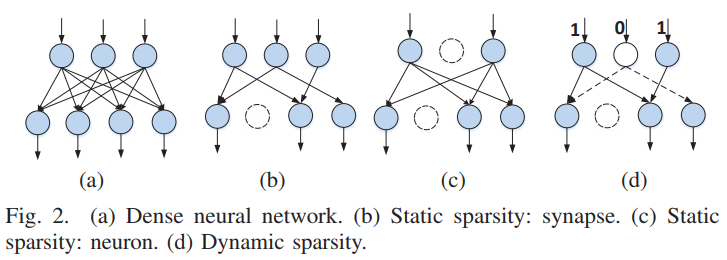

+ 静态稀疏，如图2bc，突触和神经元被永久移除。（SNS，SSS）
+ 动态稀疏，如图d，神经元输出为0，没有后续输出。（DNS）

进一步压缩数据的方法有量化和熵编码，以及CNNpack（Y. Wang, C. Xu, S. You, D. Tao, and C. Xu, “Cnnpack: Packing convolutional neural networks in the frequency domain,” in Advances In Neural Information Processing Systems, 2016.  ），它在频域处理问题，得到了已知最高的压缩比。权重编码过程如下图：

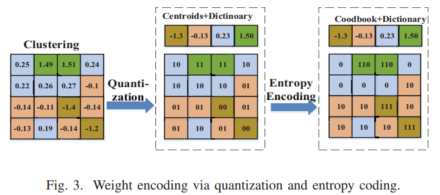

首先用聚类算法（比如K-means）将分散的权重分成K个簇，每个簇有一个中心点，由此，簇里的每一个数值可以由中心点和一个独特的索引表示。因此，一个dictionary和log（K）bit的权重，以及一个由K个独特值的codebook就可以表示所有权重。因为codebook里不同元素的出现的概率不平衡，我们会进一步使用熵编码（Huffman编码）来减少表示权重的比特。它用变长编码来表示权重，越常见的位宽越小。

### B motivation

+ 由于稀疏会带来无规律性，目前的硬件平台难以处理稀疏神经网络
+ 权重倾向于聚集成簇，被称为本地收敛。

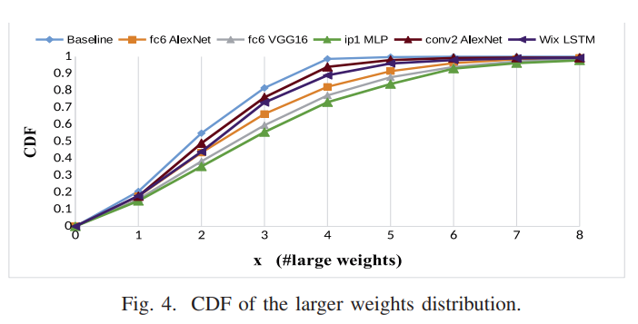

## 3 compressed neural networks

压缩算法流程如下：

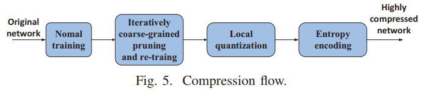

### A coarse-grained pruning

和一般的修剪不同，我们采用粗粒度的修剪，就是一次修剪几个突触。首先将突触分成几块，如果一个块达到了特定要求，就会被永久移除。然后用fine-tuning来保持精确性。注意在训练过程中我们迭代地使用粗粒度修剪以达到更好的稀疏而不损失精度。

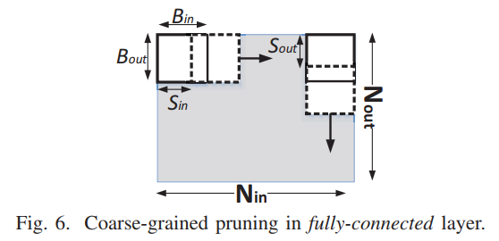

*1）pruning methodology：*以FC层和CONV层为例。

在FC层，输出神经元$N_{out}$通过独立的权重$W_{ij}$连接到输出神经元$N_{in}$，也就是图6中所示。修剪时我们以步长$S_{in}$和$S_{out}$用一个$B_{in}×B_{out}$的块在两个维度上移动。一旦某个块满足了要求，则整个块都会被修剪。在迭代修剪的过程中，滑块会跳过已经被修剪的块，使得每个被修剪的块大小一样，方便索引。有两种修剪标准：

+ 最大修剪：如果一个块里最大的绝对值低于一个事先阈值$W_{th}$，就会被修剪
+ 平均修剪：如果一个块里的均值低于一个事先预定的阈值，就会被修剪

在CONV层ofmap里的输出神经元与ifmap里的一个窗口通过一个分享的突触相连。因此，卷积层的权重可以可以被表达为一个4维的张量，也就是$N_{f_{in}},N_{f_{out}},K_x,K_y$。如图7所示。修剪时我们以步长$S_{f_{in}},S_{f_{out}},S_x,S_y$滑动一个大小为$(B_{f_{in}},B_{f_{out}},B_x,B_y)$的块，也可以应用最大修剪和平均修剪。

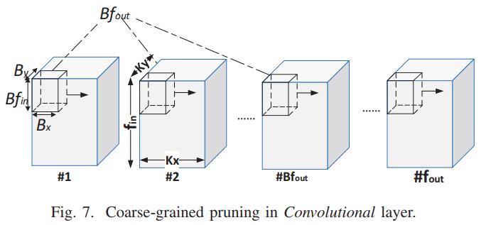

2）修剪特性

**block size.**找到能平衡压缩比和精确度的最佳块大小是很关键的。块太大会降低精确度，块太小无法体现权重的本地收敛性。块大小如果为1，就会变成细粒度修剪。（详细见S. Han, H. Mao, and W. J. Dally, “Deep compression: Compressing deep neural networks with pruning, trained quantization and huffman coding,” arXiv preprint arXiv:1510.00149, 2015.  ）

本文中修剪不同网络时我们对不同类型的层的块大小做了仔细的研究。原本对不同网络应该每层都实验确定块的大小，但这样太费时，所以最终按层的类型来确定。卷积层比FC层敏感，所以块大小为（1，N，1，1），FC层块大小为（N，N）。然后以Alexnet为例得到了上表，卷积层8bit量化，FC层4bit量化，都用了霍夫曼编码。N从1到16时压缩率提升（需要存储的index变小），N从16到64时压缩率下降（为了维持精度）。最终卷积层块大小为（1，16，1，1），fc6和fc7为（32，32），fc8为（16，16）。相对于细粒度修剪index的大小减少了102.82倍。

**neuron sparsity.**在粗粒度修剪里面只有突触被修剪了而神经元没有被直接修剪。然而动态稀疏占了很大的比例。如下表。

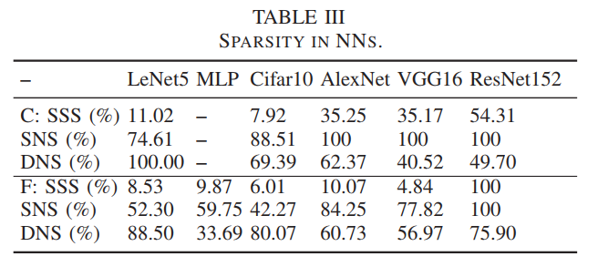

**avg. vs. max pruning.**两者特性区别很大。经过实验发现当稀疏低于15%时平均修剪精确性更高，所以本文选择平均修剪。

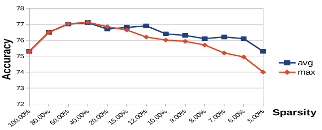

**measurement of irregularity.**为了展现粗粒度修剪带来的无规律性降低，我们用了以下的公式：
$$
R(Irr)=JBIG(I_f)/JBIG(I_c)                
$$
$R(Irr)$表示降低了的非规律性。$I_f$和$I_c$分别表示稀疏神经网络经过细粒度修剪和粗粒度的修剪后的indexes。$JBIG()$表示图像的损失。我们的基本思想是基于一个事实：有规律的数据（尤其是二进制矩阵）包含更多冗余的信息，因此可以用更少的数据表示出来。因此，我们将突触的indexes当作二进制图像，并且用JBIG压缩。压缩后的图像在一定程度上能反映无规律性（:question:）。因此得到了上述公式。

### B local quantization

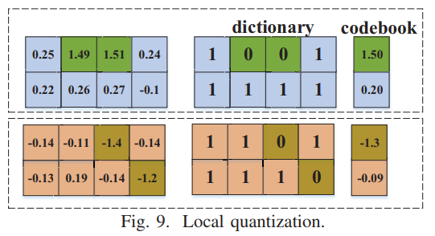

进一步减少表示权重的位数的方法有量化和权重分享。为了更好地利用本地收敛性，我们提出了本地量化，也就是在局部应用权重共享，而不是针对整个权重矩阵。如图9，本地量化首先将权重矩阵分为两个子网格，然后分别应用聚类算法。在每个子矩阵，权重将会被编码至一个codebook和一个dictionary，每一个权重一位（图3是全局量化，用的两位）。相比于全局量化，本地量化能够进一步发掘局部收敛性，用更少的bit表示权重，得到一个更高的压缩比。局部量化的开销很低。

### C entropy encoding

熵编码是一种无损的数据压缩，它创建并向每一个独特的符号赋予一个无前缀的编码。因为每一个代码的长度差不多是出现概率的负数，越常出现的代码位数越少。最常用的熵编码有Huffman编码和arithmetic编码。

### D compression results

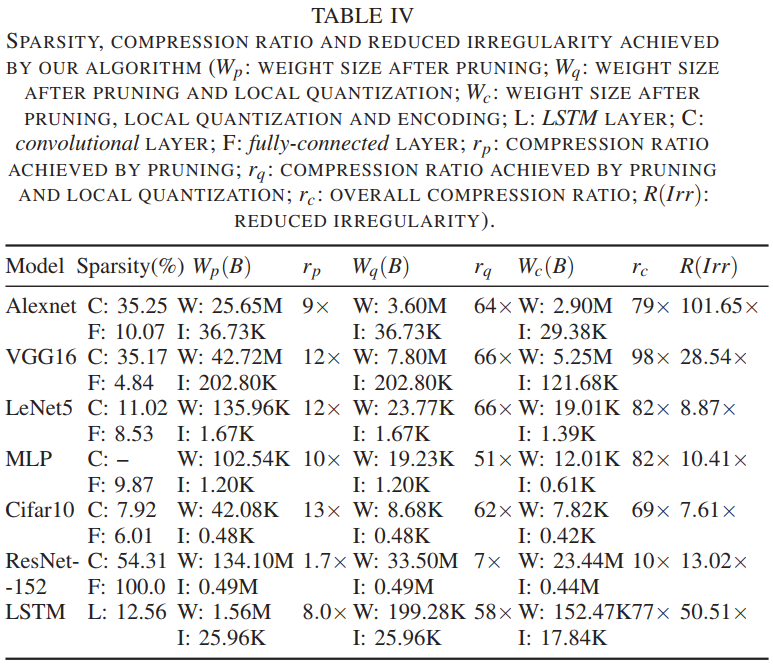

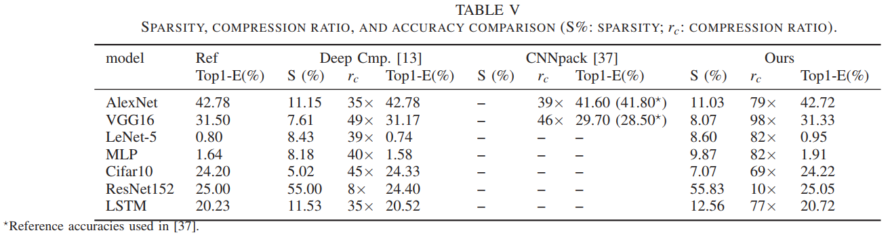

## 4 design principles

本节分析粗粒度修剪过的神经网络在设计加速器时的原则，以FC层为例，如上图。

首先indexes是在很多输出神经元之间共享的。如图10所示，n2，n3，n5，n8与所有的输出神经元之间的连接全被修剪了。因为输出神经元共享相同的连接拓扑结构，他们也共享相同的索引结构（图10中的突触indexes）。

第二，被选择的输入神经元，也就是它们的值，会在多个输出神经元之间共享（n1,n4,n6,n7）。为了不损失普遍性，考虑到FC层里修剪的块大小（$B_{in},B_{out}$），一组$B_{out}$相邻的输出神经元将会分享相同的输入神经元。这一观察和卷积层里$B_{fout}$相邻的输出神经元是一致的，如果块的大小是$(B_{f_{in}},B_{f_{out}},B_x,B_y)$。

第三，对高效而言动态稀疏性是极为重要的。由于n4、n6为0，对所有输出神经元没有贡献，所以可以省略。考虑图10的情况，考虑静态稀疏性时，有12个乘法，9个加法和16个输入；考虑动态稀疏性时，有6个乘法，3个加法，8个输入数据；相对而言，密集层有24个乘法，21个加法和32个输入数据，也就是比SS多2.4倍操作，2倍数据，比DS多5倍操作，4倍数据。因此，利用动态稀疏性是很重要的。注意到，在考虑动态稀疏性的情况下，输出神经元依然分享indexes以及选择的输入神经元。

第四，不同输出神经元的计算量是平衡的，因为它们共享相同的输入神经元。图10的例子就是平衡的，可以避免不平衡阻碍性能。

综上，为了最大限度提高效率，我们提出了如下加速器的设计原则：

+ 应该仅保存计算非零神经元和突触，最大限度利用所有计算资源
+ 利用共享的indexes以减少存储量
+ 利用动态稀疏性
+ 在相邻的输出神经元之间利用加载平衡性

## 5 accelerator architecture

本节介绍改加速器的细节，它可以高效的处理粗粒度修剪过的神经网络剩余的无规律性。

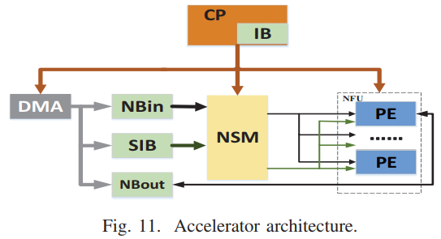

**overview.**加速器架构如上图。根据设计原则，我们设计了该加速器里的核心部件：神经元选择模块（NSM），来处理有共享indexes的静态稀疏性。我们设计了一个由很多PE组成的神经功能单元（NFU）来并行计算不同输出神经元。每一个PE包含一个本地突触选择器（SSM）来处理动态稀疏性。存储模块包含两个神经缓冲器（NBin和NBout）以及一个突触索引缓冲器（SIB）。控制模块包含一个控制处理器（CP）和一个指令缓冲器（IB）。CP高效地翻译从IB传输过来的指令，并将翻译出的控制信号传给其他模块。这里我们为加速器定义了一个VLIW（超长指令字）风格的指令集。

### A processing with sparsity

设计该加速器是为了发掘：

+ 静态稀疏性
+ 动态稀疏性
+ 能提升性能、降低能耗的压缩方法

在本加速器里，稀疏性由NSM和NFU一起处理。NSM从NBin接收输入神经元，从SIB接收突触indexes，然后生成过滤之后的神经元（静态稀疏性）以及索引字符串，再将它们传输到NFU里的所有PE。每一个PE在本地过滤出需要的突触（动态稀疏性），这样就避免了无用的计算的数据传输。

**indexing.**在详述NSM和NFU之前，我们首先解释清楚如何在加速器里存储和索引稀疏数据。为了维持经过粗粒度修剪之后体积较小的indexes，我们使用了一个高效的索引方式。只有存在的突触（未被修剪的）会和它们对应的index存储在一起，这些index表明了输入输出神经元之间的连接，也就是图10里的“synapse indexes”。我们用密集神经网络存储神经元的方式存储神经元，也就是如果一个神经元因为激活函数消失了，“0”也会被当成一个神经元的值存储。这么做是因为神经元值随着不同的输入变化，而且神经元需要的存储大小比突触小得多。因此，在处理稀疏神经网络时，加速器需要根据神经元的值（DS）和突触的index（SS）选择神经元/突触。

**NSM.**如下图，NSM通过选择需要的输入神经元处理静态稀疏性。

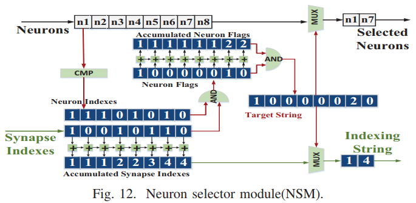

为了更高效地的处理共享的index和粗粒度稀疏的输入，我们设计了一个被多个PE共享的中心NSM来发掘规律性有所提升的稀疏网络。举例，在图10中，为了从8个神经元中找出为0的n4, n6, n8，NSM生成了*目标字符串*来找到需要的神经元n1, n7，并且生成了*索引字符串*方便之后的神经元选择。明确地说，*神经元indexes*会首先被计算出来，每一个index表示对应神经元是否为0（本例中为11101010），然后*神经元indexes*和*突触indexes*相与产生*神经元flags*（10000010）.*神经元flags*再进行自加生成*累加神经元flags*，两者再进行相与产生*目标字符串*（10000020）。此外，*目标字符串*还会与*累加突触indexes*相与，进一步生成*索引字符串*，索引字符串会用于选择突触并传输到NFU。注意，选出来的神经元和索引字符串在多个神经元之间共享，所以是broadcast至多个NFU里的PE的。

**NFU.**NFU和$T_n$个相同的PE高效地处理神经网络中的所有操作以及动态稀疏性。如下图，每一个PE包含一个本地突触缓冲器（SB），权重解码模块（WDM），突触选择模块（SSM）和神经功能单元（PEFU）。每一个PE从它本地的SB加载压缩后的突触，因为在不同的输出神经元里突触是独立的，可以在PE里分开存储。SB边上有一个带LUT的WDM，用于提取经过本地量化之后的实际权重值。SSM使用从NSM接收的索引字符串和从WDM接收的突触来为PFFU选择需要的突触，如图14a所示。（:six_pointed_star:也就是说所有没有被修剪的突触都会传输到PE里。）每一个PEFU由$T_m$个乘法器组成，以及一个$T_m$输入的加法树以及一个非线性方乘模块，如图14b所示。（:six_pointed_star:这里和cambricon-x是一样的）我们使用了一个时间共享的方式来将神经网络映射到PE上，也就是每一个PE处理一个输出神经元。理想上来说，计算一个需要M个乘法的输出神经元需要$[M/T_m]$个周期，因为一个周期内PEFU可以完成$T_m$个乘法运算。之后NFU收集并排列从所有PE传来的$T_n$个输出，为之后的计算做准备。

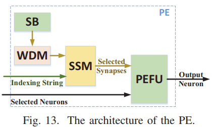

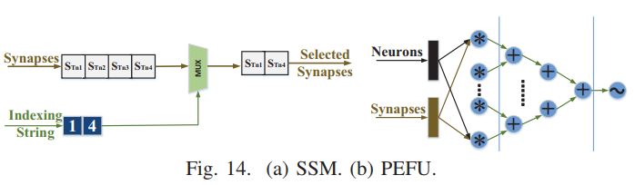

如果存在动态稀疏，SSM会选择需要的突触。为使设计有普遍性，考虑到静态稀疏，我们紧凑地存储突触权重。如图10所示，对于每一个输出神经元，第一个和第四个突触（$S_{T_i1},S_{T_i4}$）是两个计算需要的突触。SSM根据NSM传输的索引字符串选择需要的突触，索引字符串内包含了需要突触的位置，如图14a。突触和索引字符串之间进行MUX操作最终得到需要的突触。因为每个PE用不同的突触处理不同的输出神经元，我们可以在PE本地内部实现SSM和SB，这样可以避免高的带宽和长延迟。

索引部分的设计和cambricon-x有三个地方的不同。首先是我们的加速器包含了一个共享的索引模块（NSM）来利用稀疏突触提升的规律性。因为PE分享了相同的突触的indexes（粗粒度修剪导致的），选择神经元的模块（NSM）就被很多PE共享，因此减少了索引带来的开支和NSM与PE之间的带宽。第二是我们的加速器每个PE内部有一个本地索引模块（SSM）来高效利用神经稀疏性。尽管稀疏突触的规律性可以通过粗粒度修剪提升，稀疏神经元的无规律性依然存在，比如ReLU函数会向输出神经元的值引入很多0。一个SSM就被设计出来减少这种非规律性的影响。因此，我们的索引模块可以利用神经元和突触的稀疏性，而IM只能发掘突触的稀疏性。第三，加速器里引入了一个WDM来发掘本地量化，进一步减少权重的大小。

### B storage

因为在我们加速器里处理的数据有不同的行为，我们将存储分成四个部分：一个NBin，一个NBout，一个SIB，和$T_m$个SB，如图11所示。为了利用计算和DMA存储存取之间的重叠，我们以一种乒乓的方式实现buffers。

对于NBin和NBout，我们设置宽度为$16×T_m×16$-bit以便一次向NDM提供$16×T_m$个神经元。这么做是为了提高效率。尽管$T_n$个PE分享相同的输入神经元，PE一次需要$T_m$个输入神经元以避免计算时的stall引起的低效。如果稀疏性高于1/16，一次向NSM输送16×$T_m$个神经元，NSM能够给PE滤出$T_m$个输入。尽管如此，现存的网络（包括神经元和突触）有高于1/16（6.25%）的稀疏性——尤其是在卷积层里。因此，效率并不会被影响。

对于每个PE里的SB，考虑到DS，我们选择$T_m×64$-bit的宽度来提供4×$T_m$个不同的突触权重。因为存储在SB里的权重是压缩的形式（修剪过并通过本地量化编码），不同的层权重的位宽不同。为了更好地利用变化的位宽和避免解码带来巨大硬件开销（也就是WDM），我们将压缩后的权重混叠至4bit。例如，如果权重以4bit存储，SB里的一行会包含32个数据，如果是16bit就是16个，16bit就是8个。因此，当加载$T_m$×64-bit的数据时，如果是小于等于4bit的数据，WDM会把它解码成$T_m$×16个权重，如果小于等于8bit就会是$T_m$×8个，如果大于8bit就会拆解成$T_m$×4个。相比较于设计一个支持任意位宽的WDM，我们发现我们的设计面积和功耗都大大减少了，虽然数据寻址模式很复杂。

对于SIB，我们选择了宽度16×$T_m$×1-bit，因为我们选择了直接索引的形式，用0和1表示对应的突触是否存在。因此，SIB提供了16×$T_m$×1-bit的indexes给NSM来选择需要的神经元和对应的16×$T_m$输入神经元。

四个buffer的大小对整体性能和功耗有决定性的影响。尽管之前的研究提出要用足够大的缓冲器来容纳神经网络所有的中等大小的突触，以此避免开销很大的片外存储读取，它也导致了很大的延迟、面积开销、能量开销和对越来越大越来越深的神经网络的不可移植性。因此，我们使用了一个小的缓冲器以及一个合适的数据替换策略来在可移植性、性能和功耗之间达到最好的折衷。经过对不同大小的缓冲器的研究，我们使用了8KB的NBin，8KB的NBout，32KB的SB和1KB的SIB。只有当NBin里所有神经元被处理过了，或者SB里的突触全部被重利用过，或者NBout不满的时候，才会对主存进行存取来加载神经元、突触或者存储神经元（一一对应）。

### C control

CP是加速器的根基，并且掌控这整个执行过程。它高效地翻译从内部IB传来的指令，并发出执行协调，存储存取和数据组织的信号。CP通过设定对应的控制寄存器监视着每一个模块的状态。高效的VLIW风格的指令是从我们基于库的编译器生成的。