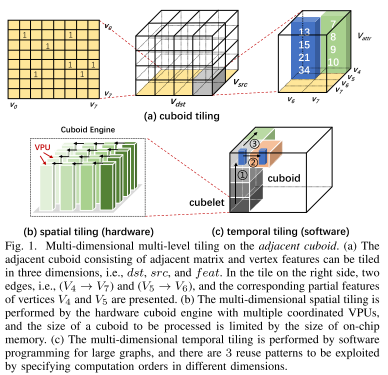

# Cambricon-G: A Polyvalent Energy-efficient Accelerator for Dynamic Graph Neural Networks

## 摘要

​	图神经网络（GNN）是对传统神经网络处理图结构数据的扩展，在许多领域得到了广泛的应用。GNN计算主要包括边处理结合边/顶点特征生成信息，和顶点处理聚合信息来更新顶点特征。除了边处理中的非平凡向量运算、顶点处理中的大量随机访问和神经网络运算外，在计算过程中，GNNs的图拓扑也会发生变化(即动态GNNs)。上述特征对现有架构提出了重大挑战。

​	在本文中，我们提出了一种名为CAMBRICON-G的新型加速器，用于有效地处理动态和静态GNN。CAMBRICON-G的关键是将广泛的GNN变量的不规则计算抽象到规则的平铺相邻长方体的过程中(通过添加顶点特征的维数扩展了传统的图的相邻矩阵)。直观的感觉是，相邻的长方体通过提供多维多级平铺(包括空间和时间平铺)机会，促进了对数据局部性和并行性的利用。为了实现多维空间平铺，CAMBRICON-G架构主要由长方体引擎(CE)和混合片上存储器组成。CE具有多个顶点处理单元(VPUs)，以协调的方式工作，有效地处理稀疏数据，并使用专用指令动态更新图拓扑。混合片上存储器包含拓扑感知缓存和多个暂存存储器以减少片外存储器访问。为了实现多维时间平铺，提供了一个易于使用的编程模型，灵活地探索大型图形的不同平铺选项。实验结果表明，与Nvidia P100 GPU相比，cambrion - g在各种gnn上的性能和能量效率分别提高了7.14×和20.18×，验证了cambrion - g的通用性和能量效率。

# introduction

​	图神经网络(GNN)，扩展了现有深层神经网络(DNN)，在各个领域处理常见的图结构的数据,如电子商务[1],[2],分子生物学知识图[3],和社交网络[4],[5],最近吸引了越来越多的来自工业和学术界关注[6],[7]。从技术上讲，GNN是一类通过提取图[7]中高维顶点的局部特征来进行图表示学习的神经网络算法。GNN的关键操作是图卷积，它将规则数据的标准2D卷积扩展到不规则高维顶点数据的非欧空间卷积。图卷积涉及三种类型的数据:高维顶点特征、边缘特征和权值。此类数据的计算一般可以用[8]信息传递范式来描述，该范式由边缘处理和顶点处理两部分组成。在边缘处理中，根据边缘特征和顶点特征生成信息。在顶点处理中，每个顶点根据聚合的信息使用聚合操作(如求和和平均)更新其特征。

​	虽然GNN建立在各种DNN计算(如内积、激活)和图分析操作(如图遍历)的基础上，但在三个方面与传统的神经网络/图分析有显著区别。首先，边和顶点的处理都需要大量的非平凡操作(如向量和NN操作)。它使最先进的图分析加速器(如Tesseract[9]、Graphicionado[10]和GraphPIM[11])，这些主要关注标量操作，对处理GNN效率很低。二是顶点处理要求对高维顶点特征进行不规则随机访问。这使得主要关注正则张量计算的神经网络加速器(如DianNao[12]和Eyeriss[13])在处理GNNs的顶点处理方面效率低下。第三，图的拓扑结构和特征维度都可能随时间动态变化，它可能会主导GNN的执行(HyGCN[14]等之前的工作完全忽略了这一点)。以Nvidia P100 GPU上的GUN[15]和DiffPool[16]为例，动态修改图形占用总执行量的66.2%和50.5%。所有这些独特的特性都需要专门的架构来高效地处理动态GNN。

​	为了解决现有加速器效率低下的问题，在本文中，我们提出了一种新的硬件架构，称为CAMBRICON-G，用于处理各种GNN。直觉的关键是抽象的计算范围广泛的GNN变量到所谓的相邻的长方体的过程,这将顶点特征维度添加到传统相邻矩阵,由此来提高数据重用和并行多维多层次的平铺,如图1所示。整个长方体可以在3个维度中平铺，即目标顶点(dst)、源顶点(src)和顶点特征(feat)，每个分区的平铺称为立方体，其大小由芯片上内存的大小决定，以提高效率。基于立方体的划分，我们提出通过硬件架构和软件编程分别实现空间和时间的平铺。

​	为了在立方体内执行多维空间平铺以增加数据重用和并行性，提出的CAMBRICON-G架构主要由长方体引擎(CE)和混合片上存储器组成。CE包含多个顶点处理单元(VPUs)，它们被组织成一个脉动阵列，以利用数据局部性和并行性，以最小的硬件成本，处理稀疏数据和更新图拓扑。注意，CE可以处理的数据受到片上存储器大小的限制，每个VPU只处理此类数据的切片块，如图1(b)所示。此外，CE根据动态GNN的关键操作的特点，为不同的计算提供专用的指令，即长方体、平面、矢量和元素。例如，立方体聚合指令处理所有顶点的消息聚合，向量矩阵乘法指令可用于更新图拓扑。混合片内存储器包含硬件管理的拓扑感知缓存和软件管理的便签存储器(SPM)，用于减少片外存储器访问。具体来说，拓扑感知缓存保存用于计算的输入顶点特征，其替换策略和缓存线大小由图拓扑决定。SPM存储边缘特征、生成的顶点特征(例如，消息和部分结果)和权值在单独的缓冲区中，因为它们的内存行为不同。

​	为了在大型GNN中实现立方体的多维暂时平铺，我们提出了一个计算多个立方体的编程模型。在图1(c)中，在确定每个立方体的平铺尺寸之后，可以按照不同维度的特定顺序计算所有立方体，这将导致不同的重用模式。更具体地说，图拓扑(即①)、顶点特征(即②)和部分聚合结果(即③)可以分别在feat、dst和src维度中的不同立方体之间重用。程序员可以通过使用提供的编程模型简单地调整嵌套for循环的顺序来指定计算顺序。例如，一旦需要重用源顶点的特性，就应该在编程期间在最内层循环中遍历dst维度中的立方体。此外，编程模型提供了利用硬件指令进行高效处理的内在功能。

​	我们为CAMBRICON-G实现了一个模拟器，并将其与普通处理器(即32核双插槽Intel Xeon 6130 CPU和Nvidia P100 GPU)进行了比较。与多核CPU相比，CAMBRICON-G的性能提高了99.84倍。与P100 GPU相比，CAMBRICON-G的性能和能效分别提高了7.14×和20.18×。在6个GNN和9个数据集上进行了实验，结果很好地证明了该体系结构的通用性和能量效率。

**贡献。**据我们所知，这是第一个有效处理和训练动态GNN的硬件加速器。具体而言，本文的贡献如下:

1)广义相邻长方体。我们对规则平铺相邻长方体的广义GNN变量进行了不规则计算。在相邻长方体的帮助下，可以在硬件和软件上实现多维多层的平铺，发掘更多的数据重用机会。

2)硬件架构。采用长方体引擎和混合片上存储器构建硬件架构，有效处理稀疏数据并动态更新图拓扑。还提供了基于动态GNN操作的整个分析的指令集。

3)软件编程。我们提供了一个串行编程模型，可以灵活地指定平铺参数(如平铺大小、计算顺序等)并实现计算逻辑。