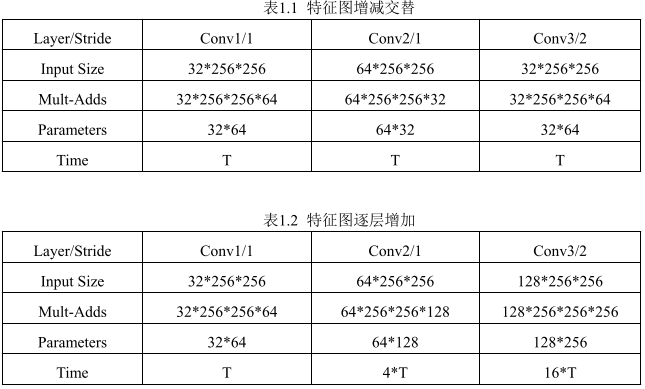
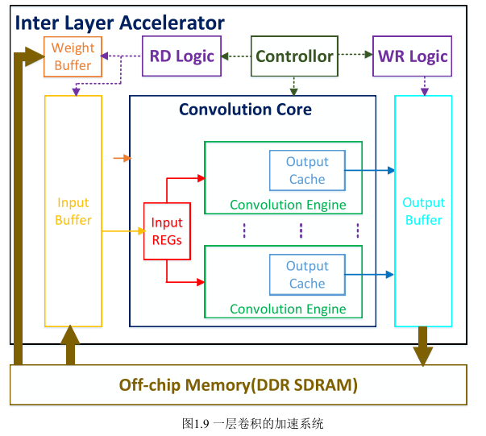
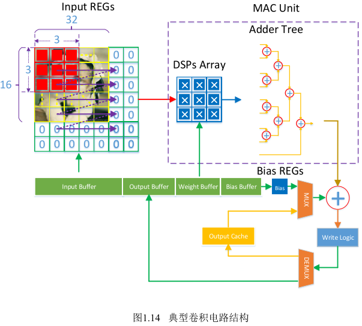
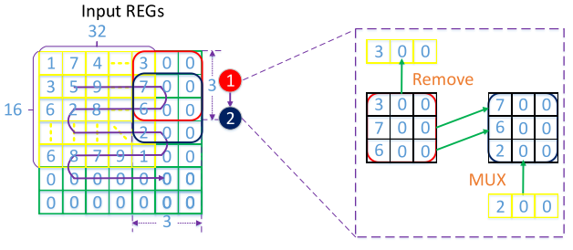
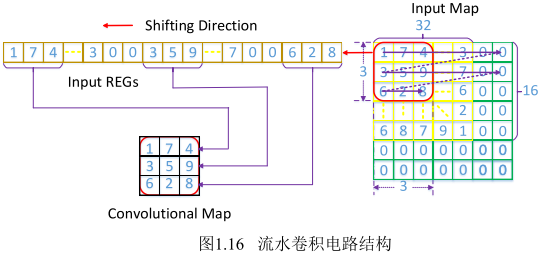
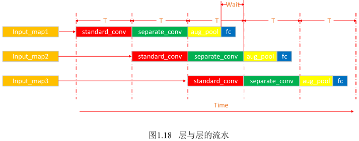
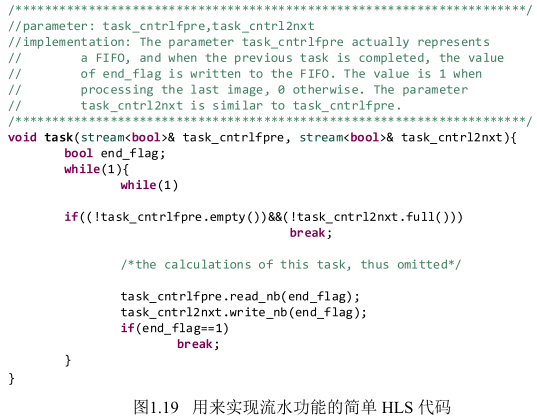
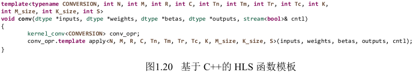
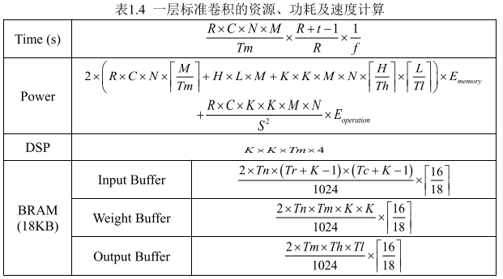

# 基于HLS的高效深度卷积神经网络FPGA实现方法

这篇文章总结了不少国外的文章。精简版在原文的基础上点明了设计思路，对神经网络的硬件化提供了很多值得参考的优化方案。

### 1.1 硬件友好和网络小巧的设计思路

1.1.1填充方式：FULL（增加padding使卷积从第一个像素开始），SAME（Ifmap和Ofmap大小一致），VALID（卷积核全部进入图像时开始卷积）。一般选择SAME（方便尺寸计算）。

1.1.2卷积核尺寸设定

一般为奇数（方便中心点作为移动基准，方便SAME填充）。常用3*3的卷积核（级联效果和5×5的一致，总而增加神经网络深度，减少正则化，减少参数数量）

1.1.3激活函数的选择

常用ReLu函数（相较于Sigmoid和Tanh函数，导数始终为一，避免梯度消失和梯度爆炸，易于硬件实现）

1.1.4以步进代替池化

可以先进行池化再经过激活函数（减少运算量，不适于平均池化）。

最好用步进代替池化（步进为2和2×2的池化效果相同并减少了运算量）。如果Ifmap的映射区域的中心坐标不是步进的倍数时可设置不卷积仅平移。

1.1.5以平均池化代替全连接

以平均池化代替全连接或者如果分类的个数太多可以再接一个小的全连接层（减少运算存储资源，且分类效果相同）。

1.1.6尺寸不变深度增加

当特征图的尺寸减少到一定大小时，保持特征图尺寸不变，卷积步进设为1（流水线执行的次数和特征图尺寸成正比，执行次数的减少会降低流水线的效率）。

采用特征图的数量增加和减少交替（特征图数量决定了流水线上具有最长处理时间的子任务，所以需要减少。这样不会带来运算量的增加，又保证了各个卷积层的处理时间大致相同）。（:question:制作硬件时确定还是软件时确定？）

1.1.7深度可分离卷积

采用深度可分离的卷积（由一层深度卷积（depthwise，滤波）和逐点卷积（pointwise，通道转换）组成）代替传统的标准卷积。（可以大大减少参数量和运算量（:question:），保留了重要的参数）参考mobile net（这篇论文之后会读到）

### 1.2 考虑资源功耗及速度灵活的设计思路

1.2.1输出数据重利用

（不用）FPGA只实现一层神经网络，计算过程中每一层结果输出暂存在片外，计算下一层前重新配置FPGA并输入数据（每层图像尺寸不同，使得资源利用率降低，处理时间变长，不能执行上一层对下一层副图像的处理，不能进行流水线）。

将整个网络实现在一块FPGA上，并使用流水线和分块处理（片内资源有限，但是可能带来数据的重复读取），尽可能地重复利用数据（减少数据传输带来的功耗）。

以图像数据为核心，最小化输入输出数据读取次数的重利用方式。具体实现：:question:（涉及到对I/Obuffer访问次数的计算）

（和angle eye的结构非常相近）

对于buffer和片外DDR SDRAM的访问总次数为：

具体实现分为三个阶段：

①输入图像从DDR被导入buffer，再加载到相应输入寄存器上；

②伪代码中N（输入通道数）的循环在M（卷积核数）之上，说明这些输入数据将会得到充分的利用，由于分块操作只读入了Tn个通道的输入图像，因此输出只是部分和而不是最终结果，又因为内部寄存器数量有限，需要将这些和暂存在output buffer中并导入外部存储；

③计算到下一个M的循环时，再从output buffer中读出相应的上一部分和与当前部分和进行累加，直到累加完成后将其存入外部DDR SDRAM。

为什么要用I/O buffer：一次突发传输中数据不一定是连续存入DDR的。同时解决内部时钟和DDR不同的跨时钟域问题。

1.2.2流水卷积电路

MAC电路结构：由DSP乘法器和加法器树组成，后面还有判断是否需要累加之前部分和的判断逻辑。

存在问题：每个选择器的输入量和选择器的数量都很多，这会使得电路变得十分拥挤，浪费资源的同时还会带来超高的线延迟，并且当卷积核尺寸变大时会出现高扇出现象。线延迟的增大和超高的扇出都会使最终设计的工作时钟频率提不上去，从而导致处理速度的下降。

解决方法一：如下图，但仍然存在大量选择器。

解决方法二：流水卷积电路结构

以一个长为((Th+(k−1))×(k−1)+ k)的寄存器向量代替寄存器矩阵，先将输入图像数据的前段按顺序存入向量中，以卷积核尺寸和图像宽为基准将其固定位置的数据导入到乘加矩阵中，因此该方式省去了选择器。并且每一时钟周期都将向量中的各元 素向右平移一次，并从输入 Buffer 中顺序读入一个图像数据填充在向量的最左端，像流水一样。

节约了大量寄存器，操作简单，节省了部分逻辑控制。但是准备时间会变长。在HLS中用UNROLL指令实现。

1.2.3 深度流水并行架构

在卷积运算内部，有着在输出通道上的并行操作。在HLS中使用PARTITION指令即可。

本设计中存在两处流水设计

①高层中，网络各层流水

②网络内部，数据输入、运算等。

1.2.4 模板化设计

在用HLS进行开发时，由于c++的灵活性，采用模板编写函数，并汇集成HLS库。（集成了减少参数的方法，结合HLS的pragma命令参数，使其生成的Verilog代码有分块、流水、并行的思想，并规范了输入输出接口和编程方式）

本文给出了一层标准卷积的资源、功耗及时间的计算公式

### 1.3 调试所遇问题及其解决方案

1.3.1 HLS对不同的C代码风格理解不一

1.3.2 浮点数的截断误差

1.3.3 如何提高系统工作频率

1.3.4 HLS不支持任务级流水中的feedback

（针对HLS提出的问题）